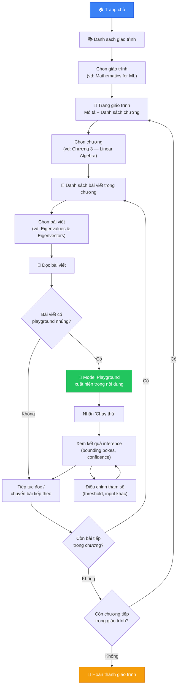
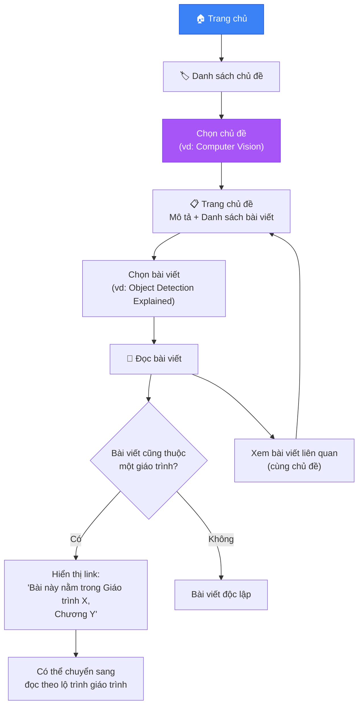
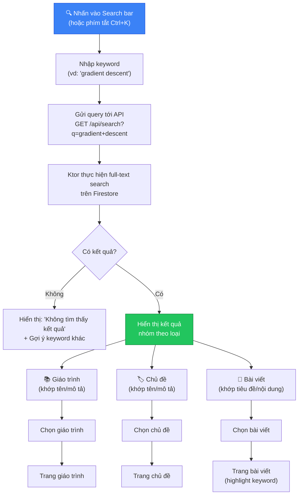
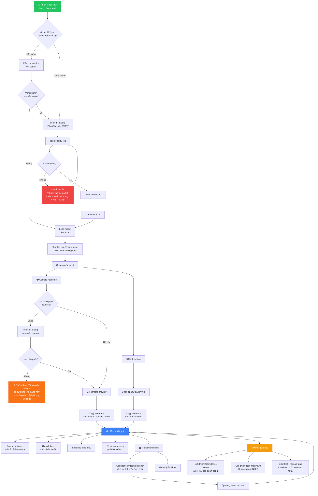
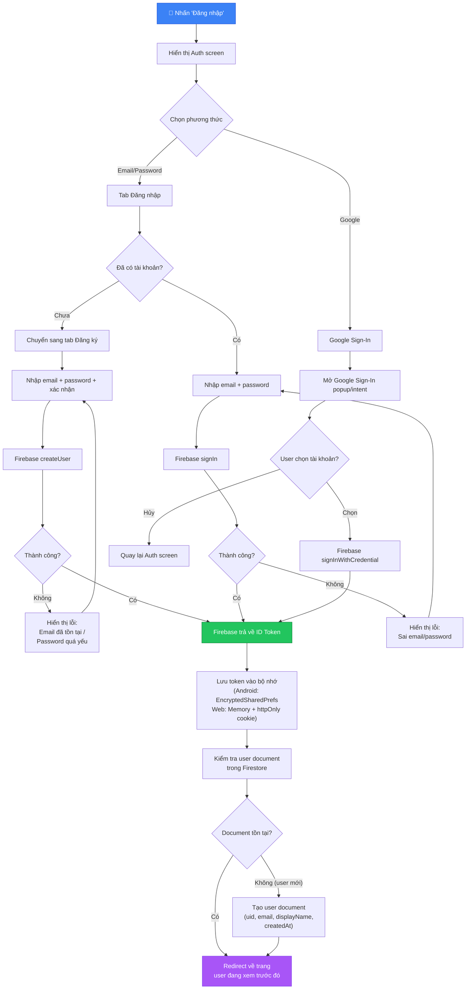
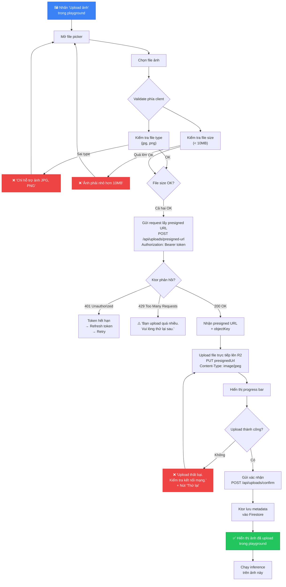
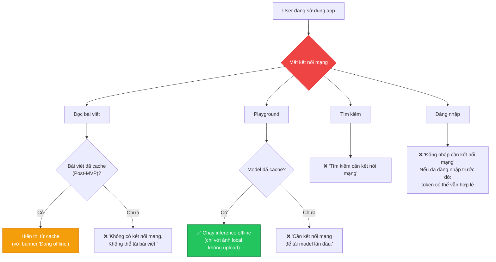
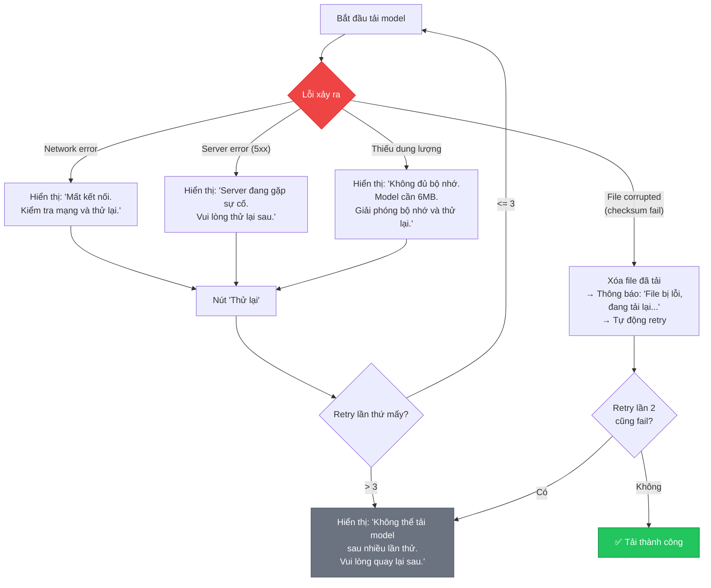
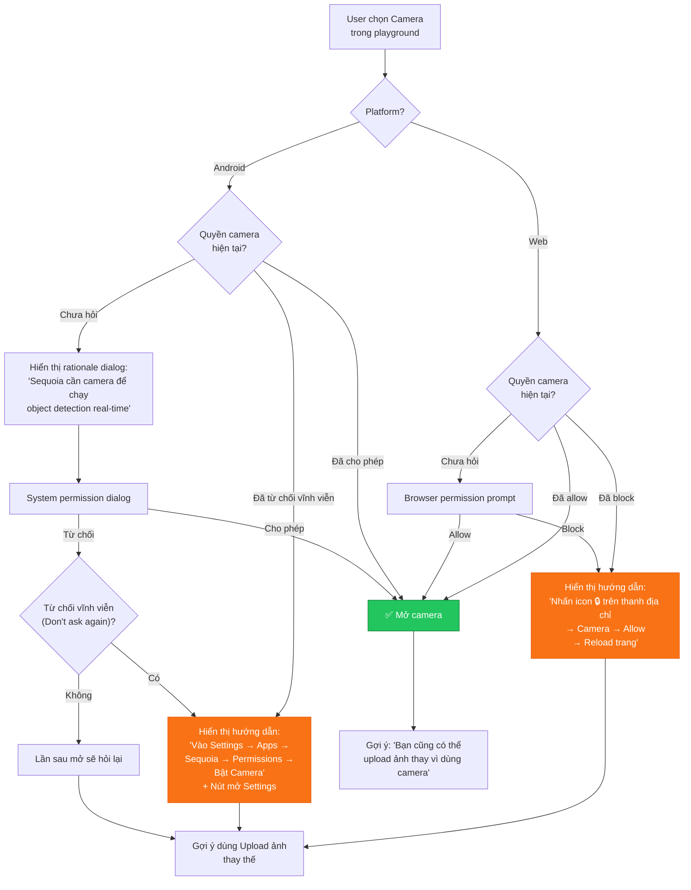
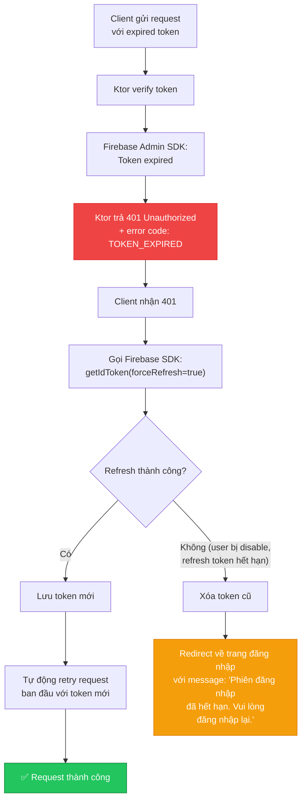

# Luồng người dùng — Sequoia

> Tài liệu mô tả chi tiết các luồng tương tác chính của người dùng trên nền tảng Sequoia, bao gồm cả happy path và edge cases.

---

## 1. Luồng duyệt theo giáo trình

Người dùng học theo lộ trình có cấu trúc: Giáo trình → Chương → Bài viết.

**Trải nghiệm mong đợi:**

- Người dùng thấy rõ **vị trí hiện tại** trong giáo trình (breadcrumb: Giáo trình > Chương > Bài viết).
- Bài viết có **nút điều hướng** (Bài trước / Bài tiếp) ở cuối trang.
- Playground được **nhúng tự nhiên** trong nội dung bài viết, tại vị trí liên quan đến lý thuyết đang trình bày.
- *(Post-MVP)* Hiển thị **tiến độ đọc** — bài nào đã đọc, chương nào đã hoàn thành.

---

## 2. Luồng duyệt theo chủ đề

Người dùng khám phá theo sở thích, không cần theo lộ trình cố định.

**Ghi chú thiết kế:**

- Một bài viết có thể **thuộc cả giáo trình lẫn chủ đề** — ví dụ bài "Convolution" vừa thuộc chủ đề "Computer Vision" vừa là bài trong giáo trình "Deep Learning".
- Khi bài viết thuộc giáo trình, hiển thị **banner nhỏ** gợi ý người dùng có thể đọc theo lộ trình.
- Danh sách bài trong chủ đề **không có thứ tự bắt buộc** — khác với giáo trình.

---

## 3. Luồng tìm kiếm

**Chi tiết kỹ thuật:**

| Đặc điểm | Mô tả |
| ----------- | ------- |
| **Phạm vi tìm kiếm** | Tiêu đề bài viết, nội dung bài viết (text), tên giáo trình, tên chủ đề |
| **Thuật toán** | Full-text search qua Firestore (hoặc index bên ngoài nếu cần mở rộng) |
| **Debounce** | Client debounce 300ms trước khi gửi request, tránh gọi API quá nhiều |
| **Highlight** | Keyword được highlight trong tiêu đề và đoạn trích kết quả |
| **Phân trang** | Hiển thị tối đa 20 kết quả mỗi trang, hỗ trợ load more |

---

## 4. Luồng playground

Đây là luồng phức tạp nhất — bao gồm tải model, chọn input, chạy inference và hiển thị kết quả giáo dục.

**Các tham số playground:**

| Tham số | Giá trị mặc định | Phạm vi | Mô tả |
| --------- | ------------------- | --------- | ------- |
| `confidenceThreshold` | 0.5 | 0.0 – 1.0 | Ngưỡng confidence tối thiểu để hiển thị detection |
| `iouThreshold` | 0.45 | 0.0 – 1.0 | Ngưỡng IoU cho Non-Maximum Suppression |
| `maxDetections` | 20 | 1 – 100 | Số lượng detection tối đa hiển thị |
| `showLabels` | true | true/false | Hiển thị class label trên bounding box |
| `showConfidence` | true | true/false | Hiển thị confidence % trên bounding box |

---

## 5. Luồng đăng ký / đăng nhập

**Chính sách bảo mật token:**

| Platform | Lưu trữ token | Ghi chú |
| ---------- | --------------- | --------- |
| **Android** | EncryptedSharedPreferences | Mã hóa bằng Android Keystore, xóa khi logout |
| **Web** | In-memory (JS variable) | Không lưu vào localStorage để tránh XSS. Firebase SDK tự quản lý persistence qua IndexedDB |

---

## 6. Luồng upload ảnh

**Giới hạn upload:**

| Quy tắc | Giá trị |
| --------- | --------- |
| File types cho phép | `image/jpeg`, `image/png` |
| Kích thước tối đa | 10 MB |
| Rate limit | 10 uploads / phút / user |
| Presigned URL hết hạn | 15 phút |

---

## 7. Edge cases và xử lý lỗi

### 7.1. Offline / Mất kết nối

### 7.2. Model tải thất bại

### 7.3. Camera bị từ chối quyền

### 7.4. Token hết hạn

**Cơ chế token refresh tự động:**

- Client cài đặt **HTTP interceptor** (Ktor Client trên Android, Axios interceptor trên Web).
- Khi nhận response 401 với error code `TOKEN_EXPIRED`, interceptor tự động:
  1. Gọi `getIdToken(forceRefresh = true)` để lấy token mới.
  2. Cập nhật header `Authorization` và retry request ban đầu.
  3. Nếu retry vẫn fail → redirect về trang đăng nhập.
- **Tối đa 1 lần retry** per request để tránh infinite loop.
- Nếu nhiều request cùng fail 401, chỉ **1 request gọi refresh**, các request khác chờ kết quả.

---

## Tổng hợp trạng thái UI

Bảng tổng hợp các trạng thái UI cần thiết kế cho mỗi màn hình:

| Màn hình | Loading | Empty | Error | Success | Offline |
| ---------- | --------- | ------- | ------- | --------- | --------- |
| Danh sách giáo trình | Skeleton loader | "Chưa có giáo trình nào" | "Không thể tải. Thử lại." | Hiển thị danh sách | Cache (Post-MVP) |
| Danh sách bài viết | Skeleton loader | "Chương này chưa có bài viết" | "Không thể tải. Thử lại." | Hiển thị danh sách | Cache (Post-MVP) |
| Đọc bài viết | Skeleton + shimmer | — | "Không thể tải bài viết." | Render content | Cache (Post-MVP) |
| Tìm kiếm | Spinner | "Không tìm thấy kết quả" | "Tìm kiếm thất bại." | Hiển thị kết quả | Không khả dụng |
| Playground | Loading model bar | — | "Không thể tải model." | Camera/ảnh + detections | Dùng cache model |
| Đăng nhập | Button spinner | — | "Sai email/mật khẩu." | Redirect | Không khả dụng |
| Upload ảnh | Progress bar % | — | "Upload thất bại." | Hiển thị ảnh | Không khả dụng |
