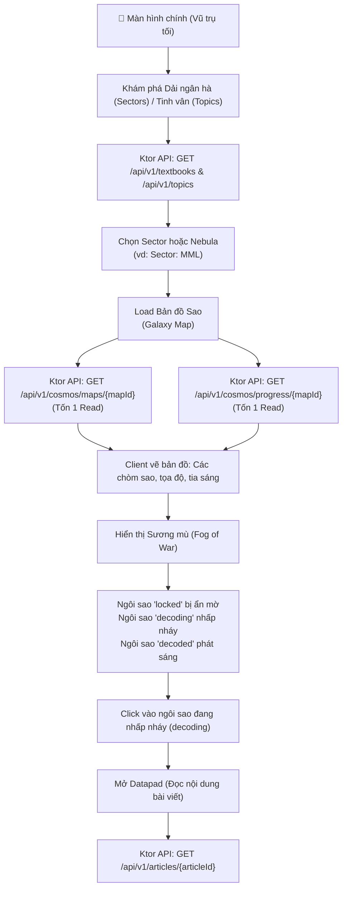
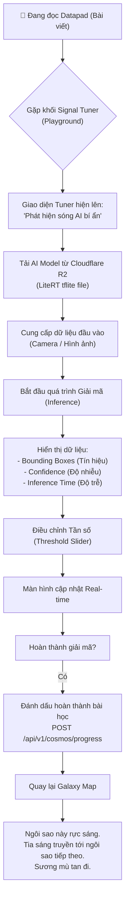
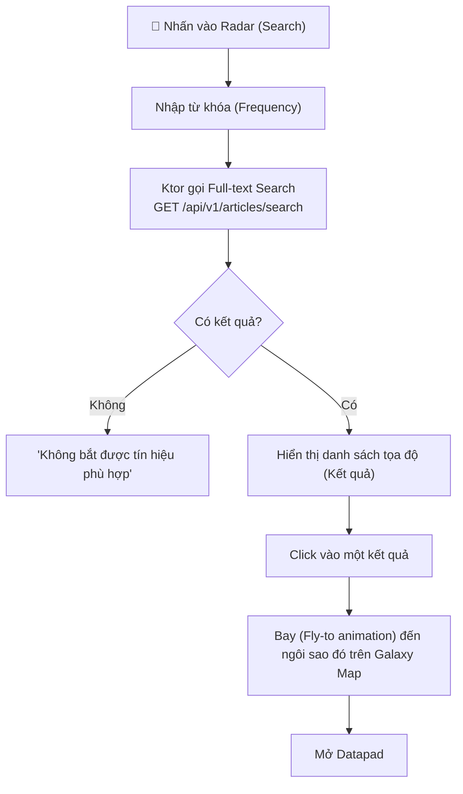

# Luồng người dùng — Sequoia (The Neural Cosmos)

> Tài liệu mô tả chi tiết các luồng tương tác chính của người dùng, lấy UI "The Neural Cosmos" làm chủ đạo. Tuy nhiên, API ngầm bên dưới vẫn giao tiếp với các hệ thống giáo trình, bài viết cốt lõi.
> Cập nhật lần cuối: 2026-07-20

---

## 1. Luồng Khám phá Vũ trụ (Thay cho Duyệt Giáo trình)

**Trải nghiệm mong đợi:**
- Không có cảm giác "đang đọc sách". Người dùng đang là nhà thám hiểm.
- Sương mù bao phủ các bài học (ngôi sao) chưa được mở khóa.
- Bản đồ load ngay lập tức nhờ kiến trúc 2-reads.

---

## 2. Luồng Giải mã Tín hiệu (Thay cho Playground)

Khi người dùng mở một bài viết (Datapad) và gặp một khối Playground (Signal Tuner).

**Khác biệt UX:**
- Threshold slider không gọi là "Threshold", mà gọi là "Bộ tinh chỉnh tần số / Noise Filter".
- Kết quả không gọi là "Bounding box", mà gọi là "Vùng tín hiệu".

---

## 3. Luồng Tìm kiếm (Quét Tín hiệu)

---

## 4. Xử lý Edge Cases trong môi trường Cosmos

| Tình huống | Trạng thái UI theo Theme | Lỗi kỹ thuật ngầm hiểu |
| --- | --- | --- |
| Mất mạng | "Mất kết nối với Bộ Chỉ Huy. Khởi động chế độ sinh tồn (Offline Mode)." | No Internet Connection. Dùng cached data. |
| Model tải thất bại | "Bão từ trường cản trở việc tải AI core. Đang thử lại..." | R2 download failed hoặc timeout. |
| Camera từ chối quyền | "Cảm biến quang học (Camera) đang bị khóa. Hãy mở khóa trong Settings." | Permission Denied. |
| Token hết hạn | "Phiên bản Datapad đã cũ. Đang tái đồng bộ tín hiệu nhận dạng..." | JWT Expired, auto refresh token. |
