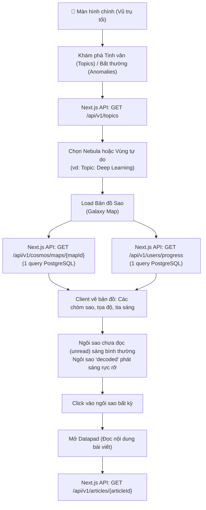
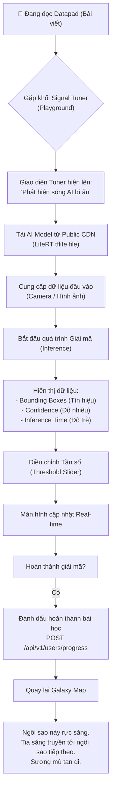
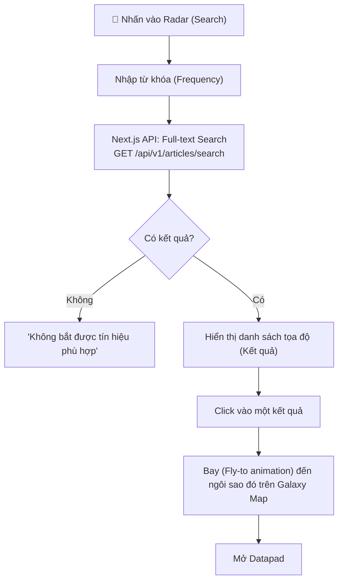
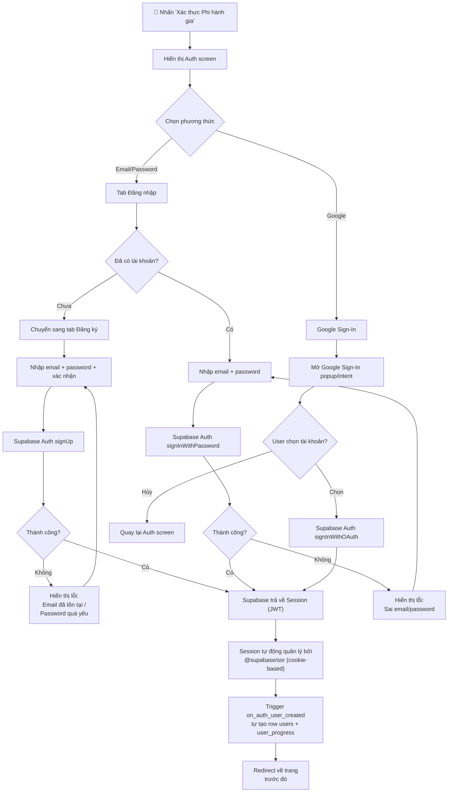
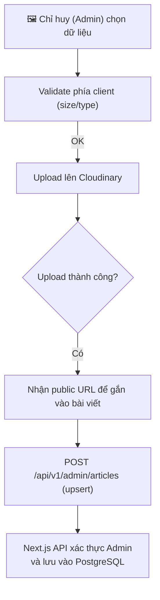

# Luồng người dùng — Sequoia (The Neural Cosmos)

> Tài liệu mô tả chi tiết các luồng tương tác chính của người dùng, lấy UI "The Neural Cosmos" làm chủ đạo. Tuy nhiên, API ngầm bên dưới vẫn giao tiếp với hệ thống bài viết cốt lõi.
> Cập nhật lần cuối: 2026-08-19

---

## 1. Luồng Điều hướng Chính (Khám phá Vũ trụ)

```mermaid
flowchart TD
    A["🌌 Màn hình chính (Vũ trụ tối)"] --> B["Khám phá Tinh vân (Topics) / Bất thường (Anomalies)"]
    B --> C["Next.js API: GET /api/v1/topics"]
    C --> D["Chọn Nebula hoặc Vùng tự do<br/>(vd: Topic: Deep Learning)"]
    D --> E["Load Bản đồ Sao<br/>(Galaxy Map)"]
    
    E --> F["Next.js API: GET /api/v1/cosmos/maps/{mapId}<br/>(1 query PostgreSQL)"]
    E --> G["Next.js API: GET /api/v1/users/progress<br/>(1 query PostgreSQL)"]
    
    F --> H["Client vẽ bản đồ: Các chòm sao, tọa độ, tia sáng"]
    G --> H
    
    H --> J["Ngôi sao chưa đọc (unread) sáng bình thường<br/>Ngôi sao 'decoded' phát sáng rực rỡ"]
    J --> K["Click vào ngôi sao bất kỳ"]
    K --> L["Mở Datapad (Đọc nội dung bài viết)"]
    L --> M["Next.js API: GET /api/v1/articles/{articleId}"]
```

**Trải nghiệm người dùng:**
- Giao diện được thiết kế theo chủ đề thám hiểm không gian.

- Bản đồ tối ưu thời gian tải nhờ kiến trúc 2-queries (1 cho map, 1 cho progress).

---

## 2. Luồng Thực hành AI (Giải mã Tín hiệu)

Khi người dùng mở một bài viết (Datapad) và gặp một khối Playground (Signal Tuner).

```mermaid
flowchart TD
    A["📝 Đang đọc Datapad (Bài viết)"] --> B{"Gặp khối Signal Tuner<br/>(Playground)"}
    
    B --> C["Giao diện Tuner hiện lên:<br/>'Phát hiện sóng AI bí ẩn'"]
    C --> D["Tải AI Model từ Public CDN<br/>(LiteRT tflite file)"]
    D --> E["Cung cấp dữ liệu đầu vào<br/>(Camera / Hình ảnh)"]
    
    E --> F["Bắt đầu quá trình Giải mã (Inference)"]
    F --> G["Hiển thị dữ liệu:<br/>- Bounding Boxes (Tín hiệu)<br/>- Confidence (Độ nhiễu)<br/>- Inference Time (Độ trễ)"]
    
    G --> H["Điều chỉnh Tần số (Threshold Slider)"]
    H --> I["Màn hình cập nhật Real-time"]
    I --> J["Hoàn thành giải mã?"]
    
    J -->|"Có"| K["Đánh dấu hoàn thành bài học<br/>POST /api/v1/users/progress"]
    K --> L["Quay lại Galaxy Map"]
    L --> M["Ngôi sao này rực sáng.<br/>Tia sáng truyền tới ngôi sao tiếp theo.<br/>Sương mù tan đi."]
```

**Ngữ nghĩa Giao diện (UX Semantics):**
- Threshold slider được thiết kế dưới dạng "Bộ tinh chỉnh tần số / Noise Filter".
- Kết quả nhận diện (Bounding box) được hiển thị dưới dạng "Vùng tín hiệu".

---

## 3. Luồng Tìm kiếm (Quét Tín hiệu)

```mermaid
flowchart TD
    A["📡 Nhấn vào Radar (Search)"] --> B["Nhập từ khóa (Frequency)"]
    B --> C["Next.js API: Full-text Search<br/>GET /api/v1/articles/search"]
    C --> D{"Có kết quả?"}
    
    D -->|"Không"| E["'Không bắt được tín hiệu phù hợp'"]
    D -->|"Có"| F["Hiển thị danh sách tọa độ (Kết quả)"]
    
    F --> G["Click vào một kết quả"]
    G --> H["Bay (Fly-to animation) đến ngôi sao đó trên Galaxy Map"]
    H --> I["Mở Datapad"]
```

---

## 4. Luồng Hồ sơ Phi hành gia (Auth)

```mermaid
flowchart TD
    A["👤 Nhấn 'Xác thực Phi hành gia'"] --> B["Hiển thị Auth screen"]
    B --> C{"Chọn phương thức"}

    C -->|"Email/Password"| D["Tab Đăng nhập"]
    C -->|"Google"| E["Google Sign-In"]

    D --> D1{"Đã có tài khoản?"}
    D1 -->|"Có"| D2["Nhập email + password"]
    D1 -->|"Chưa"| D3["Chuyển sang tab Đăng ký"]
    D3 --> D4["Nhập email + password + xác nhận"]
    D4 --> D5["Supabase Auth signUp"]
    D5 --> D6{"Thành công?"}
    D6 -->|"Không"| D7["Hiển thị lỗi:<br/>Email đã tồn tại /<br/>Password quá yếu"]
    D7 --> D4
    D6 -->|"Có"| F["Supabase trả về Session (JWT)"]

    D2 --> D8["Supabase Auth signInWithPassword"]
    D8 --> D9{"Thành công?"}
    D9 -->|"Không"| D10["Hiển thị lỗi:<br/>Sai email/password"]
    D10 --> D2
    D9 -->|"Có"| F

    E --> E1["Mở Google Sign-In popup/intent"]
    E1 --> E2{"User chọn tài khoản?"}
    E2 -->|"Hủy"| E3["Quay lại Auth screen"]
    E2 -->|"Chọn"| E4["Supabase Auth signInWithOAuth"]
    E4 --> F

    F --> G["Session tự động quản lý bởi<br/>@supabase/ssr (cookie-based)"]
    G --> H["Trigger on_auth_user_created<br/>tự tạo row users + user_progress"]
    H --> I["Redirect về trang<br/>trước đó"]
```

---

## 5. Luồng Cập nhật Trạm Kiểm soát (CMS Admin)

```mermaid
flowchart TD
    A["🖼️ Chỉ huy (Admin) chọn dữ liệu"] --> B["Validate phía client (size/type)"]
    
    B -->|"OK"| C["Upload lên Cloudinary"]
    C --> D{"Upload thành công?"}
    D -->|"Có"| E["Nhận public URL để gắn vào bài viết"]
    E --> F["POST /api/v1/admin/articles (upsert)"]
    F --> G["Next.js API xác thực Admin<br/>và lưu vào PostgreSQL"]
```

---

## 6. Xử lý Edge Cases trong môi trường Cosmos

| Tình huống | Trạng thái UI theo Theme | Lỗi kỹ thuật ngầm hiểu |
| --- | --- | --- |
| Mất mạng | "Mất kết nối với Bộ Chỉ Huy. Khởi động chế độ sinh tồn (Offline Mode)." | No Internet Connection. Dùng cached data. |
| Model tải thất bại | "Bão từ trường cản trở việc tải AI core. Đang thử lại..." | CDN download failed hoặc timeout. |
| Camera từ chối quyền | "Cảm biến quang học (Camera) đang bị khóa. Hãy mở khóa trong Settings." | Permission Denied. |
| Token hết hạn | "Phiên bản Datapad đã cũ. Đang tái đồng bộ tín hiệu nhận dạng..." | JWT Expired, Supabase auto refresh token. |
