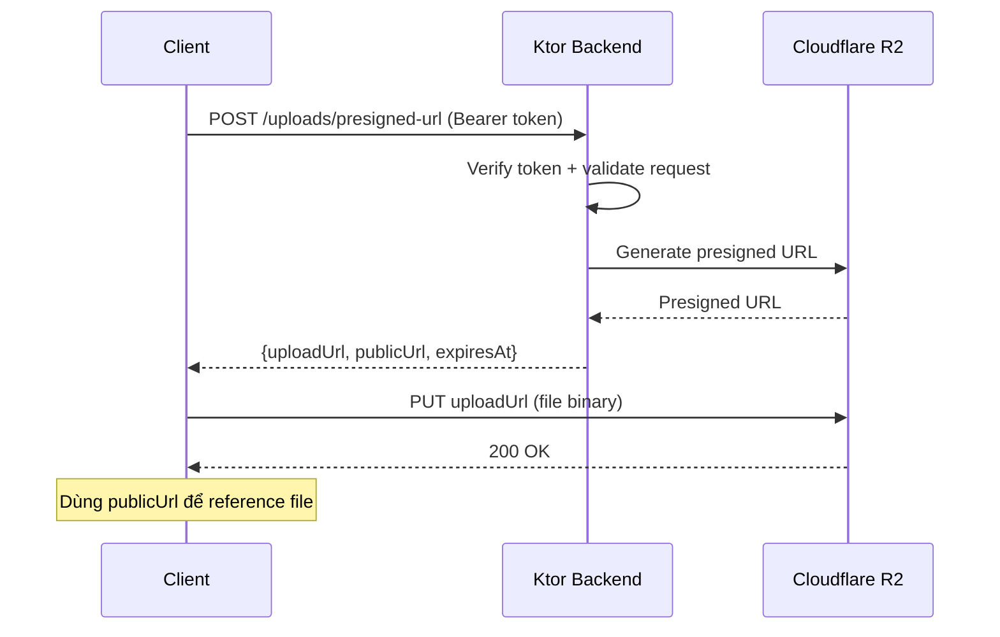

# API Contract — Sequoia Backend

> Tài liệu mô tả chi tiết API contract cho Ktor backend của Sequoia.
> Cập nhật lần cuối: 2026-07-16

---

## 1. Tổng quan

### Base URL

| Môi trường | Base URL |
| --- | --- |
| Development | `http://localhost:8080/api/v1` |
| Staging | `https://api-staging.sequoia.dev/api/v1` |
| Production | `https://api.sequoia.dev/api/v1` |

### Versioning

API sử dụng URL path versioning: `/api/v1/...`. Khi có breaking changes, version mới sẽ được tạo (`/api/v2/...`) và version cũ được duy trì trong thời gian chuyển đổi.

### Authentication

Các endpoint yêu cầu xác thực sử dụng **Firebase ID Token** trong header `Authorization`:

```text
Authorization: Bearer <firebase-id-token>
```

Token được verify bởi Ktor backend (lớp 1) trước khi xử lý request. Client lấy ID token từ Firebase Auth SDK.

### Error Format

Mọi lỗi trả về cùng format thống nhất:

```json
{
  "code": "RESOURCE_NOT_FOUND",
  "message": "Bài viết không tồn tại.",
  "details": {
    "slug": "bai-viet-khong-ton-tai"
  }
}
```

| Field | Type | Description |
| --- | --- | --- |
| `code` | `string` | Mã lỗi dạng UPPER_SNAKE_CASE, dùng để client xử lý programmatically |
| `message` | `string` | Mô tả lỗi dạng human-readable |
| `details` | `object \| null` | Thông tin bổ sung, null nếu không có |

### Bảng mã lỗi chung

| HTTP Status | Error Code | Mô tả |
| --- | --- | --- |
| 400 | `INVALID_REQUEST` | Request thiếu field hoặc format sai |
| 401 | `UNAUTHORIZED` | Thiếu hoặc sai token |
| 403 | `FORBIDDEN` | Không có quyền truy cập resource |
| 404 | `RESOURCE_NOT_FOUND` | Resource không tồn tại |
| 409 | `CONFLICT` | Resource đã tồn tại (ví dụ: email đã đăng ký) |
| 429 | `RATE_LIMIT_EXCEEDED` | Vượt quá giới hạn request |
| 500 | `INTERNAL_ERROR` | Lỗi server không xác định |

---

## 2. Endpoints

### 2.1. GET `/api/v1/textbooks` — Danh sách giáo trình

Lấy danh sách tất cả giáo trình, sắp xếp theo `sortOrder`.

| | |
| --- | --- |
| **Auth Required** | ❌ |
| **Method** | `GET` |

#### Query Parameters

| Param | Type | Required | Default | Description |
| --- | --- | --- | --- | --- |
| `limit` | `number` | ❌ | `20` | Số lượng tối đa (1–50) |
| `cursor` | `string` | ❌ | — | Cursor cho pagination |

#### Response 200

```json
{
  "data": [
    {
      "id": "Ld9kX3mPqR2s",
      "title": "Nhập môn Machine Learning",
      "authors": ["Nguyễn Văn B", "Trần Thị C"],
      "description": "Giáo trình toàn diện về Machine Learning...",
      "coverImageUrl": "https://r2.sequoia.dev/covers/nhap-mon-ml.jpg",
      "totalChapters": 12,
      "sortOrder": 1,
      "createdAt": "2026-06-01T08:00:00Z",
      "updatedAt": "2026-07-10T14:20:00Z"
    }
  ],
  "cursor": "eyJzb3J0T3JkZXIiOjF9",
  "hasMore": true
}
```

#### Ví dụ curl

```bash
curl -X GET "https://api.sequoia.dev/api/v1/textbooks?limit=10"
```

---

### 2.2. GET `/api/v1/textbooks/:id/chapters` — Danh sách chương theo giáo trình

Lấy danh sách chương của một giáo trình, sắp xếp theo `sortOrder`.

| | |
| --- | --- |
| **Auth Required** | ❌ |
| **Method** | `GET` |

#### Path Parameters

| Param | Type | Description |
| --- | --- | --- |
| `id` | `string` | ID của giáo trình |

#### Query Parameters

| Param | Type | Required | Default | Description |
| --- | --- | --- | --- | --- |
| `limit` | `number` | ❌ | `50` | Số lượng tối đa (1–100) |
| `cursor` | `string` | ❌ | — | Cursor cho pagination |

#### Response 200

```json
{
  "data": [
    {
      "id": "Wn5tY8vBcD1f",
      "textbookId": "Ld9kX3mPqR2s",
      "title": "Chương 3: Neural Networks cơ bản",
      "description": "Tìm hiểu cấu trúc neuron, hàm kích hoạt...",
      "sortOrder": 3,
      "articleCount": 5,
      "createdAt": "2026-06-05T09:00:00Z"
    }
  ],
  "cursor": null,
  "hasMore": false
}
```

#### Response 404

```json
{
  "code": "RESOURCE_NOT_FOUND",
  "message": "Giáo trình không tồn tại.",
  "details": { "textbookId": "invalid-id" }
}
```

#### Ví dụ curl

```bash
curl -X GET "https://api.sequoia.dev/api/v1/textbooks/Ld9kX3mPqR2s/chapters"
```

---

### 2.3. GET `/api/v1/chapters/:id/articles` — Danh sách bài viết theo chương

Lấy danh sách bài viết đã publish thuộc một chương.

| | |
| --- | --- |
| **Auth Required** | ❌ |
| **Method** | `GET` |

#### Path Parameters

| Param | Type | Description |
| --- | --- | --- |
| `id` | `string` | ID của chương |

#### Query Parameters

| Param | Type | Required | Default | Description |
| --- | --- | --- | --- | --- |
| `limit` | `number` | ❌ | `20` | Số lượng tối đa (1–50) |
| `cursor` | `string` | ❌ | — | Cursor cho pagination |

#### Response 200

```json
{
  "data": [
    {
      "id": "neural-network-co-ban",
      "title": "Neural Network cơ bản — Từ Perceptron đến Multi-Layer",
      "slug": "neural-network-co-ban",
      "summary": "Tìm hiểu neural network từ perceptron đơn giản...",
      "tags": ["neural-network", "perceptron", "deep-learning"],
      "readingTimeMinutes": 12,
      "publishedAt": "2026-06-15T08:00:00Z"
    }
  ],
  "cursor": "eyJzb3J0T3JkZXIiOjN9",
  "hasMore": true
}
```

> [!NOTE]
> Response danh sách bài viết **không** bao gồm `content` và `playgroundBlocks` để giảm payload. Dùng endpoint chi tiết (`GET /articles/:slug`) để lấy đầy đủ.

#### Ví dụ curl

```bash
curl -X GET "https://api.sequoia.dev/api/v1/chapters/Wn5tY8vBcD1f/articles?limit=10"
```

---

### 2.4. GET `/api/v1/topics` — Danh sách chủ đề độc lập

Lấy tất cả chủ đề, sắp xếp theo `sortOrder`.

| | |
| --- | --- |
| **Auth Required** | ❌ |
| **Method** | `GET` |

#### Query Parameters

| Param | Type | Required | Default | Description |
| --- | --- | --- | --- | --- |
| `limit` | `number` | ❌ | `50` | Số lượng tối đa (1–100) |
| `cursor` | `string` | ❌ | — | Cursor cho pagination |

#### Response 200

```json
{
  "data": [
    {
      "id": "Hj3kM7nPqS9w",
      "name": "Computer Vision",
      "description": "Các bài viết về thị giác máy tính...",
      "iconUrl": "https://r2.sequoia.dev/icons/computer-vision.svg",
      "sortOrder": 1,
      "articleCount": 15,
      "createdAt": "2026-06-01T08:00:00Z"
    }
  ],
  "cursor": null,
  "hasMore": false
}
```

#### Ví dụ curl

```bash
curl -X GET "https://api.sequoia.dev/api/v1/topics"
```

---

### 2.5. GET `/api/v1/topics/:id/articles` — Danh sách bài viết theo chủ đề

Lấy danh sách bài viết đã publish thuộc một chủ đề, mới nhất trước.

| | |
| --- | --- |
| **Auth Required** | ❌ |
| **Method** | `GET` |

#### Path Parameters

| Param | Type | Description |
| --- | --- | --- |
| `id` | `string` | ID của chủ đề |

#### Query Parameters

| Param | Type | Required | Default | Description |
| --- | --- | --- | --- | --- |
| `limit` | `number` | ❌ | `20` | Số lượng tối đa (1–50) |
| `cursor` | `string` | ❌ | — | Cursor cho pagination |

#### Response 200

```json
{
  "data": [
    {
      "id": "yolo-object-detection-tutorial",
      "title": "Hướng dẫn YOLO Object Detection từ A-Z",
      "slug": "yolo-object-detection-tutorial",
      "summary": "Từ lý thuyết đến thực hành YOLO trên thiết bị...",
      "tags": ["yolo", "object-detection", "on-device"],
      "readingTimeMinutes": 18,
      "publishedAt": "2026-07-01T10:00:00Z"
    }
  ],
  "cursor": "eyJwdWJsaXNoZWRBdCI6IjIwMjYtMDctMDEifQ",
  "hasMore": false
}
```

#### Response 404

```json
{
  "code": "RESOURCE_NOT_FOUND",
  "message": "Chủ đề không tồn tại.",
  "details": { "topicId": "invalid-id" }
}
```

#### Ví dụ curl

```bash
curl -X GET "https://api.sequoia.dev/api/v1/topics/Hj3kM7nPqS9w/articles?limit=5"
```

---

### 2.6. GET `/api/v1/articles/:slug` — Chi tiết bài viết

Lấy toàn bộ nội dung bài viết kèm cấu hình playground.

| | |
| --- | --- |
| **Auth Required** | ❌ |
| **Method** | `GET` |

#### Path Parameters

| Param | Type | Description |
| --- | --- | --- |
| `slug` | `string` | Slug (URL-friendly ID) của bài viết |

#### Response 200

```json
{
  "data": {
    "id": "neural-network-co-ban",
    "title": "Neural Network cơ bản — Từ Perceptron đến Multi-Layer",
    "slug": "neural-network-co-ban",
    "content": "# Neural Network cơ bản\n\nNeural network là mô hình...",
    "summary": "Tìm hiểu neural network từ perceptron đơn giản...",
    "chapterId": "Wn5tY8vBcD1f",
    "topicId": "Hj3kM7nPqS9w",
    "textbookId": "Ld9kX3mPqR2s",
    "playgroundBlocks": [
      {
        "modelId": "Rt6uI0oLkJ2h",
        "position": 3,
        "defaultConfig": {
          "threshold": 0.45,
          "inputSize": 320,
          "showBoundingBoxes": true
        },
        "model": {
          "id": "Rt6uI0oLkJ2h",
          "name": "YOLOv8n Object Detection",
          "taskType": "object_detection",
          "fileUrl": "https://r2.sequoia.dev/models/yolov8n-v1.0.0.tflite",
          "fileSizeBytes": 6340096,
          "format": "litert"
        }
      }
    ],
    "tags": ["neural-network", "perceptron", "deep-learning"],
    "readingTimeMinutes": 12,
    "createdAt": "2026-06-10T11:00:00Z",
    "updatedAt": "2026-07-12T16:45:00Z",
    "publishedAt": "2026-06-15T08:00:00Z"
  }
}
```

> [!IMPORTANT]
> Response chi tiết bài viết **inline model metadata** bên trong mỗi `playgroundBlock`. Client không cần gọi thêm endpoint `/models/:id` để lấy thông tin model cần thiết cho playground.

#### Response 404

```json
{
  "code": "RESOURCE_NOT_FOUND",
  "message": "Bài viết không tồn tại.",
  "details": { "slug": "bai-viet-khong-ton-tai" }
}
```

#### Ví dụ curl

```bash
curl -X GET "https://api.sequoia.dev/api/v1/articles/neural-network-co-ban"
```

---

### 2.7. GET `/api/v1/articles/search` — Tìm kiếm full-text

Tìm kiếm bài viết theo từ khóa trong `title`, `summary`, `tags` và `content`.

| | |
| --- | --- |
| **Auth Required** | ❌ |
| **Method** | `GET` |

#### Query Parameters

| Param | Type | Required | Default | Description |
| --- | --- | --- | --- | --- |
| `q` | `string` | ✅ | — | Từ khóa tìm kiếm, tối thiểu 2 ký tự |
| `limit` | `number` | ❌ | `20` | Số lượng kết quả tối đa (1–50) |
| `cursor` | `string` | ❌ | — | Cursor cho pagination |

#### Response 200

```json
{
  "data": [
    {
      "id": "neural-network-co-ban",
      "title": "Neural Network cơ bản — Từ Perceptron đến Multi-Layer",
      "slug": "neural-network-co-ban",
      "summary": "Tìm hiểu neural network từ perceptron đơn giản...",
      "tags": ["neural-network", "perceptron", "deep-learning"],
      "readingTimeMinutes": 12,
      "publishedAt": "2026-06-15T08:00:00Z",
      "matchHighlight": "...mô hình **neural network** lấy cảm hứng từ..."
    }
  ],
  "cursor": null,
  "hasMore": false,
  "totalEstimate": 3
}
```

> [!NOTE]
> `matchHighlight` chứa đoạn text ngắn với từ khóa được bọc `**bold**` để client hiển thị snippet. `totalEstimate` là ước tính tổng số kết quả (không chính xác tuyệt đối do Firestore limitation).

#### Response 400

```json
{
  "code": "INVALID_REQUEST",
  "message": "Từ khóa tìm kiếm phải có ít nhất 2 ký tự.",
  "details": { "field": "q", "minLength": 2 }
}
```

#### Ví dụ curl

```bash
curl -X GET "https://api.sequoia.dev/api/v1/articles/search?q=neural+network&limit=10"
```

---

### 2.8. GET `/api/v1/models/:id` — Thông tin model + download URL

Lấy metadata và URL tải model AI.

| | |
| --- | --- |
| **Auth Required** | ❌ |
| **Method** | `GET` |

#### Path Parameters

| Param | Type | Description |
| --- | --- | --- |
| `id` | `string` | ID của model |

#### Response 200

```json
{
  "data": {
    "id": "Rt6uI0oLkJ2h",
    "name": "YOLOv8n Object Detection",
    "description": "YOLOv8 nano — mô hình nhận diện vật thể nhẹ...",
    "taskType": "object_detection",
    "fileUrl": "https://r2.sequoia.dev/models/yolov8n-v1.0.0.tflite",
    "fileSizeBytes": 6340096,
    "version": "1.0.0",
    "format": "litert",
    "defaultConfig": {
      "threshold": 0.5,
      "inputSize": 640
    },
    "createdAt": "2026-06-01T08:00:00Z",
    "updatedAt": "2026-07-01T10:00:00Z"
  }
}
```

> [!TIP]
> `fileUrl` là URL public trên Cloudflare R2. Client tải model trực tiếp từ R2 mà không cần đi qua Ktor backend, giúp giảm tải server và tận dụng CDN global.

#### Ví dụ curl

```bash
curl -X GET "https://api.sequoia.dev/api/v1/models/Rt6uI0oLkJ2h"
```

---

### 2.9. POST `/api/v1/uploads/presigned-url` — Tạo presigned URL upload

Tạo presigned URL để client upload file trực tiếp lên R2.

| | |
| --- | --- |
| **Auth Required** | ✅ |
| **Method** | `POST` |

#### Request Body

```json
{
  "fileName": "cover-ml-textbook.jpg",
  "contentType": "image/jpeg",
  "fileSizeBytes": 245760,
  "category": "covers"
}
```

| Field | Type | Required | Description |
| --- | --- | --- | --- |
| `fileName` | `string` | ✅ | Tên file gốc |
| `contentType` | `string` | ✅ | MIME type: `image/jpeg`, `image/png`, `image/webp`, `image/svg+xml` |
| `fileSizeBytes` | `number` | ✅ | Dung lượng file (bytes), tối đa 10MB cho ảnh |
| `category` | `string` | ✅ | Thư mục lưu trên R2: `covers`, `icons`, `avatars` |

#### Response 200

```json
{
  "data": {
    "uploadUrl": "https://r2.sequoia.dev/covers/a1b2c3d4-cover-ml-textbook.jpg?X-Amz-Algorithm=AWS4-HMAC-SHA256&...",
    "publicUrl": "https://r2.sequoia.dev/covers/a1b2c3d4-cover-ml-textbook.jpg",
    "expiresAt": "2026-07-16T08:00:00Z"
  }
}
```

| Field | Type | Description |
| --- | --- | --- |
| `uploadUrl` | `string` | Presigned URL, dùng HTTP PUT để upload, hết hạn sau 15 phút |
| `publicUrl` | `string` | URL public sau khi upload thành công |
| `expiresAt` | `string` | Thời điểm presigned URL hết hạn |

#### Response 400

```json
{
  "code": "INVALID_REQUEST",
  "message": "Content type không được hỗ trợ.",
  "details": {
    "allowedTypes": ["image/jpeg", "image/png", "image/webp", "image/svg+xml"]
  }
}
```

#### Luồng upload



#### Ví dụ curl

```bash
# Bước 1: Lấy presigned URL
curl -X POST "https://api.sequoia.dev/api/v1/uploads/presigned-url" \
  -H "Authorization: Bearer <firebase-id-token>" \
  -H "Content-Type: application/json" \
  -d '{
    "fileName": "cover-ml-textbook.jpg",
    "contentType": "image/jpeg",
    "fileSizeBytes": 245760,
    "category": "covers"
  }'

# Bước 2: Upload file lên R2
curl -X PUT "<uploadUrl-from-step-1>" \
  -H "Content-Type: image/jpeg" \
  --data-binary @cover-ml-textbook.jpg
```

---

### 2.10. POST `/api/v1/auth/register` — Đăng ký tài khoản

Tạo tài khoản mới với email và password.

| | |
| --- | --- |
| **Auth Required** | ❌ |
| **Method** | `POST` |

#### Request Body

```json
{
  "email": "nguyen.van.a@gmail.com",
  "password": "SecureP@ssw0rd!",
  "displayName": "Nguyễn Văn A"
}
```

| Field | Type | Required | Validation |
| --- | --- | --- | --- |
| `email` | `string` | ✅ | Email hợp lệ, unique |
| `password` | `string` | ✅ | Tối thiểu 8 ký tự, chứa chữ hoa, chữ thường, số |
| `displayName` | `string` | ✅ | 2–50 ký tự |

#### Response 201

```json
{
  "data": {
    "uid": "fB7xK2mNpQe4rT1u",
    "email": "nguyen.van.a@gmail.com",
    "displayName": "Nguyễn Văn A",
    "token": "eyJhbGciOiJSUzI1NiIsInR5cCI6IkpXVCJ9...",
    "createdAt": "2026-07-16T07:45:00Z"
  }
}
```

#### Response 409

```json
{
  "code": "CONFLICT",
  "message": "Email đã được đăng ký.",
  "details": { "field": "email" }
}
```

#### Ví dụ curl

```bash
curl -X POST "https://api.sequoia.dev/api/v1/auth/register" \
  -H "Content-Type: application/json" \
  -d '{
    "email": "nguyen.van.a@gmail.com",
    "password": "SecureP@ssw0rd!",
    "displayName": "Nguyễn Văn A"
  }'
```

---

### 2.11. POST `/api/v1/auth/login` — Đăng nhập

Đăng nhập bằng email và password, nhận Firebase ID token.

| | |
| --- | --- |
| **Auth Required** | ❌ |
| **Method** | `POST` |

#### Request Body

```json
{
  "email": "nguyen.van.a@gmail.com",
  "password": "SecureP@ssw0rd!"
}
```

| Field | Type | Required | Description |
| --- | --- | --- | --- |
| `email` | `string` | ✅ | Email đã đăng ký |
| `password` | `string` | ✅ | Mật khẩu |

#### Response 200

```json
{
  "data": {
    "uid": "fB7xK2mNpQe4rT1u",
    "email": "nguyen.van.a@gmail.com",
    "displayName": "Nguyễn Văn A",
    "photoUrl": null,
    "token": "eyJhbGciOiJSUzI1NiIsInR5cCI6IkpXVCJ9...",
    "expiresIn": 3600
  }
}
```

| Field | Type | Description |
| --- | --- | --- |
| `token` | `string` | Firebase ID token, dùng trong header `Authorization: Bearer <token>` |
| `expiresIn` | `number` | Thời gian hết hạn (giây), mặc định 3600s (1 giờ) |

#### Response 401

```json
{
  "code": "UNAUTHORIZED",
  "message": "Email hoặc mật khẩu không đúng.",
  "details": null
}
```

#### Ví dụ curl

```bash
curl -X POST "https://api.sequoia.dev/api/v1/auth/login" \
  -H "Content-Type: application/json" \
  -d '{
    "email": "nguyen.van.a@gmail.com",
    "password": "SecureP@ssw0rd!"
  }'
```

---

### 2.12. GET `/api/v1/users/me` — Thông tin user hiện tại

Lấy thông tin profile của user đang đăng nhập.

| | |
| --- | --- |
| **Auth Required** | ✅ |
| **Method** | `GET` |

#### Response 200

```json
{
  "data": {
    "uid": "fB7xK2mNpQe4rT1u",
    "email": "nguyen.van.a@gmail.com",
    "displayName": "Nguyễn Văn A",
    "photoUrl": "https://r2.sequoia.dev/avatars/fB7xK2mNpQe4rT1u.jpg",
    "createdAt": "2026-07-15T10:30:00Z",
    "updatedAt": "2026-07-15T10:30:00Z"
  }
}
```

#### Response 401

```json
{
  "code": "UNAUTHORIZED",
  "message": "Token không hợp lệ hoặc đã hết hạn.",
  "details": null
}
```

#### Ví dụ curl

```bash
curl -X GET "https://api.sequoia.dev/api/v1/users/me" \
  -H "Authorization: Bearer <firebase-id-token>"
```

---

## 3. Pagination — Cursor-based

Tất cả endpoint trả về danh sách sử dụng **cursor-based pagination** thay vì offset-based để đảm bảo hiệu suất với Firestore.

### Response format

```json
{
  "data": [ ... ],
  "cursor": "eyJzb3J0T3JkZXIiOjEwLCJpZCI6Inh5eiJ9",
  "hasMore": true
}
```

| Field | Type | Description |
| --- | --- | --- |
| `data` | `array` | Mảng kết quả |
| `cursor` | `string \| null` | Cursor cho trang tiếp theo, `null` nếu hết dữ liệu |
| `hasMore` | `boolean` | `true` nếu còn dữ liệu phía sau cursor |

### Cách sử dụng

```bash
# Trang đầu
GET /api/v1/textbooks?limit=10

# Trang tiếp theo
GET /api/v1/textbooks?limit=10&cursor=eyJzb3J0T3JkZXIiOjEwLCJpZCI6Inh5eiJ9
```

### Cấu trúc cursor

Cursor là base64-encoded JSON chứa giá trị sort field + document ID của phần tử cuối cùng:

```json
// Decoded cursor example
{
  "sortOrder": 10,
  "id": "Ld9kX3mPqR2s"
}
```

> [!WARNING]
> Cursor là **opaque string** — client không nên decode, parse, hay chỉnh sửa cursor. Format nội bộ có thể thay đổi giữa các version.

### Giới hạn `limit`

| Endpoint | Min | Default | Max |
| --- | --- | --- | --- |
| `/textbooks` | 1 | 20 | 50 |
| `/chapters` | 1 | 50 | 100 |
| `/articles` (danh sách) | 1 | 20 | 50 |
| `/articles/search` | 1 | 20 | 50 |
| `/topics` | 1 | 50 | 100 |

---

## 4. Rate Limiting

### Giới hạn theo loại request

| Loại | Limit | Window | Áp dụng cho |
| --- | --- | --- | --- |
| Public read | 100 requests | 1 phút | Tất cả GET endpoints không auth |
| Authenticated read | 200 requests | 1 phút | GET endpoints có auth |
| Write | 20 requests | 1 phút | POST/PUT/DELETE endpoints |
| Auth (login/register) | 5 requests | 1 phút | `/auth/login`, `/auth/register` |
| Search | 30 requests | 1 phút | `/articles/search` |
| Upload | 10 requests | 1 phút | `/uploads/presigned-url` |

### Cách xác định client

- **Authenticated requests**: rate limit theo `uid` từ Firebase token
- **Unauthenticated requests**: rate limit theo IP address

### Response headers

Mỗi response bao gồm rate limit headers:

```text
X-RateLimit-Limit: 100
X-RateLimit-Remaining: 87
X-RateLimit-Reset: 1752634800
```

| Header | Description |
| --- | --- |
| `X-RateLimit-Limit` | Tổng số request được phép trong window |
| `X-RateLimit-Remaining` | Số request còn lại |
| `X-RateLimit-Reset` | Unix timestamp khi window reset |

### Response 429 — Rate Limit Exceeded

```json
{
  "code": "RATE_LIMIT_EXCEEDED",
  "message": "Bạn đã gửi quá nhiều request. Vui lòng thử lại sau.",
  "details": {
    "retryAfterSeconds": 32
  }
}
```

Headers kèm theo:

```text
Retry-After: 32
X-RateLimit-Limit: 100
X-RateLimit-Remaining: 0
X-RateLimit-Reset: 1752634800
```

> [!TIP]
> Client nên implement exponential backoff khi nhận 429. Bắt đầu với delay từ `retryAfterSeconds`, sau đó nhân đôi cho mỗi lần retry tiếp theo, tối đa 5 lần.
