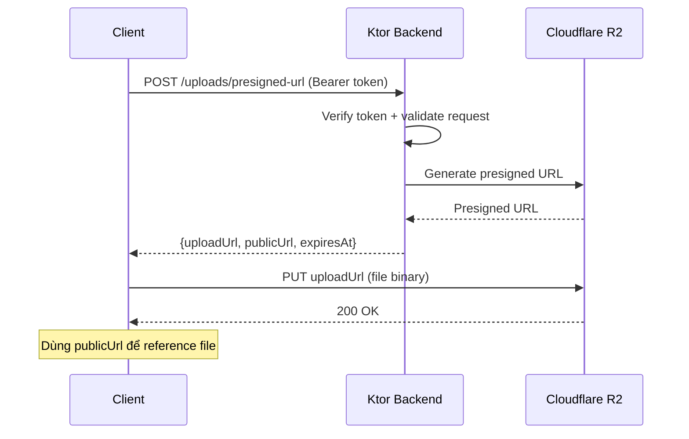

# API Contract — Sequoia Backend

> Tài liệu mô tả chi tiết API contract cho Ktor backend của Sequoia.
> Cập nhật lần cuối: 2026-07-16

---

## 1. Tổng quan

### Base URL

| Môi trường | Base URL |
| --- | --- |
| Development | `http://localhost:8080/api/v1` |
| Staging | `https://api-staging.sequoia.dev/api/v1` |
| Production | `https://api.sequoia.dev/api/v1` |

### Versioning

API sử dụng URL path versioning: `/api/v1/...`. Khi có breaking changes, version mới sẽ được tạo (`/api/v2/...`) và version cũ được duy trì trong thời gian chuyển đổi.

### Authentication

Các endpoint yêu cầu xác thực sử dụng **Firebase ID Token** trong header `Authorization`:

```text
Authorization: Bearer <firebase-id-token>
```

Token được verify bởi Ktor backend (lớp 1) trước khi xử lý request. Client lấy ID token từ Firebase Auth SDK.

### Error Format

Mọi lỗi trả về cùng format thống nhất:

```json
{
  "code": "RESOURCE_NOT_FOUND",
  "message": "Article not found.",
  "details": {
    "slug": "invalid-article-slug"
  }
}
```

| Field | Type | Description |
| --- | --- | --- |
| `code` | `string` | Mã lỗi dạng UPPER_SNAKE_CASE, dùng để client xử lý programmatically |
| `message` | `string` | Mô tả lỗi dạng human-readable |
| `details` | `object \| null` | Thông tin bổ sung, null nếu không có |

### Bảng mã lỗi chung

| HTTP Status | Error Code | Mô tả |
| --- | --- | --- |
| 400 | `INVALID_REQUEST` | Request thiếu field hoặc format sai |
| 401 | `UNAUTHORIZED` | Thiếu hoặc sai token |
| 403 | `FORBIDDEN` | Không có quyền truy cập resource |
| 404 | `RESOURCE_NOT_FOUND` | Resource không tồn tại |
| 409 | `CONFLICT` | Resource đã tồn tại (ví dụ: email đã đăng ký) |
| 429 | `RATE_LIMIT_EXCEEDED` | Vượt quá giới hạn request |
| 500 | `INTERNAL_ERROR` | Lỗi server không xác định |

---

## 2. Endpoints

### 2.1. GET `/api/v1/textbooks` — Danh sách PDF (Textbooks)

Lấy danh sách tất cả file PDF lưu trữ.

| | |
| --- | --- |
| **Auth Required** | ❌ |
| **Method** | `GET` |

#### Response 200

```json
{
  "data": [
    {
      "id": "Ld9kX3mPqR2s",
      "title": "Mathematics for Machine Learning",
      "description": "Comprehensive foundation of mathematics for machine learning...",
      "pdfUrl": "https://r2.sequoia.dev/pdfs/mml.pdf",
      "coverImageUrl": "https://r2.sequoia.dev/covers/nhap-mon-ml.jpg"
    }
  ]
}
```

#### Ví dụ curl

```bash
curl -X GET "https://api.sequoia.dev/api/v1/textbooks"
```

---


### 2.2. GET `/api/v1/topics` — Danh sách chủ đề độc lập (Free Nebulas)

Lấy tất cả chủ đề, sắp xếp theo `sortOrder`.

| | |
| --- | --- |
| **Auth Required** | ❌ |
| **Method** | `GET` |

#### Response 200

```json
{
  "data": [
    {
      "id": "Hj3kM7nPqS9w",
      "name": "Deep Learning Papers",
      "description": "Groundbreaking papers in deep learning history...",
      "iconUrl": "https://r2.sequoia.dev/icons/computer-vision.svg",
      "sortOrder": 1,
      "articleCount": 15,
      "createdAt": 1780272000000
    }
  ]
}
```

#### Ví dụ curl

```bash
curl -X GET "https://api.sequoia.dev/api/v1/topics"
```

---

### 2.3. GET `/api/v1/topics/:id/articles` — Danh sách bài viết (Rogue Stars) theo chủ đề

Lấy danh sách bài viết đã publish thuộc một chủ đề, mới nhất trước.

| | |
| --- | --- |
| **Auth Required** | ❌ |
| **Method** | `GET` |

#### Path Parameters

| Param | Type | Description |
| --- | --- | --- |
| `id` | `string` | ID của chủ đề |

#### Response 200

```json
{
  "data": [
    {
      "id": "attention-is-all-you-need",
      "title": "Attention Is All You Need",
      "slug": "attention-is-all-you-need",
      "summary": "The foundational paper introducing the Transformer architecture...",
      "tags": ["nlp", "transformers", "attention"],
      "isPublished": true,
      "createdAt": 1782871200000
    }
  ]
}
```

#### Response 404

```json
{
  "code": "RESOURCE_NOT_FOUND",
  "message": "Topic not found.",
  "details": { "topicId": "invalid-id" }
}
```

#### Ví dụ curl

```bash
curl -X GET "https://api.sequoia.dev/api/v1/topics/Hj3kM7nPqS9w/articles"
```

---

### 2.4. GET `/api/v1/articles/standalone` — Danh sách bài viết tự do (Standalone Articles)

Lấy danh sách tất cả các bài viết tự do (không thuộc giáo trình hay chủ đề, `textbookId = null` và `topicId = null`). Các bài viết này thường được map vào các bản đồ `rogue_anomalies`.

| | |
| --- | --- |
| **Auth Required** | ❌ |
| **Method** | `GET` |

#### Response 200

```json
{
  "data": [
    {
      "id": "attention-is-all-you-need",
      "title": "Attention Is All You Need",
      "slug": "attention-is-all-you-need",
      "summary": "The foundational paper introducing the Transformer architecture...",
      "tags": ["nlp", "transformers", "attention"],
      "isPublished": true,
      "createdAt": 1782871200000
    }
  ]
}
```

#### Ví dụ curl

```bash
curl -X GET "https://api.sequoia.dev/api/v1/articles/standalone"
```

---

### 2.5. GET `/api/v1/articles/:slug` — Chi tiết bài viết

Lấy toàn bộ nội dung bài viết kèm cấu hình playground dựa trên slug.

| | |
| --- | --- |
| **Auth Required** | ❌ |
| **Method** | `GET` |

#### Path Parameters

| Param | Type | Description |
| --- | --- | --- |
| `slug` | `string` | Slug (URL-friendly ID) của bài viết |

#### Response 200

```json
{
  "data": {
    "id": "norms-and-inner-products",
    "title": "Norms and Inner Products",
    "slug": "norms-and-inner-products",
    "content": "# Norms and Inner Products\n\nIn this log, we explore...",
    "summary": "Understanding distance and angles in vector spaces...",
    "topicId": "Hj3kM7nPqS9w",
    "tags": [
      "linear-algebra", "geometry", "vectors"],
    "isPublished": true,
    "createdAt": 1781053200000,
    "updatedAt": 1784013900000
  }
}
```

> [!IMPORTANT]
> Response chi tiết bài viết **inline model metadata** bên trong mỗi `playgroundBlock`. Client không cần gọi thêm endpoint `/models/:id` để lấy thông tin model cần thiết cho playground.

#### Response 404

```json
{
  "code": "RESOURCE_NOT_FOUND",
  "message": "Article not found.",
  "details": { "slug": "invalid-article-slug" }
}
```

#### Ví dụ curl

```bash
curl -X GET "https://api.sequoia.dev/api/v1/articles/neural-network-co-ban"
```

---

### 2.6. GET `/api/v1/articles/search` — Tìm kiếm full-text

Tìm kiếm bài viết theo từ khóa (dựa trên Tiền tố của `title` HOẶC chính xác `tags` cho phiên bản MVP).

| | |
| --- | --- |
| **Auth Required** | ❌ |
| **Method** | `GET` |

#### Query Parameters

| Param | Type | Required | Default | Description |
| --- | --- | --- | --- | --- |
| `q` | `string` | ✅ | — | Từ khóa tìm kiếm, tối thiểu 2 ký tự |

#### Response 200

```json
{
  "data": [
    {
      "id": "norms-and-inner-products",
      "title": "Norms and Inner Products",
      "slug": "norms-and-inner-products",
      "summary": "Understanding distance and angles in vector spaces...",
      "tags": ["linear-algebra", "geometry", "vectors"],
      "isPublished": true,
      "createdAt": 1781481600000
    }
  ]
}
```

> [!NOTE]
> Tìm kiếm hiện tại sử dụng thuật toán query native của Firestore (chỉ tìm theo Tiền tố của Title HOẶC khớp với Tag) để tiết kiệm chi phí băng thông và lượt đọc.

#### Response 400

```json
{
  "code": "INVALID_REQUEST",
  "message": "Search keyword must be at least 2 characters long.",
  "details": { "field": "q", "minLength": 2 }
}
```

#### Ví dụ curl

```bash
curl -X GET "https://api.sequoia.dev/api/v1/articles/search?q=neural+network"
```

---

### 2.7. GET `/api/v1/models/:id` — Thông tin model + download URL

Lấy metadata và URL tải model AI.

| | |
| --- | --- |
| **Auth Required** | ❌ |
| **Method** | `GET` |

#### Path Parameters

| Param | Type | Description |
| --- | --- | --- |
| `id` | `string` | ID của model |

#### Response 200

```json
{
  "data": {
    "id": "Rt6uI0oLkJ2h",
    "name": "YOLOv8n Object Detection",
    "description": "YOLOv8 nano — lightweight object detection model...",
    "taskType": "object_detection",
    "fileUrl": "https://r2.sequoia.dev/models/yolov8n-v1.0.0.tflite",
    "fileSizeBytes": 6340096,
    "version": "1.0.0",
    "format": "litert",
    "metadataUrl": "https://cdn.jsdelivr.net/gh/USERNAME/sequoia-models/yolov8n/metadata.json",
    "createdAt": 1780272000000,
    "updatedAt": 1782871200000
  }
}
```

> [!TIP]
> `fileUrl` là URL public trên Cloudflare R2. Client tải model trực tiếp từ R2 mà không cần đi qua Ktor backend, giúp giảm tải server và tận dụng CDN global.

#### Ví dụ curl

```bash
curl -X GET "https://api.sequoia.dev/api/v1/models/Rt6uI0oLkJ2h"
```

---

### 2.8. POST `/api/v1/uploads/presigned-url` — Tạo presigned URL upload

Tạo presigned URL để client upload file trực tiếp lên R2.

| | |
| --- | --- |
| **Auth Required** | ✅ |
| **Method** | `POST` |

#### Request Body

```json
{
  "fileName": "cover-ml-textbook.jpg",
  "contentType": "image/jpeg",
  "fileSizeBytes": 245760,
  "category": "covers"
}
```

| Field | Type | Required | Description |
| --- | --- | --- | --- |
| `fileName` | `string` | ✅ | Tên file gốc |
| `contentType` | `string` | ✅ | MIME type: `image/jpeg`, `image/png`, `image/webp`, `image/svg+xml` |
| `fileSizeBytes` | `number` | ✅ | Dung lượng file (bytes), tối đa 10MB cho ảnh |
| `category` | `string` | ✅ | Thư mục lưu trên R2: `covers`, `icons`, `avatars` |

#### Response 200

```json
{
  "data": {
    "uploadUrl": "https://r2.sequoia.dev/covers/a1b2c3d4-cover-ml-textbook.jpg?X-Amz-Algorithm=AWS4-HMAC-SHA256&...",
    "publicUrl": "https://r2.sequoia.dev/covers/a1b2c3d4-cover-ml-textbook.jpg",
    "expiresAt": "2026-07-16T08:00:00Z"
  }
}
```

| Field | Type | Description |
| --- | --- | --- |
| `uploadUrl` | `string` | Presigned URL, dùng HTTP PUT để upload, hết hạn sau 15 phút |
| `publicUrl` | `string` | URL public sau khi upload thành công |
| `expiresAt` | `string` | Thời điểm presigned URL hết hạn |

#### Response 400

```json
{
  "code": "INVALID_REQUEST",
  "message": "Unsupported content type.",
  "details": {
    "allowedTypes": ["image/jpeg", "image/png", "image/webp", "image/svg+xml"]
  }
}
```

#### Luồng upload


```mermaid
sequenceDiagram
    participant C as Client
    participant K as Ktor Backend
    participant R as Cloudflare R2

    C->>K: POST /uploads/presigned-url (Bearer token)
    K->>K: Verify token + validate request
    K->>R: Generate presigned URL
    R-->>K: Presigned URL
    K-->>C: {uploadUrl, publicUrl, expiresAt}
    C->>R: PUT uploadUrl (file binary)
    R-->>C: 200 OK
    Note over C: Dùng publicUrl để reference file
```

#### Ví dụ curl

```bash
# Bước 1: Lấy presigned URL
curl -X POST "https://api.sequoia.dev/api/v1/uploads/presigned-url" \
  -H "Authorization: Bearer <firebase-id-token>" \
  -H "Content-Type: application/json" \
  -d '{
    "fileName": "cover-ml-textbook.jpg",
    "contentType": "image/jpeg",
    "fileSizeBytes": 245760,
    "category": "covers"
  }'

# Bước 2: Upload file lên R2
curl -X PUT "<uploadUrl-from-step-1>" \
  -H "Content-Type: image/jpeg" \
  --data-binary @cover-ml-textbook.jpg
```

> [!NOTE]
> **Authentication Note:**
> Dự án Sequoia sử dụng kiến trúc Firebase Auth trực tiếp trên Client (Frontend). Do đó, Backend Ktor không cung cấp API Đăng nhập (`/auth/login`) hay Đăng ký (`/auth/register`).
> Thay vào đó, Frontend sử dụng Firebase Client SDK để đăng nhập bằng Email/Password hoặc Google. Sau khi đăng nhập thành công, Frontend sẽ lấy `Firebase ID Token` và gửi kèm trong header `Authorization: Bearer <token>` khi gọi các API cần xác thực (như `GET /cosmos/progress/:mapId`).
> Ktor Backend sẽ sử dụng thư viện `ktor-server-auth-jwt` để xác thực token này.

---


### 2.9. GET `/api/v1/users/me` — Thông tin user hiện tại

Lấy thông tin profile của user đang đăng nhập.

| | |
| --- | --- |
| **Auth Required** | ✅ |
| **Method** | `GET` |

#### Response 200

```json
{
  "data": {
    "uid": "fB7xK2mNpQe4rT1u",
    "email": "commander.shepard@alliance.com",
    "displayName": "Commander Shepard",
    "photoUrl": null
  }
}
```

#### Response 401

```json
{
  "code": "UNAUTHORIZED",
  "message": "Invalid or expired token.",
  "details": null
}
```

#### Ví dụ curl

```bash
curl -X GET "https://api.sequoia.dev/api/v1/users/me" \
  -H "Authorization: Bearer <firebase-id-token>"
```

---

### 2.10. GET `/api/v1/cosmos/maps/:mapId` — Lấy Bản đồ Sao (Galaxy Map)

Trả về toàn bộ cấu trúc bản đồ của một Chủ đề hoặc bản đồ tự do. Tối ưu 1 Firestore Read.

| | |
| --- | --- |
| **Auth Required** | ❌ |
| **Method** | `GET` |

#### Response 200

```json
{
  "data": {
    "id": "mml-id",
    "mapType": "topic",
    "theme": "cosmos",
    "nodes": [
      {
        "articleId": "vector-spaces",
        "title": "Vector Spaces",
        "celestialType": "star",
        "x": 150,
        "y": 300,
        "connections": ["matrix-decomp"]
      }
    ]
  }
}
```

---

### 2.11. GET `/api/v1/cosmos/progress/:mapId` — Lấy Tiến trình

Trả về trạng thái tiến độ của user trên bản đồ.

| | |
| --- | --- |
| **Auth Required** | ✅ |
| **Method** | `GET` |

#### Response 200

```json
{
  "data": {
    "progressMap": {
      "vector-spaces": "decoded",
      "matrix-decomp": "decoding",
      "eigenvalues": "locked"
    }
  }
}
```

---

### 2.12. POST `/api/v1/cosmos/progress/:mapId/decode` — Cập nhật Tiến trình (Mở khóa tín hiệu)

Gọi khi người dùng giải mã thành công (chạy xong Signal Tuner).

| | |
| --- | --- |
| **Auth Required** | ✅ |
| **Method** | `POST` |

#### Request Body

```json
{
  "articleId": "matrix-decomp"
}
```

#### Response 200

```json
{
  "data": {
    "success": true,
    "nextUnlocked": ["eigenvalues"]
  }
}
```

---

### 2.13. GET `/api/v1/users/progress/summary` — Tổng hợp tiến độ học tập

Trả về tổng hợp tiến độ học tập của user, phân theo topic và standalone articles.

**Auth Required:** Yes (Bearer Token)

**Response (200 OK):**
```json
{
  "data": {
    "topics": {
      "topic_id_1": {
        "total": 8,
        "completed": 3,
        "decoding": 1
      }
    },
    "standalone": {
      "article_id_1": "decoded",
      "article_id_2": "decoding",
      "article_id_3": "locked"
    }
  }
}
```

**Response Fields:**
- `topics`: Map of topic ID → progress. `total` = tổng articles trong topic, `completed` = đã hoàn thành.
- `standalone`: Map of article ID → status string (`"decoded"`, `"unread"`).

**Error Responses:**
- `401 Unauthorized`: Token không hợp lệ hoặc hết hạn.

**Ví dụ curl:**
```bash
curl -H "Authorization: Bearer <token>" http://localhost:8080/api/v1/users/progress/summary
```

---

## 3. Rate Limiting

### Giới hạn theo loại request

| Loại | Limit | Window | Áp dụng cho |
| --- | --- | --- | --- |
| Public read | 100 requests | 1 phút | Tất cả GET endpoints không auth |
| Authenticated read | 200 requests | 1 phút | GET endpoints có auth |
| Write | 20 requests | 1 phút | POST/PUT/DELETE endpoints |
| Auth (login/register) | 5 requests | 1 phút | `/auth/login`, `/auth/register` |
| Search | 30 requests | 1 phút | `/articles/search` |
| Upload | 10 requests | 1 phút | `/uploads/presigned-url` |

### Cách xác định client

- **Authenticated requests**: rate limit theo `uid` từ Firebase token
- **Unauthenticated requests**: rate limit theo IP address

### Response headers

Mỗi response bao gồm rate limit headers:

```text
X-RateLimit-Limit: 100
X-RateLimit-Remaining: 87
X-RateLimit-Reset: 1752634800
```

| Header | Description |
| --- | --- |
| `X-RateLimit-Limit` | Tổng số request được phép trong window |
| `X-RateLimit-Remaining` | Số request còn lại |
| `X-RateLimit-Reset` | Unix timestamp khi window reset |

### Response 429 — Rate Limit Exceeded

```json
{
  "code": "RATE_LIMIT_EXCEEDED",
  "message": "Too many requests. Please try again later.",
  "details": {
    "retryAfterSeconds": 32
  }
}
```

Headers kèm theo:

```text
Retry-After: 32
X-RateLimit-Limit: 100
X-RateLimit-Remaining: 0
X-RateLimit-Reset: 1752634800
```

> [!TIP]
> Client nên implement exponential backoff khi nhận 429. Bắt đầu với delay từ `retryAfterSeconds`, sau đó nhân đôi cho mỗi lần retry tiếp theo, tối đa 5 lần.
