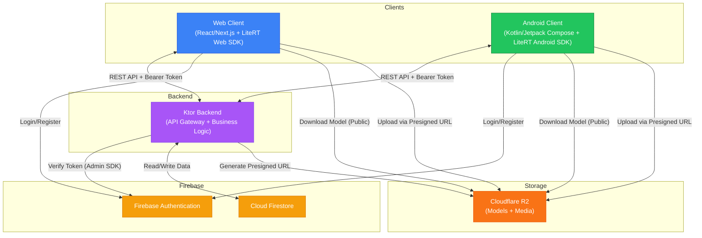
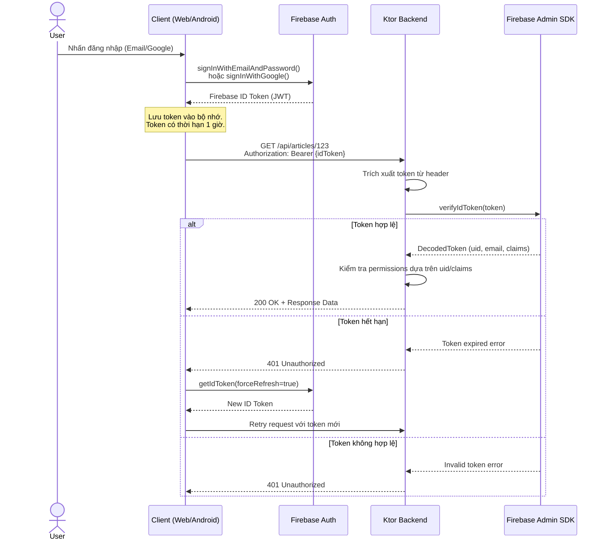
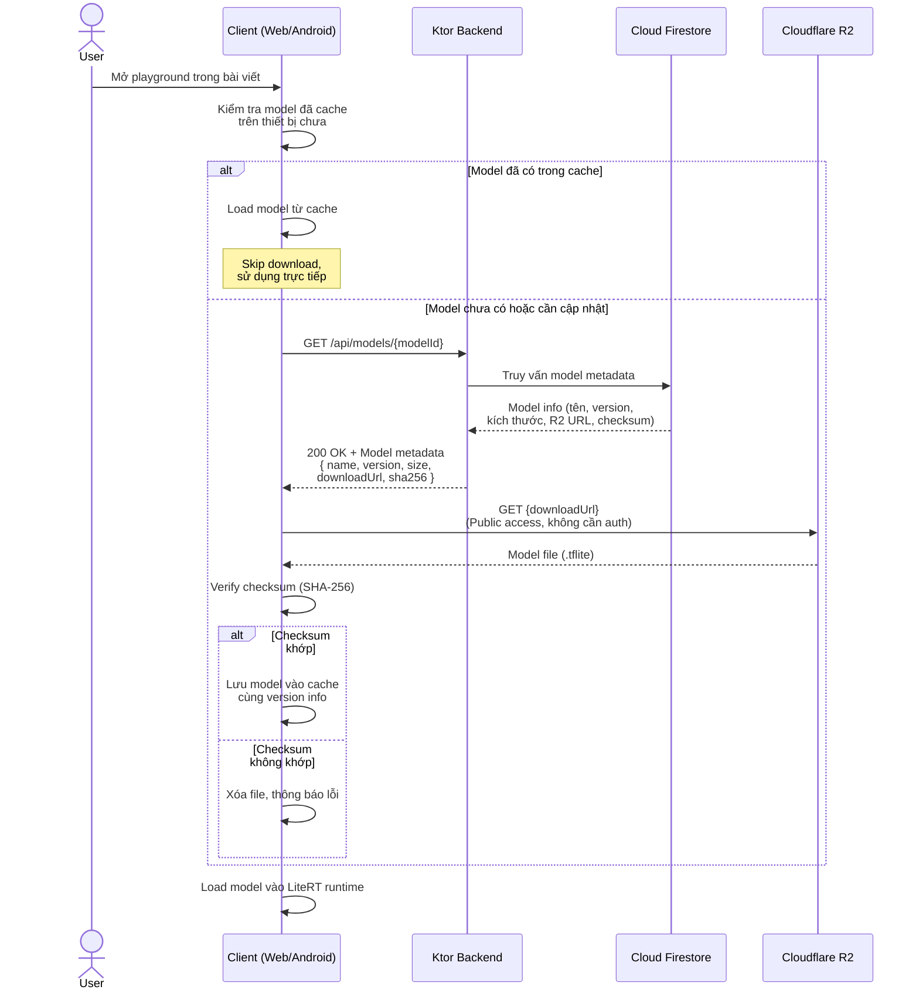
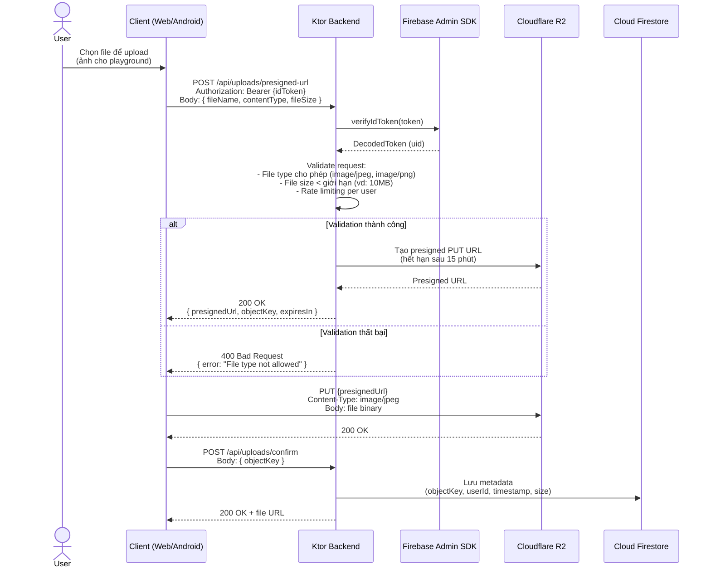
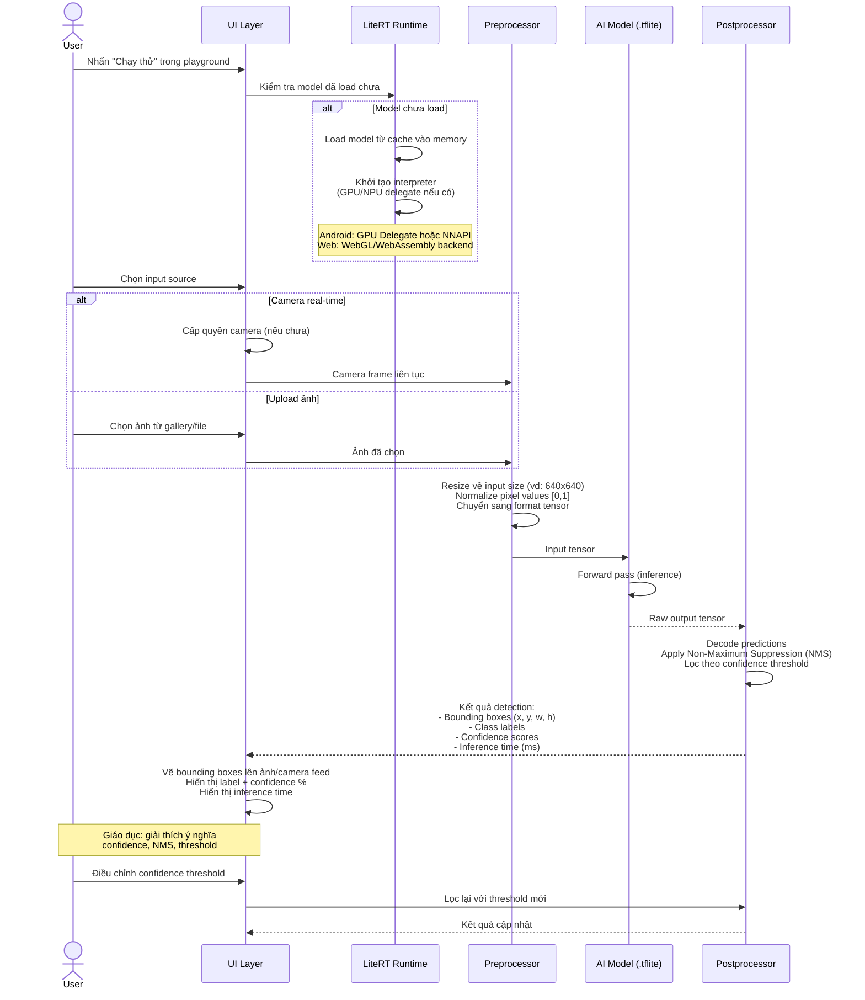
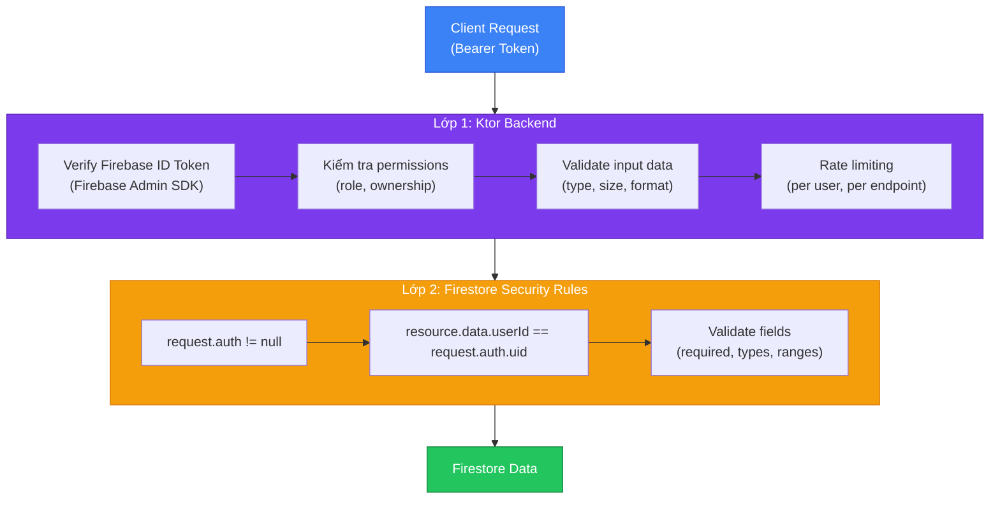

# Kiến trúc hệ thống — Sequoia

> Tài liệu mô tả kiến trúc tổng thể, tech stack, các luồng dữ liệu chính và chiến lược bảo mật của nền tảng Sequoia.

---

## 1. Sơ đồ kiến trúc tổng thể



**Nguyên tắc thiết kế chính:**

- **Ktor là trung tâm điều phối** — mọi request từ client đều đi qua Ktor trước khi truy cập dữ liệu hoặc storage.
- **AI inference chạy hoàn toàn on-device** — Ktor không xử lý inference, chỉ cung cấp metadata và URL tải model.
- **Client tải model/upload file trực tiếp với R2** — Ktor chỉ cấp URL, không proxy dữ liệu lớn qua server để giảm tải bandwidth và latency.
- **Firebase Auth là nguồn xác thực duy nhất** — cả client lẫn Ktor đều dựa vào Firebase ID Token.

---

## 2. Tech stack chi tiết

### 2.1. Tổng quan theo component

| Component | Technology | Vai trò |
| ----------- | ----------- | --------- |
| **Web Frontend** | React / Next.js | SPA/SSR cho giao diện web, render bài viết, nhúng playground |
| **Web AI Runtime** | LiteRT Web SDK (WebAssembly/WebGL) | Chạy model AI trực tiếp trên trình duyệt, không cần server |
| **Android App** | Kotlin + Jetpack Compose | Native Android UI với Material Design 3, UX tối ưu |
| **Android AI Runtime** | LiteRT Android SDK (GPU/NPU delegate) | Inference tận dụng phần cứng GPU/NPU trên thiết bị Android |
| **Backend API** | Ktor (Kotlin) | API Gateway, business logic, xác thực, cấp presigned URL |
| **Database** | Cloud Firestore | NoSQL document database, realtime sync, offline support |
| **Authentication** | Firebase Authentication | Quản lý user, hỗ trợ email/password và Google Sign-In |
| **Object Storage** | Cloudflare R2 | Lưu trữ model files và media, S3-compatible, không egress fee |

### 2.2. Chi tiết từng lớp

#### Web Client

| Thư viện / Công cụ | Mục đích |
| --------------------- | ---------- |
| React / Next.js | Framework UI chính |
| KaTeX | Render công thức toán LaTeX trong bài viết |
| CodeMirror / Prism.js | Syntax highlighting cho code blocks |
| LiteRT Web SDK | Load và chạy `.tflite` model qua WebAssembly/WebGL |
| Firebase JS SDK | Authentication trên web |

#### Android Client

| Thư viện / Công cụ | Mục đích |
| --------------------- | ---------- |
| Jetpack Compose | Declarative UI framework |
| Material Design 3 | Design system, hỗ trợ dynamic color và dark mode |
| CameraX | Truy cập camera cho playground real-time |
| LiteRT Android SDK | Chạy model `.tflite` với GPU/NPU acceleration |
| Firebase Android SDK | Authentication trên Android |
| Ktor Client (Kotlin) | HTTP client gọi API backend |
| Coil | Image loading và caching |

#### Ktor Backend

| Module / Plugin | Mục đích |
| ----------------- | ---------- |
| Ktor Server (Netty) | HTTP server engine |
| Content Negotiation (kotlinx.serialization) | JSON serialization/deserialization |
| Authentication (Bearer) | Xác thực JWT token từ Firebase |
| Firebase Admin SDK | Verify ID Token, quản lý user phía server |
| AWS SDK for Kotlin (S3) | Tương tác với Cloudflare R2 (S3-compatible API) |
| StatusPages | Xử lý lỗi tập trung, trả error response chuẩn |
| CORS | Cấu hình Cross-Origin cho web client |
| CallLogging | Logging request/response cho monitoring |

---

## 3. Luồng xác thực (Authentication Flow)



**Ghi chú quan trọng:**

- Firebase ID Token có **thời hạn 1 giờ**. Client SDK tự động refresh token khi gần hết hạn.
- Ktor **không lưu session** — mỗi request đều verify token độc lập (stateless).
- Một số endpoint public (đọc bài viết, xem danh sách giáo trình) **không yêu cầu auth** — token là optional để cá nhân hóa trải nghiệm (tiến độ đọc, bookmark).

---

## 4. Luồng download model



**Chi tiết caching strategy:**

| Platform | Vị trí cache | Cơ chế kiểm tra version |
| ---------- | ------------- | ------------------------ |
| **Android** | Internal storage (`/data/data/{package}/files/models/`) | So sánh `version` field từ API với version đã lưu trong SharedPreferences |
| **Web** | Cache API hoặc IndexedDB | So sánh `version` field từ API với version lưu trong IndexedDB |

**Tại sao R2 public access?**

- Model files là tài nguyên giáo dục, không chứa dữ liệu nhạy cảm.
- Public access giúp client tải trực tiếp mà không cần proxy qua Ktor, giảm latency và server load.
- Cloudflare R2 không tính phí egress → tối ưu chi phí khi nhiều user tải model.

---

## 5. Luồng upload file



**Tại sao dùng presigned URL thay vì upload qua Ktor?**

- **Giảm tải server** — file binary không đi qua Ktor, tránh bottleneck bandwidth.
- **Tiết kiệm memory** — Ktor không cần buffer file lớn trong RAM.
- **Bảo mật** — Presigned URL có thời hạn ngắn (15 phút), chỉ cho phép upload đúng object key được chỉ định.

---

## 6. Luồng inference on-device



**Hiệu năng inference theo platform:**

| Platform | Backend | Acceleration | Inference time (YOLO) |
| ---------- | --------- | ------------- | ---------------------- |
| Android (high-end) | LiteRT Android SDK | GPU Delegate | ~15-30ms |
| Android (mid-range) | LiteRT Android SDK | CPU (4 threads) | ~50-100ms |
| Web (desktop) | LiteRT Web SDK | WebGL | ~30-60ms |
| Web (mobile browser) | LiteRT Web SDK | WebAssembly | ~80-150ms |

> **Lưu ý:** Thời gian inference phụ thuộc vào kích thước model, độ phân giải input, và phần cứng cụ thể. Các con số trên là ước tính cho YOLO model kích thước nhỏ (~6MB).

---

## 7. Bảo mật defense-in-depth

### 7.1. Mô hình hai lớp bảo vệ



### 7.2. Tại sao cần cả hai lớp?

| Kịch bản tấn công | Lớp 1 (Ktor) | Lớp 2 (Firestore Rules) |
| ------------------- | --------------- | ------------------------ |
| Request không có token | ✅ Reject tại middleware auth | ✅ `request.auth != null` fail |
| Token hợp lệ nhưng truy cập data của user khác | ✅ Kiểm tra ownership trong business logic | ✅ `resource.data.userId == request.auth.uid` |
| Gửi data không hợp lệ (field sai type) | ✅ Validate bằng schema (kotlinx.serialization) | ✅ Field validation trong rules |
| Bypass Ktor, gọi thẳng Firestore | ❌ Không bảo vệ được | ✅ Rules vẫn enforce |
| Bug trong business logic bỏ sót kiểm tra | ❌ Có thể bị miss | ✅ Rules vẫn chặn |
| Brute force / spam requests | ✅ Rate limiting | ❌ Không hỗ trợ native |
| Complex business rule (vd: chỉ admin mới tạo giáo trình) | ✅ Linh hoạt, dễ implement | ⚠️ Có thể nhưng phức tạp |

**Kết luận:** Hai lớp bổ sung cho nhau — Ktor xử lý logic phức tạp và rate limiting, Firestore Rules đảm bảo dữ liệu luôn được bảo vệ ngay cả khi có bug ở tầng application.

### 7.3. Ví dụ Firestore Security Rules

```javascript
rules_version = '2';
service cloud.firestore {
  match /databases/{database}/documents {

    // Users: chỉ đọc/sửa profile của chính mình
    match /users/{userId} {
      allow read: if request.auth != null && request.auth.uid == userId;
      allow write: if request.auth != null && request.auth.uid == userId;
    }

    // Articles: ai cũng đọc được, chỉ admin mới tạo/sửa/xóa
    match /articles/{articleId} {
      allow read: if true;
      allow write: if request.auth != null
                   && request.auth.token.admin == true;
    }

    // Textbooks, Chapters, Topics: tương tự articles
    match /textbooks/{docId} {
      allow read: if true;
      allow write: if request.auth != null
                   && request.auth.token.admin == true;
    }

    match /chapters/{docId} {
      allow read: if true;
      allow write: if request.auth != null
                   && request.auth.token.admin == true;
    }

    match /topics/{docId} {
      allow read: if true;
      allow write: if request.auth != null
                   && request.auth.token.admin == true;
    }

    // Models: ai cũng đọc metadata, chỉ admin mới quản lý
    match /models/{modelId} {
      allow read: if true;
      allow write: if request.auth != null
                   && request.auth.token.admin == true;
    }
  }
}
```

### 7.4. Nguyên tắc bảo mật bổ sung

- **HTTPS everywhere** — Mọi kết nối Client ↔ Ktor đều qua HTTPS.
- **Presigned URL có thời hạn ngắn** — Upload URL hết hạn sau 15 phút.
- **Input validation** — Ktor validate mọi input trước khi xử lý (file type, size, format).
- **CORS** — Chỉ cho phép origin của web client.
- **Không lưu token phía server** — Stateless authentication, mỗi request verify độc lập.
- **Model files là public** — Không chứa dữ liệu nhạy cảm, nhưng có checksum để đảm bảo integrity.

---

## 8. Cấu trúc thư mục dự án

```text
Sequoia/
├── android/                    # Android app (Kotlin + Jetpack Compose)
│   ├── app/
│   │   ├── src/
│   │   │   ├── main/
│   │   │   │   ├── java/.../sequoia/
│   │   │   │   │   ├── data/          # Repository, data source, API client
│   │   │   │   │   ├── domain/        # Use cases, domain models
│   │   │   │   │   ├── ui/            # Compose screens, components
│   │   │   │   │   │   ├── home/
│   │   │   │   │   │   ├── article/
│   │   │   │   │   │   ├── playground/
│   │   │   │   │   │   ├── search/
│   │   │   │   │   │   └── auth/
│   │   │   │   │   ├── ml/            # LiteRT integration, model manager
│   │   │   │   │   └── di/            # Dependency injection (Hilt/Koin)
│   │   │   │   ├── res/
│   │   │   │   └── AndroidManifest.xml
│   │   │   └── test/
│   │   └── build.gradle.kts
│   ├── gradle/
│   └── build.gradle.kts
│
├── web/                        # Web client (React / Next.js)
│   ├── src/
│   │   ├── app/               # Next.js App Router (pages, layouts)
│   │   ├── components/        # Reusable UI components
│   │   │   ├── article/       # Article renderer, LaTeX, code blocks
│   │   │   ├── playground/    # Model playground, canvas, controls
│   │   │   └── common/        # Header, footer, search bar
│   │   ├── lib/               # Utilities, API client, auth helpers
│   │   ├── hooks/             # Custom React hooks
│   │   └── styles/            # CSS/Tailwind styles
│   ├── public/
│   ├── package.json
│   └── next.config.js
│
├── core/                       # Ktor Backend
│   ├── src/
│   │   ├── main/kotlin/.../
│   │   │   ├── Application.kt        # Entry point, plugin installation
│   │   │   ├── plugins/              # Ktor plugins config
│   │   │   │   ├── Authentication.kt
│   │   │   │   ├── Serialization.kt
│   │   │   │   ├── CORS.kt
│   │   │   │   └── StatusPages.kt
│   │   │   ├── routes/               # API route definitions
│   │   │   │   ├── ArticleRoutes.kt
│   │   │   │   ├── TextbookRoutes.kt
│   │   │   │   ├── TopicRoutes.kt
│   │   │   │   ├── ModelRoutes.kt
│   │   │   │   ├── UploadRoutes.kt
│   │   │   │   └── AuthRoutes.kt
│   │   │   ├── services/             # Business logic
│   │   │   ├── models/               # Data classes (request/response)
│   │   │   └── utils/                # Helpers, extensions
│   │   └── test/kotlin/
│   ├── build.gradle.kts
│   └── Dockerfile
│
├── docs/                       # Tài liệu dự án
│   ├── architecture.md         # (File này)
│   ├── user-flows.md
│   ├── data-models.md
│   └── api-reference.md
│
├── .github/                    # CI/CD workflows
├── .gitignore
└── README.md
```

**Quy ước đặt tên:**

| Quy ước | Ví dụ | Áp dụng cho |
| --------- | ------- | ------------- |
| camelCase | `articleRoutes.kt`, `useAuth.ts` | Kotlin files, TypeScript hooks |
| PascalCase | `ArticleScreen.kt`, `PlaygroundCard.tsx` | Compose/React components |
| kebab-case | `user-flows.md`, `api-reference.md` | Documentation files |
| snake_case | `build.gradle.kts` | Build files (theo convention của hệ sinh thái) |
