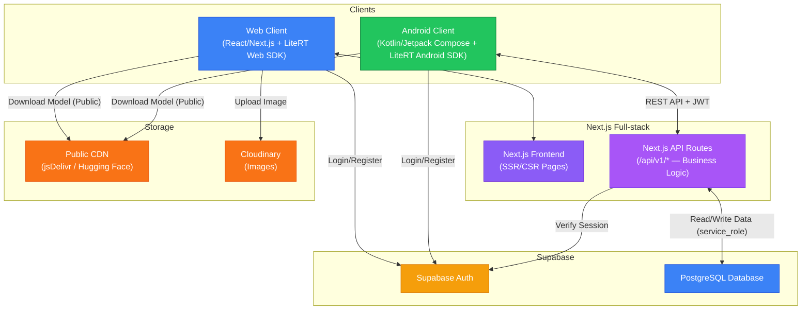
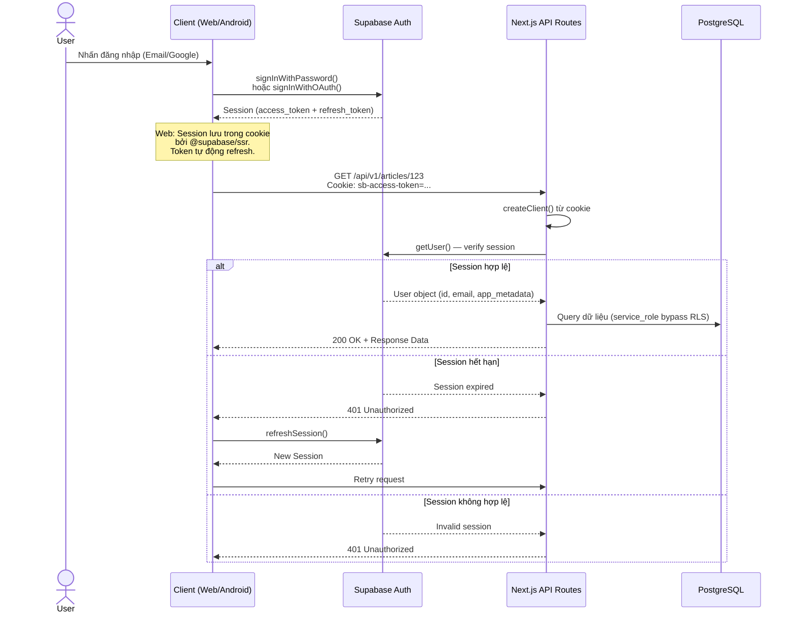
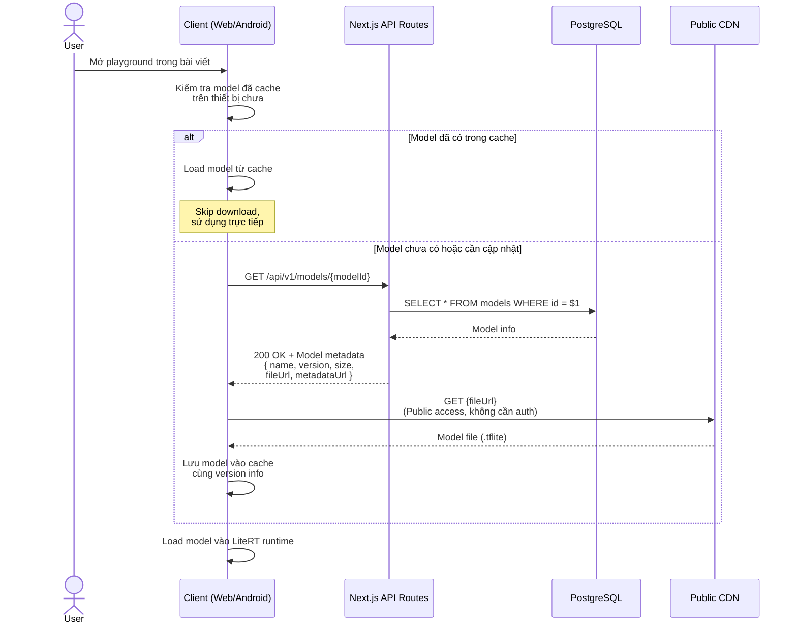
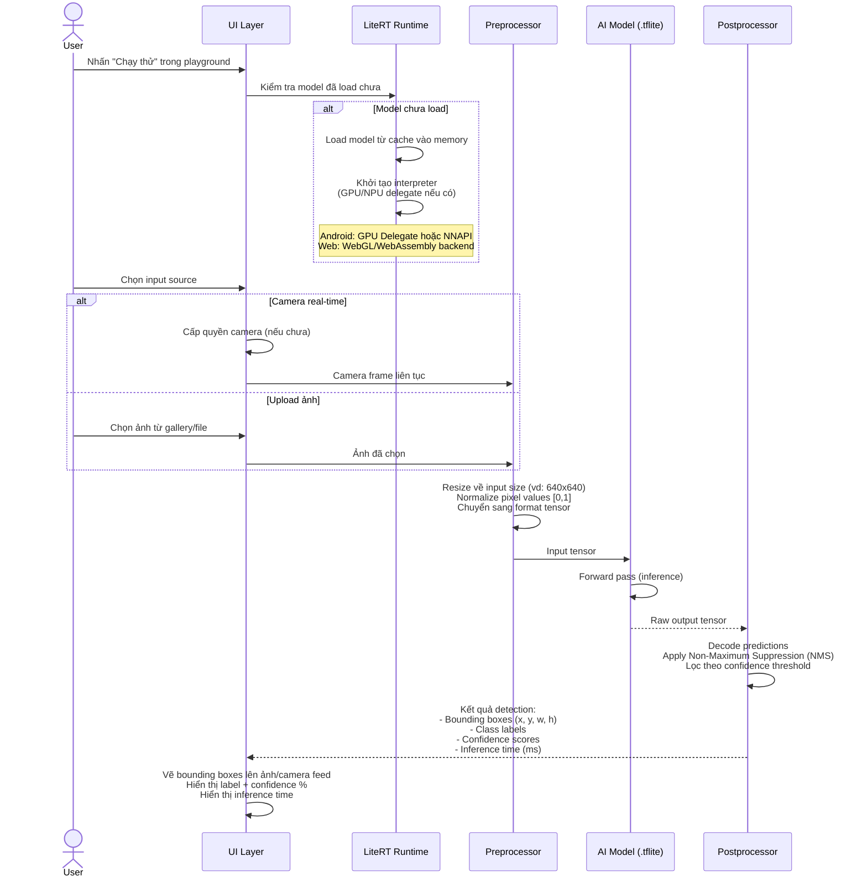
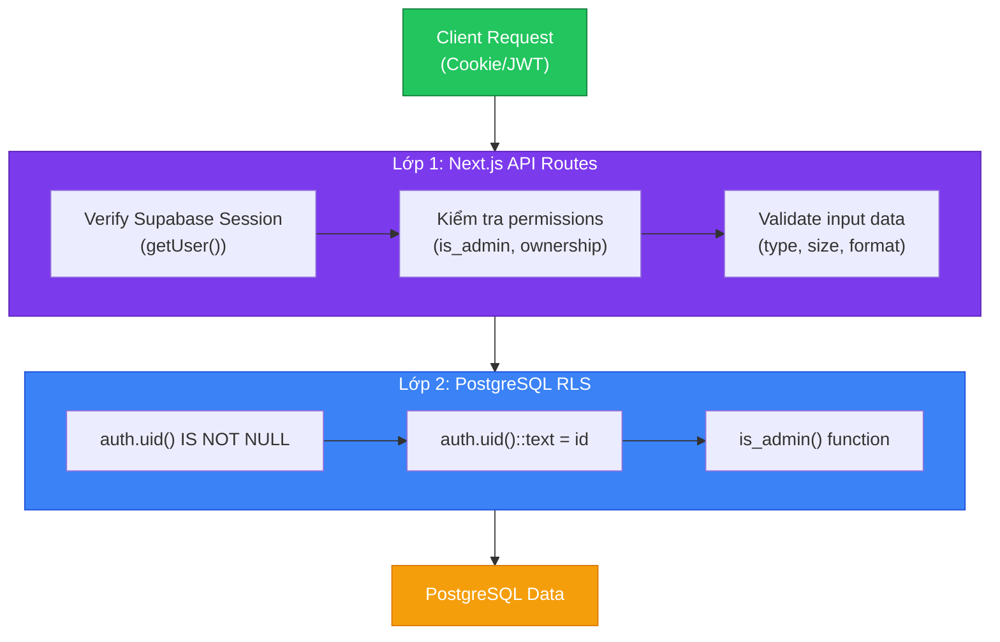

# Kiến trúc hệ thống — Sequoia

> Tài liệu mô tả kiến trúc tổng thể, tech stack, các luồng dữ liệu chính và chiến lược bảo mật của nền tảng Sequoia.
> Cập nhật lần cuối: 2026-08-19

---

## 1. Sơ đồ kiến trúc tổng thể


```mermaid
graph TB
    subgraph Clients
        WEB["Web Client<br/>(React/Next.js + LiteRT Web SDK)"]
        ANDROID["Android Client<br/>(Kotlin/Jetpack Compose + LiteRT Android SDK)"]
    end

    subgraph "Next.js Full-stack"
        FRONTEND["Next.js Frontend<br/>(SSR/CSR Pages)"]
        API["Next.js API Routes<br/>(/api/v1/* — Business Logic)"]
    end

    subgraph Supabase
        AUTH["Supabase Auth"]
        POSTGRES["PostgreSQL Database"]
    end

    subgraph Storage
        CDN["Public CDN<br/>(jsDelivr / Hugging Face)"]
        CLOUDINARY["Cloudinary<br/>(Images)"]
    end

    WEB <--> FRONTEND
    ANDROID <-->|"REST API + JWT"| API

    WEB -->|"Login/Register"| AUTH
    ANDROID -->|"Login/Register"| AUTH

    API -->|"Verify Session"| AUTH
    API <-->|"Read/Write Data (service_role)"| POSTGRES

    WEB -->|"Download Model (Public)"| CDN
    ANDROID -->|"Download Model (Public)"| CDN
    WEB -->|"Upload Image"| CLOUDINARY

    style WEB fill:#3b82f6,stroke:#1d4ed8,color:#fff
    style ANDROID fill:#22c55e,stroke:#15803d,color:#fff
    style FRONTEND fill:#8b5cf6,stroke:#6d28d9,color:#fff
    style API fill:#a855f7,stroke:#7c3aed,color:#fff
    style AUTH fill:#f59e0b,stroke:#d97706,color:#fff
    style POSTGRES fill:#3b82f6,stroke:#1d4ed8,color:#fff
    style CDN fill:#f97316,stroke:#ea580c,color:#fff
    style CLOUDINARY fill:#f97316,stroke:#ea580c,color:#fff
```

**Nguyên tắc thiết kế chính:**

- **Next.js là trung tâm điều phối** — Web Frontend và API Routes cùng deploy trong một ứng dụng, giảm overhead vận hành.
- **AI inference chạy hoàn toàn on-device** — API không xử lý inference, chỉ cung cấp metadata và URL tải model.
- **Client tải model trực tiếp từ CDN** — API không proxy dữ liệu lớn qua server để giảm tải bandwidth và latency.
- **Supabase Auth là nguồn xác thực duy nhất** — cả client lẫn API đều dựa vào Supabase JWT.

---

## 2. Tech stack chi tiết

### 2.1. Tổng quan theo component

| Component | Technology | Vai trò |
| ----------- | ----------- | --------- |
| **Web Frontend** | React / Next.js (App Router) | SSR/CSR cho giao diện web, render bài viết, nhúng playground |
| **Web AI Runtime** | LiteRT Web SDK (WebAssembly/WebGL) | Chạy model AI trực tiếp trên trình duyệt |
| **Web API** | Next.js API Routes | RESTful API, business logic, xác thực |
| **Android App** | Kotlin + Jetpack Compose | Native Android UI với Material Design 3 |
| **Android AI Runtime** | LiteRT Android SDK (GPU/NPU delegate) | Inference tận dụng phần cứng GPU/NPU |
| **Database** | PostgreSQL (Supabase) | Relational database với RLS, triggers, JSONB |
| **Authentication** | Supabase Auth | Quản lý user, hỗ trợ email/password và Google Sign-In |
| **Model Storage** | Public CDN (jsDelivr / Hugging Face) | Host model files, miễn phí, globally distributed |
| **Image Storage** | Cloudinary | Upload và serve hình ảnh bài viết |

### 2.2. Chi tiết từng lớp

#### Web Client (Next.js)

| Thư viện / Công cụ | Mục đích |
| --------------------- | ---------- |
| React / Next.js (App Router) | Framework UI chính, SSR + API Routes |
| @supabase/ssr | Auth session management (cookie-based) |
| KaTeX | Render công thức toán LaTeX trong bài viết |
| react-markdown + remark-gfm | Render Markdown content |
| LiteRT Web SDK | Load và chạy `.tflite` model qua WebAssembly/WebGL |
| Tailwind CSS | Styling framework |

#### Android Client

| Thư viện / Công cụ | Mục đích |
| --------------------- | ---------- |
| Jetpack Compose | Declarative UI framework |
| Material Design 3 | Design system, hỗ trợ dynamic color và dark mode |
| CameraX | Truy cập camera cho playground real-time |
| LiteRT Android SDK | Chạy model `.tflite` với GPU/NPU acceleration |
| Supabase Kotlin Client | Auth + Database trên Android |
| Coil | Image loading và caching |

---

## 3. Luồng xác thực (Authentication Flow)


```mermaid
sequenceDiagram
    actor User
    participant Client as Client (Web/Android)
    participant SupaAuth as Supabase Auth
    participant API as Next.js API Routes
    participant DB as PostgreSQL

    User->>Client: Nhấn đăng nhập (Email/Google)
    Client->>SupaAuth: signInWithPassword()<br/>hoặc signInWithOAuth()
    SupaAuth-->>Client: Session (access_token + refresh_token)
    
    Note over Client: Web: Session lưu trong cookie<br/>bởi @supabase/ssr.<br/>Token tự động refresh.
    
    Client->>API: GET /api/v1/articles/123<br/>Cookie: sb-access-token=...
    
    API->>API: createClient() từ cookie
    API->>SupaAuth: getUser() — verify session
    
    alt Session hợp lệ
        SupaAuth-->>API: User object (id, email, app_metadata)
        API->>DB: Query dữ liệu (service_role bypass RLS)
        API-->>Client: 200 OK + Response Data
    else Session hết hạn
        SupaAuth-->>API: Session expired
        API-->>Client: 401 Unauthorized
        Client->>SupaAuth: refreshSession()
        SupaAuth-->>Client: New Session
        Client->>API: Retry request
    else Session không hợp lệ
        SupaAuth-->>API: Invalid session
        API-->>Client: 401 Unauthorized
    end
```

**Ghi chú quan trọng:**

- Supabase access token có **thời hạn 1 giờ**. `@supabase/ssr` tự động refresh token.
- API Routes **không lưu session** — mỗi request đều verify session độc lập (stateless).
- Một số endpoint public (đọc bài viết, xem danh sách) **không yêu cầu auth**.

---

## 4. Luồng download model


```mermaid
sequenceDiagram
    actor User
    participant Client as Client (Web/Android)
    participant API as Next.js API Routes
    participant DB as PostgreSQL
    participant CDN as Public CDN

    User->>Client: Mở playground trong bài viết

    Client->>Client: Kiểm tra model đã cache<br/>trên thiết bị chưa

    alt Model đã có trong cache
        Client->>Client: Load model từ cache
        Note over Client: Skip download,<br/>sử dụng trực tiếp
    else Model chưa có hoặc cần cập nhật
        Client->>API: GET /api/v1/models/{modelId}
        API->>DB: SELECT * FROM models WHERE id = $1
        DB-->>API: Model info
        API-->>Client: 200 OK + Model metadata<br/>{ name, version, size,<br/>fileUrl, metadataUrl }
        
        Client->>CDN: GET {fileUrl}<br/>(Public access, không cần auth)
        CDN-->>Client: Model file (.tflite)
        
        Client->>Client: Lưu model vào cache<br/>cùng version info
    end

    Client->>Client: Load model vào LiteRT runtime
```

**Chi tiết caching strategy:**

| Platform | Vị trí cache | Cơ chế kiểm tra version |
| ---------- | ------------- | ------------------------ |
| **Android** | Internal storage (`/data/data/{package}/files/models/`) | So sánh `version` field từ API với version đã lưu trong SharedPreferences |
| **Web** | Cache API hoặc IndexedDB | So sánh `version` field từ API với version lưu trong IndexedDB |

**Tại sao dùng Public CDN?**

- Model files là tài nguyên giáo dục, không chứa dữ liệu nhạy cảm.
- Public CDN (jsDelivr, Hugging Face) giúp client tải trực tiếp mà không cần proxy qua API, giảm latency.
- CDN miễn phí và globally distributed → tối ưu chi phí và tốc độ.

---

## 5. Luồng inference on-device


```mermaid
sequenceDiagram
    actor User
    participant UI as UI Layer
    participant Runtime as LiteRT Runtime
    participant Preprocessor as Preprocessor
    participant Model as AI Model (.tflite)
    participant Postprocessor as Postprocessor

    User->>UI: Nhấn "Chạy thử" trong playground
    
    UI->>Runtime: Kiểm tra model đã load chưa
    
    alt Model chưa load
        Runtime->>Runtime: Load model từ cache vào memory
        Runtime->>Runtime: Khởi tạo interpreter<br/>(GPU/NPU delegate nếu có)
        Note over Runtime: Android: GPU Delegate hoặc NNAPI<br/>Web: WebGL/WebAssembly backend
    end

    User->>UI: Chọn input source
    
    alt Camera real-time
        UI->>UI: Cấp quyền camera (nếu chưa)
        UI->>Preprocessor: Camera frame liên tục
    else Upload ảnh
        User->>UI: Chọn ảnh từ gallery/file
        UI->>Preprocessor: Ảnh đã chọn
    end

    Preprocessor->>Preprocessor: Resize về input size (vd: 640x640)<br/>Normalize pixel values [0,1]<br/>Chuyển sang format tensor

    Preprocessor->>Model: Input tensor
    Model->>Model: Forward pass (inference)
    Model-->>Postprocessor: Raw output tensor

    Postprocessor->>Postprocessor: Decode predictions<br/>Apply Non-Maximum Suppression (NMS)<br/>Lọc theo confidence threshold

    Postprocessor-->>UI: Kết quả detection:<br/>- Bounding boxes (x, y, w, h)<br/>- Class labels<br/>- Confidence scores<br/>- Inference time (ms)

    UI->>UI: Vẽ bounding boxes lên ảnh/camera feed<br/>Hiển thị label + confidence %<br/>Hiển thị inference time
```

**Hiệu năng inference theo platform:**

| Platform | Backend | Acceleration | Inference time (YOLO) |
| ---------- | --------- | ------------- | ---------------------- |
| Android (high-end) | LiteRT Android SDK | GPU Delegate | ~15-30ms |
| Android (mid-range) | LiteRT Android SDK | CPU (4 threads) | ~50-100ms |
| Web (desktop) | LiteRT Web SDK | WebGL | ~30-60ms |
| Web (mobile browser) | LiteRT Web SDK | WebAssembly | ~80-150ms |

---

## 6. Bảo mật defense-in-depth

### 6.1. Mô hình hai lớp bảo vệ


```mermaid
graph TB
    CLIENT["Client Request<br/>(Cookie/JWT)"] --> API_LAYER

    subgraph API_LAYER["Lớp 1: Next.js API Routes"]
        VERIFY["Verify Supabase Session<br/>(getUser())"]
        PERMISSION["Kiểm tra permissions<br/>(is_admin, ownership)"]
        VALIDATE["Validate input data<br/>(type, size, format)"]
        
        VERIFY --> PERMISSION --> VALIDATE
    end

    API_LAYER --> RLS_LAYER

    subgraph RLS_LAYER["Lớp 2: PostgreSQL RLS"]
        AUTH_CHECK["auth.uid() IS NOT NULL"]
        OWNER_CHECK["auth.uid()::text = id"]
        ADMIN_CHECK["is_admin() function"]
        
        AUTH_CHECK --> OWNER_CHECK --> ADMIN_CHECK
    end

    RLS_LAYER --> DATA["PostgreSQL Data"]

    style API_LAYER fill:#7c3aed,stroke:#5b21b6,color:#fff
    style RLS_LAYER fill:#3b82f6,stroke:#1d4ed8,color:#fff
    style CLIENT fill:#22c55e,stroke:#15803d,color:#fff
    style DATA fill:#f59e0b,stroke:#d97706,color:#fff
```

### 6.2. Tại sao cần cả hai lớp?

| Kịch bản tấn công | Lớp 1 (API Routes) | Lớp 2 (RLS) |
| ------------------- | --------------- | ------------------------ |
| Request không có session | ✅ Reject tại auth check | ✅ `auth.uid()` trả NULL |
| Session hợp lệ nhưng truy cập data của user khác | ✅ Kiểm tra ownership trong business logic | ✅ `auth.uid()::text = id` |
| Bypass API, dùng anon key truy cập thẳng Supabase | ❌ Không bảo vệ được | ✅ RLS vẫn enforce |
| Bug trong business logic bỏ sót kiểm tra | ❌ Có thể bị miss | ✅ RLS vẫn chặn |

### 6.3. Nguyên tắc bảo mật bổ sung

- **HTTPS everywhere** — Vercel tự cung cấp SSL.
- **`SUPABASE_SERVICE_ROLE_KEY` chỉ dùng phía server** — không bao giờ import trong Client Components.
- **Input validation** — API validate mọi input trước khi xử lý.
- **CORS** — Chỉ cho phép origin của web client.
- **Model files là public** — Không chứa dữ liệu nhạy cảm.

---

## 7. Cấu trúc thư mục dự án

```text
Sequoia/
├── android/                    # Android app (Kotlin + Jetpack Compose)
│   ├── app/
│   │   ├── src/
│   │   │   ├── main/
│   │   │   │   ├── java/.../sequoia/
│   │   │   │   │   ├── data/          # Repository, data source, API client
│   │   │   │   │   ├── domain/        # Use cases, domain models
│   │   │   │   │   ├── ui/            # Compose screens, components
│   │   │   │   │   ├── ml/            # LiteRT integration, model manager
│   │   │   │   │   └── di/            # Dependency injection
│   │   │   │   └── AndroidManifest.xml
│   │   └── build.gradle.kts
│
├── web/                        # Web client + API (Next.js Full-stack)
│   ├── src/
│   │   ├── app/               # Next.js App Router
│   │   │   ├── api/v1/        # API Routes (REST endpoints)
│   │   │   │   ├── admin/     # Admin CRUD (articles, topics, models, textbooks)
│   │   │   │   ├── users/     # User profile & progress
│   │   │   │   └── cosmos/    # Cosmos maps
│   │   │   ├── auth/          # Auth page
│   │   │   ├── dashboard/     # User dashboard
│   │   │   ├── genesis/       # Admin CMS (Genesis Core)
│   │   │   ├── articles/      # Article pages
│   │   │   └── playground/    # Model playground
│   │   ├── components/        # Reusable UI components
│   │   │   ├── admin/         # Admin components (GenesisClient, Forges)
│   │   │   ├── cosmos/        # Galaxy map, nodes
│   │   │   └── ui/            # Common UI elements
│   │   ├── hooks/             # Custom React hooks
│   │   ├── services/          # Service layer (AdminService, UploadService)
│   │   ├── utils/             # Utilities
│   │   │   └── supabase/      # Supabase clients (client.ts, server.ts, admin.ts)
│   │   └── contexts/          # React contexts (Auth, Theme)
│   ├── scripts/               # Seed scripts
│   ├── supabase/migrations/   # SQL migration files
│   ├── package.json
│   └── next.config.ts
│
├── docs/                       # Tài liệu dự án
│   ├── design/                # Thiết kế kỹ thuật
│   ├── analysis/              # Phân tích luồng người dùng
│   ├── requirements/          # PRD
│   ├── management/            # Quy ước, master plan
│   ├── operations/            # Hướng dẫn triển khai
│   └── guides/                # Hướng dẫn sử dụng
│
├── .github/                    # CI/CD workflows
├── .gitignore
└── README.md
```

**Quy ước đặt tên:**

| Quy ước | Ví dụ | Áp dụng cho |
| --------- | ------- | ------------- |
| camelCase | `useAuth.ts`, `adminService.ts` | TypeScript files, hooks |
| PascalCase | `GenesisClient.tsx`, `PlaygroundCard.tsx` | React components |
| kebab-case | `user-flows.md`, `api-contract.md` | Documentation files |
| snake_case | `seed_models.ts`, `00_reset_and_init.sql` | Seed scripts, SQL migrations |
