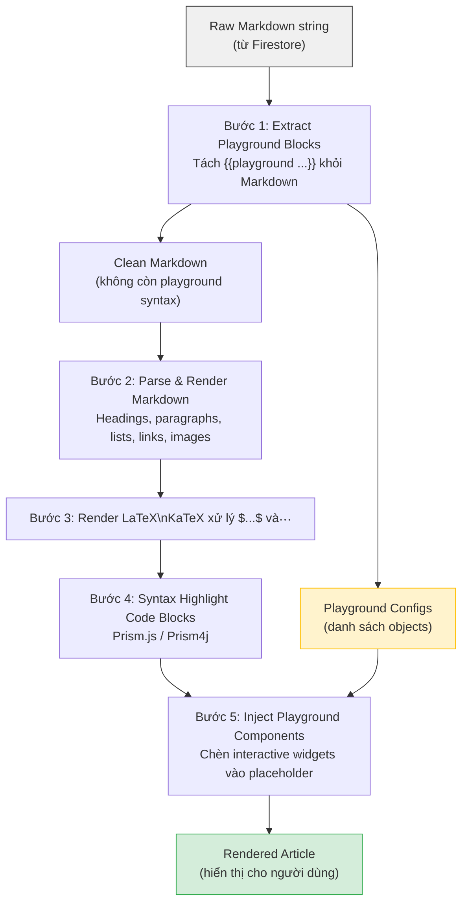
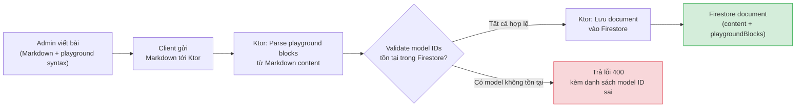

# Quy định định dạng nội dung bài viết — Sequoia

> Tài liệu này quy định cách lưu trữ, cấu trúc, và render nội dung bài viết trên cả Web (React/Next.js) và Android (Kotlin/Jetpack Compose). Mọi thay đổi liên quan đến content format phải cập nhật lại tài liệu này.

---

## Mục lục

1. [Định dạng lưu trữ](#1-định-dạng-lưu-trữ)
2. [Cú pháp nhúng Playground](#2-cú-pháp-nhúng-playground)
3. [Cú pháp nhúng LaTeX](#3-cú-pháp-nhúng-latex)
4. [Cú pháp nhúng Code Blocks](#4-cú-pháp-nhúng-code-blocks)
5. [Cú pháp nhúng hình ảnh](#5-cú-pháp-nhúng-hình-ảnh)
6. [Client-side Rendering Pipeline](#6-client-side-rendering-pipeline)
7. [Lưu trữ trên Firestore](#7-lưu-trữ-trên-firestore)
8. [Ví dụ hoàn chỉnh](#8-ví-dụ-hoàn-chỉnh)

---

## 1. Định dạng lưu trữ

### Quyết định: Markdown là định dạng chính

Toàn bộ nội dung bài viết được lưu trữ dưới dạng **Markdown** (CommonMark + phần mở rộng tùy chỉnh). Nội dung Markdown được lưu nguyên bản dạng chuỗi string trong Firestore và được render phía client.

### Lý do chọn Markdown

| Tiêu chí | Markdown | Rich Text JSON (ProseMirror/Tiptap) | Raw HTML |
| --- | --- | --- | --- |
| **Portable** | ✅ Đọc được bằng bất kỳ text editor nào | ❌ Cần parser riêng để hiển thị | ⚠️ Đọc được nhưng lẫn markup |
| **Dễ viết** | ✅ Cú pháp tối giản, phổ biến | ❌ Cần WYSIWYG editor | ❌ Verbose, dễ sai cú pháp |
| **LaTeX native** | ✅ `$...$` và `$$...$$` nhúng tự nhiên | ⚠️ Cần custom node type | ⚠️ Cần escape ký tự HTML |
| **Code blocks native** | ✅ Fenced code blocks có sẵn | ⚠️ Cần custom node type | ⚠️ Cần `<pre><code>` |
| **Kích thước lưu trữ** | ✅ Nhỏ gọn | ❌ JSON tree phình to 3-5x | ⚠️ Lớn hơn Markdown ~2x |
| **Multiplatform render** | ✅ Thư viện sẵn có (react-markdown, Markwon) | ❌ Mỗi platform cần adapter riêng | ✅ WebView render được, nhưng nặng |
| **Admin CMS tương lai** | ✅ Dùng Markdown editor (Monaco, CodeMirror) | ✅ WYSIWYG tốt nhất | ⚠️ Cần rich text editor |
| **Mở rộng cú pháp** | ✅ Custom block syntax dễ parse | ✅ Custom node types | ⚠️ Custom elements phức tạp |

### Kết luận

Markdown là lựa chọn tối ưu cho Sequoia vì:

1. **Hỗ trợ LaTeX và code blocks natively** — hai yêu cầu cốt lõi cho nội dung AI/ML.
2. **Portable giữa Web và Android** — cùng một source, render bằng thư viện native của từng platform.
3. **Dễ mở rộng** — thêm cú pháp custom (playground blocks) bằng regex parse đơn giản.
4. **Phù hợp với workflow admin** — viết nội dung bằng bất kỳ Markdown editor nào, không phụ thuộc CMS.

---

## 2. Cú pháp nhúng Playground

### Cú pháp

Playground được nhúng trong Markdown bằng **custom block syntax** sử dụng dấu `{{ }}`:

```text
{{playground model="yolo-v8-nano" mode="camera" threshold=0.5}}
```

Block playground **phải nằm trên một dòng riêng biệt**, không được nằm giữa đoạn văn bản. Parser sẽ tách playground block khỏi Markdown trước khi render.

### Danh sách attributes

| Attribute | Bắt buộc | Kiểu | Mô tả | Giá trị mặc định |
| --- | --- | --- | --- | --- |
| `model` | ✅ | `string` | ID của model trong Firestore collection `models`. Phải khớp chính xác với document ID. | — |
| `mode` | ❌ | `string` | Chế độ đầu vào: `"camera"` (dùng camera thiết bị) hoặc `"upload"` (tải ảnh lên). | `"camera"` |
| `threshold` | ❌ | `float` | Ngưỡng confidence mặc định, giá trị từ `0.0` đến `1.0`. Người dùng có thể điều chỉnh khi chạy. | `0.25` |
| `inputSize` | ❌ | `int` | Kích thước ảnh đầu vào (pixel, hình vuông). VD: `320`, `640`. Phải khớp với input size của model. | Lấy từ config model trong Firestore |
| `title` | ❌ | `string` | Tiêu đề hiển thị phía trên playground. Nếu không có, hiển thị tên model. | Tên model từ Firestore |

### Quy tắc cú pháp

- Giá trị string phải đặt trong dấu ngoặc kép: `model="yolo-v8-nano"`.
- Giá trị số không cần ngoặc kép: `threshold=0.5`, `inputSize=640`.
- Thứ tự attributes không quan trọng.
- Một bài viết có thể chứa **nhiều playground blocks** tại các vị trí khác nhau.

### Ví dụ sử dụng

**Playground cơ bản — chỉ cần model ID:**

```text
{{playground model="yolo-v8-nano"}}
```

**Playground đầy đủ tùy chỉnh:**

```text
{{playground model="yolo-v8-nano" mode="upload" threshold=0.5 inputSize=640 title="Thử nghiệm YOLO v8 Nano"}}
```

**Nhiều playground trong cùng bài viết:**

```markdown
## Phần 1: Object Detection cơ bản

Hãy thử nhận diện vật thể bằng YOLO v8 Nano — model nhẹ nhất:

{{playground model="yolo-v8-nano" mode="camera" title="YOLO v8 Nano — Nhẹ, nhanh"}}

## Phần 2: So sánh với model lớn hơn

Bây giờ hãy thử model lớn hơn để so sánh độ chính xác:

{{playground model="yolo-v8-small" mode="camera" title="YOLO v8 Small — Chính xác hơn"}}
```

### Regex pattern để parse

```regex
^\{\{playground\s+((?:\w+="[^"]*"|\w+=[\d.]+)(?:\s+(?:\w+="[^"]*"|\w+=[\d.]+))*)\s*\}\}$
```

Pattern này match dòng bắt đầu và kết thúc bằng `{{ }}`, chứa các cặp `key=value` hoặc `key="value"` phân cách bằng khoảng trắng.

---

## 3. Cú pháp nhúng LaTeX

### Thư viện render

| Platform | Thư viện | Ghi chú |
| --- | --- | --- |
| Web | **KaTeX** | Nhanh hơn MathJax ~10x, render đồng bộ, bundle size nhỏ (~200KB gzip). Dùng `rehype-katex` + `remark-math` tích hợp với react-markdown. |
| Android | **Markwon** + `markwon-ext-latex` | Plugin LaTeX cho Markwon, render bằng KaTeX dưới native. Hoặc dùng KaTeX trong WebView nếu Markwon không đủ phức tạp. |

> **Tại sao KaTeX mà không phải MathJax?**
>
> - KaTeX render nhanh hơn ~10 lần, đặc biệt quan trọng khi bài viết chứa hàng chục công thức.
> - KaTeX render đồng bộ — không gây layout shift sau khi trang đã load.
> - Bundle size nhỏ hơn đáng kể (~200KB vs ~600KB gzip).
> - KaTeX hỗ trợ đủ các ký hiệu cần thiết cho nội dung AI/ML (ma trận, tích phân, tổng, đạo hàm riêng, v.v.).

### Cú pháp inline

Dùng ký hiệu dollar đơn `$...$` cho công thức nằm trong dòng văn bản:

```markdown
Gradient descent cập nhật trọng số theo công thức $\theta_{t+1} = \theta_t - \alpha \nabla J(\theta_t)$ ở mỗi bước lặp.
```

**Kết quả:** Gradient descent cập nhật trọng số theo công thức θₜ₊₁ = θₜ − α∇J(θₜ) ở mỗi bước lặp.

### Cú pháp block

Dùng ký hiệu dollar kép `$$...$$` cho công thức riêng dòng, canh giữa:

```markdown
Hàm mất mát cross-entropy cho bài toán phân loại nhị phân:

$$
\mathcal{L}(\hat{y}, y) = -\frac{1}{N} \sum_{i=1}^{N} \left[ y_i \log(\hat{y}_i) + (1 - y_i) \log(1 - \hat{y}_i) \right]
$$
```

### Các ký hiệu thường dùng trong nội dung AI/ML

| Ký hiệu | LaTeX | Mô tả |
| --- | --- | --- |
| Ma trận | `$\mathbf{W} \in \mathbb{R}^{m \times n}$` | Ma trận trọng số |
| Đạo hàm riêng | `$\frac{\partial \mathcal{L}}{\partial w}$` | Đạo hàm riêng của loss theo w |
| Tổng | `$\sum_{i=1}^{N} x_i$` | Tổng từ 1 đến N |
| Norm | `$\|\mathbf{x}\|_2$` | L2 norm |
| Softmax | `$\sigma(z_i) = \frac{e^{z_i}}{\sum_{j=1}^{K} e^{z_j}}$` | Hàm softmax |
| IoU | `$\text{IoU} = \frac{\|A \cap B\|}{\|A \cup B\|}$` | Intersection over Union — quan trọng cho YOLO |

### Lưu ý quan trọng

- **Không đặt khoảng trắng** giữa ký hiệu `$` và nội dung LaTeX: `$x^2$` ✅, `$ x^2 $` ❌ (một số parser sẽ không nhận diện).
- **Escape ký tự** nếu dùng `$` với nghĩa tiền tệ, viết `\$` để tránh bị parse thành LaTeX.
- **Block LaTeX** (`$$...$$`) phải có dòng trống phía trước và phía sau để parser nhận diện chính xác.

---

## 4. Cú pháp nhúng Code Blocks

### Cú pháp

Sử dụng fenced code blocks chuẩn Markdown với triple backtick và tên ngôn ngữ:

````markdown
```python
import numpy as np

def sigmoid(x):
    return 1 / (1 + np.exp(-x))
```
````

### Ngôn ngữ hỗ trợ

Chỉ load syntax highlighting cho các ngôn ngữ thực sự cần thiết để giữ bundle nhỏ:

| Ngôn ngữ | Identifier | Lý do |
| --- | --- | --- |
| Python | `python` | Ngôn ngữ chính của AI/ML |
| Kotlin | `kotlin` | Code Android và backend Ktor |
| JavaScript | `javascript` | Code Web |
| TypeScript | `typescript` | Code Web (nếu dùng TypeScript) |
| JSON | `json` | Cấu hình, API response |
| Bash | `bash` | Lệnh terminal, cài đặt |
| YAML | `yaml` | Cấu hình model, pipeline |
| LaTeX | `latex` | Block code LaTeX (khác với LaTeX render) |
| Plain text | `text` hoặc không có identifier | Nội dung không cần highlight |

### Thư viện Syntax Highlighting

| Platform | Thư viện | Cấu hình |
| --- | --- | --- |
| Web | **Prism.js** (qua `react-syntax-highlighter`) | Chỉ import các ngôn ngữ cần thiết. Dùng `PrismLight` component để tree-shake. Hỗ trợ theme tùy chỉnh cho dark mode. |
| Android | **Markwon** + `markwon-ext-code-highlight` (dùng Prism4j) | Prism4j là port Java của Prism.js, đảm bảo nhất quán syntax highlight giữa Web và Android. |

### Nút Copy

Mỗi code block hiển thị nút **Copy** ở góc trên bên phải:

- **Web:** Dùng `navigator.clipboard.writeText()`. Nút hiển thị icon copy, chuyển thành icon check ✓ trong 2 giây sau khi copy thành công.
- **Android:** Dùng `ClipboardManager`. Hiển thị Toast "Đã sao chép" sau khi copy.

### Ví dụ code block trong bài viết

````markdown
Cài đặt thư viện cần thiết:

```bash
pip install ultralytics torch torchvision
```

Chạy inference với YOLO:

```python
from ultralytics import YOLO

model = YOLO("yolov8n.pt")
results = model("image.jpg")

for result in results:
    boxes = result.boxes
    for box in boxes:
        confidence = box.conf[0].item()
        class_id = int(box.cls[0].item())
        print(f"Detected: {model.names[class_id]}, Confidence: {confidence:.2f}")
```
````

---

## 5. Cú pháp nhúng hình ảnh

### Cú pháp

Sử dụng cú pháp Markdown chuẩn, URL trỏ tới Cloudflare R2:

```markdown

```

### Quy ước URL

Tất cả hình ảnh trong bài viết được lưu trên Cloudflare R2 bucket công khai. Cấu trúc đường dẫn:

```text
https://cdn.sequoia.app/images/articles/{article-id}/{filename}
```

| Thành phần | Mô tả | Ví dụ |
| --- | --- | --- |
| `cdn.sequoia.app` | Custom domain trỏ tới R2 bucket | — |
| `images/articles/` | Thư mục gốc cho ảnh bài viết | — |
| `{article-id}` | Document ID của bài viết trên Firestore | `intro-to-yolo` |
| `{filename}` | Tên file, snake_case, mô tả nội dung | `yolo_v8_architecture.png` |

### Quy ước đặt tên file ảnh

- Dùng `snake_case`: `yolo_v8_architecture.png` ✅, `YOLO v8 Architecture.png` ❌
- Tên file phải mô tả nội dung: `loss_function_graph.png` ✅, `image1.png` ❌
- Định dạng ưu tiên: **WebP** (kích thước nhỏ, chất lượng tốt), fallback **PNG** (cho sơ đồ, biểu đồ).
- Kích thước tối đa: **2MB** mỗi ảnh. Ảnh lớn hơn phải nén trước khi upload.

### Alt text

Alt text là **bắt buộc** — phải mô tả nội dung ảnh bằng tiếng Việt hoặc tiếng Anh, phục vụ:

- Accessibility (screen reader).
- Fallback khi ảnh không load được.
- SEO trên Web.

---

## 6. Client-side Rendering Pipeline

### Tổng quan luồng render

Nội dung Markdown thô được xử lý qua nhiều bước tuần tự trên client để tạo ra giao diện hoàn chỉnh. Pipeline được thiết kế để **cùng logic trên cả Web và Android**, chỉ khác thư viện cụ thể ở mỗi bước.



### Chi tiết từng bước

#### Bước 1: Extract Playground Blocks

**Input:** Raw Markdown string từ Firestore.

**Xử lý:**

1. Quét từng dòng, tìm pattern `{{playground ...}}` bằng regex.
2. Với mỗi match: parse attributes thành object, ghi nhận vị trí (index dòng trong Markdown).
3. Thay thế dòng playground bằng **placeholder marker** duy nhất, ví dụ: `<!-- playground:0 -->`, `<!-- playground:1 -->`.

**Output:**

- Clean Markdown (playground syntax đã được thay bằng placeholder).
- Danh sách playground configs (array of objects).

```typescript
// Web — Pseudocode
interface PlaygroundConfig {
  index: number;
  model: string;
  mode: "camera" | "upload";
  threshold: number;
  inputSize?: number;
  title?: string;
}

function extractPlaygrounds(markdown: string): {
  cleanMarkdown: string;
  playgrounds: PlaygroundConfig[];
}
```

```kotlin
// Android — Pseudocode
data class PlaygroundConfig(
    val index: Int,
    val model: String,
    val mode: String = "camera",
    val threshold: Float = 0.25f,
    val inputSize: Int? = null,
    val title: String? = null
)

fun extractPlaygrounds(markdown: String): Pair<String, List<PlaygroundConfig>>
```

#### Bước 2: Parse & Render Markdown

| Platform | Thư viện | Ghi chú |
| --- | --- | --- |
| Web | `react-markdown` + `remark-gfm` | Hỗ trợ tables, strikethrough, autolinks. Output là React components. |
| Android | `Markwon` | Render Markdown thành `Spanned` cho `TextView`, hoặc dùng Compose integration. |

Markdown được parse thành các thành phần: headings, paragraphs, lists, links, images, tables, horizontal rules. Placeholder `<!-- playground:N -->` được giữ nguyên qua bước này (sẽ được xử lý ở bước 5).

#### Bước 3: Render LaTeX (KaTeX)

| Platform | Thư viện | Tích hợp |
| --- | --- | --- |
| Web | `remark-math` + `rehype-katex` | Plugin cho react-markdown, tự động nhận diện `$...$` và `$$...$$`, render thành HTML/CSS. |
| Android | `markwon-ext-latex` hoặc KaTeX trong WebView | Nếu dùng Markwon plugin: render inline. Nếu phức tạp: dùng mini WebView cho mỗi block LaTeX. |

#### Bước 4: Syntax Highlight Code Blocks

| Platform | Thư viện | Tích hợp |
| --- | --- | --- |
| Web | `react-syntax-highlighter` (Prism) | Custom renderer cho code blocks trong react-markdown. Thêm nút copy. |
| Android | `markwon-ext-code-highlight` (Prism4j) | Plugin Markwon, highlight tự động theo ngôn ngữ. |

#### Bước 5: Inject Playground Components

**Web:** Quét rendered output tìm placeholder `<!-- playground:N -->`, thay bằng React component `<ModelPlayground config={playgrounds[N]} />`.

**Android:** Tương tự — tìm placeholder trong rendered content, thay bằng Compose component `ModelPlayground(config = playgrounds[N])`.

### So sánh thư viện giữa Web và Android

| Bước | Web | Android |
| --- | --- | --- |
| Markdown Parser | `react-markdown` + `remark-gfm` | `Markwon` |
| LaTeX | `remark-math` + `rehype-katex` | `markwon-ext-latex` |
| Syntax Highlight | `react-syntax-highlighter` (Prism) | `markwon-ext-code-highlight` (Prism4j) |
| Playground | React component | Jetpack Compose component |

---

## 7. Lưu trữ trên Firestore

### Cấu trúc document bài viết (collection `articles`)

```text
articles/{articleId}
```

| Field | Kiểu | Mô tả |
| --- | --- | --- |
| `title` | `string` | Tiêu đề bài viết |
| `slug` | `string` | URL-friendly slug, dùng cho routing. VD: `gioi-thieu-yolo-v8` |
| `content` | `string` | **Nội dung bài viết dạng Markdown**, bao gồm cả cú pháp playground `{{playground ...}}` |
| `summary` | `string` | Tóm tắt ngắn (hiển thị trong danh sách, SEO) |
| `authorId` | `string` | UID của tác giả (reference tới collection `users`) |
| `chapterId` | `string \| null` | ID chương thuộc giáo trình (null nếu không thuộc giáo trình nào) |
| `topicIds` | `array<string>` | Danh sách ID các chủ đề liên quan |
| `tags` | `array<string>` | Tags tìm kiếm. VD: `["yolo", "object-detection", "computer-vision"]` |
| `coverImage` | `string \| null` | URL ảnh bìa trên R2 |
| `playgroundBlocks` | `array<map>` | Danh sách cấu hình playground được extract từ content (xem bên dưới) |
| `readingTimeMinutes` | `number` | Thời gian đọc ước tính (tính bằng phút) |
| `order` | `number` | Thứ tự trong chương (nếu thuộc giáo trình) |
| `status` | `string` | Trạng thái: `"draft"`, `"published"`, `"archived"` |
| `createdAt` | `timestamp` | Thời điểm tạo |
| `updatedAt` | `timestamp` | Thời điểm cập nhật lần cuối |
| `publishedAt` | `timestamp \| null` | Thời điểm xuất bản |

### Field `playgroundBlocks` — Chi tiết

`playgroundBlocks` là **array các map**, được extract từ nội dung Markdown khi tạo hoặc cập nhật bài viết. Mục đích:

1. **Validate model IDs**: Backend (Ktor) kiểm tra tất cả `model` ID trong `playgroundBlocks` có tồn tại trong collection `models` trước khi lưu bài viết.
2. **Prefetch model info**: Client có thể đọc `playgroundBlocks` trước khi parse Markdown để bắt đầu tải model metadata song song.
3. **Thống kê**: Biết bài viết nào dùng model nào mà không cần parse content.

Cấu trúc mỗi phần tử trong `playgroundBlocks`:

```json
{
  "index": 0,
  "model": "yolo-v8-nano",
  "mode": "camera",
  "threshold": 0.5,
  "inputSize": 640,
  "title": "Thử nghiệm YOLO v8 Nano"
}
```

| Field | Kiểu | Mô tả |
| --- | --- | --- |
| `index` | `number` | Thứ tự xuất hiện trong bài viết (0-based) |
| `model` | `string` | Document ID trong collection `models` |
| `mode` | `string` | `"camera"` hoặc `"upload"` |
| `threshold` | `number` | Ngưỡng confidence mặc định |
| `inputSize` | `number \| null` | Kích thước input, null = lấy từ config model |
| `title` | `string \| null` | Tiêu đề tùy chỉnh |

### Luồng lưu bài viết



**Lưu ý quan trọng:** `content` (Markdown) và `playgroundBlocks` (array) phải **luôn đồng bộ**. Mỗi khi `content` được cập nhật, Ktor phải re-parse playground blocks và cập nhật `playgroundBlocks` tương ứng. Không bao giờ chỉ cập nhật một trong hai.

---

## 8. Ví dụ hoàn chỉnh

### Nội dung Markdown mẫu

Dưới đây là một bài viết mẫu sử dụng đầy đủ các tính năng: heading, text, LaTeX inline + block, code block, hình ảnh, và playground nhúng.

````markdown
# Giới thiệu YOLO v8 — Object Detection thời gian thực

YOLO (You Only Look Once) là họ mô hình **object detection** nổi tiếng nhất hiện nay.
Không giống các phương pháp two-stage như Faster R-CNN, YOLO xử lý toàn bộ ảnh
trong **một lần forward pass** duy nhất, cho tốc độ cực nhanh.

## 1. Ý tưởng cốt lõi

YOLO chia ảnh đầu vào thành lưới $S \times S$ ô. Mỗi ô chịu trách nhiệm dự đoán
$B$ bounding boxes và confidence score tương ứng.

Confidence score được định nghĩa:

$$
\text{Confidence} = P(\text{Object}) \times \text{IoU}_{\text{pred}}^{\text{truth}}
$$

trong đó $\text{IoU}$ (Intersection over Union) đo mức độ trùng khớp giữa
bounding box dự đoán và ground truth:

$$
\text{IoU} = \frac{|B_{\text{pred}} \cap B_{\text{gt}}|}{|B_{\text{pred}} \cup B_{\text{gt}}|}
$$


## 2. Hàm mất mát

Hàm loss của YOLO kết hợp ba thành phần: **localization loss**, **confidence loss**,
và **classification loss**:

$$
\mathcal{L} = \lambda_{\text{coord}} \mathcal{L}_{\text{loc}} + \mathcal{L}_{\text{conf}} + \lambda_{\text{class}} \mathcal{L}_{\text{cls}}
$$

với $\lambda_{\text{coord}} = 5$ và $\lambda_{\text{class}} = 1$ theo paper gốc.

## 3. Chạy inference với Python

Cài đặt thư viện Ultralytics:

```bash
pip install ultralytics
```

Chạy YOLO trên một ảnh:

```python
from ultralytics import YOLO

# Tải model YOLOv8 Nano (nhẹ nhất, ~3.2M params)
model = YOLO("yolov8n.pt")

# Chạy inference
results = model("bus.jpg")

# In kết quả
for result in results:
    for box in result.boxes:
        cls_name = model.names[int(box.cls[0])]
        conf = box.conf[0].item()
        x1, y1, x2, y2 = box.xyxy[0].tolist()
        print(f"{cls_name}: {conf:.2f} at [{x1:.0f}, {y1:.0f}, {x2:.0f}, {y2:.0f}]")
```

## 4. Thử nghiệm trực tiếp

Hãy trải nghiệm YOLO v8 Nano ngay trên thiết bị của bạn. Hướng camera vào các
vật thể xung quanh và quan sát kết quả nhận diện:

{{playground model="yolo-v8-nano" mode="camera" threshold=0.25 title="YOLO v8 Nano — Real-time Detection"}}

Thử tăng threshold lên 0.7 — bạn sẽ thấy model chỉ hiển thị những dự đoán mà
nó thực sự "tự tin". Đây chính là tradeoff giữa **precision** và **recall**.

Bây giờ hãy thử với ảnh tải lên để so sánh:

{{playground model="yolo-v8-nano" mode="upload" threshold=0.5 title="YOLO v8 Nano — Upload ảnh"}}

## 5. Tổng kết

| Đặc điểm | YOLO v8 Nano | YOLO v8 Small |
| --- | --- | --- |
| Params | ~3.2M | ~11.2M |
| mAP (COCO) | 37.3 | 44.9 |
| Inference time (CPU) | ~80ms | ~150ms |

YOLO v8 Nano là lựa chọn lý tưởng cho ứng dụng **on-device** nhờ kích thước nhỏ
và tốc độ nhanh, dù đánh đổi một phần độ chính xác so với các biến thể lớn hơn.
````

### Document JSON trên Firestore

```json
{
  "title": "Giới thiệu YOLO v8 — Object Detection thời gian thực",
  "slug": "gioi-thieu-yolo-v8",
  "content": "# Giới thiệu YOLO v8 — Object Detection thời gian thực\n\nYOLO (You Only Look Once) là họ mô hình **object detection** nổi tiếng nhất hiện nay.\nKhông giống các phương pháp two-stage như Faster R-CNN, YOLO xử lý toàn bộ ảnh\ntrong **một lần forward pass** duy nhất, cho tốc độ cực nhanh.\n\n## 1. Ý tưởng cốt lõi\n\nYOLO chia ảnh đầu vào thành lưới $S \\times S$ ô. Mỗi ô chịu trách nhiệm dự đoán\n$B$ bounding boxes và confidence score tương ứng.\n\nConfidence score được định nghĩa:\n\n$$\n\\text{Confidence} = P(\\text{Object}) \\times \\text{IoU}_{\\text{pred}}^{\\text{truth}}\n$$\n\ntrong đó $\\text{IoU}$ (Intersection over Union) đo mức độ trùng khớp giữa\nbounding box dự đoán và ground truth:\n\n$$\n\\text{IoU} = \\frac{|B_{\\text{pred}} \\cap B_{\\text{gt}}|}{|B_{\\text{pred}} \\cup B_{\\text{gt}}|}\n$$\n\n\n\n## 2. Hàm mất mát\n\nHàm loss của YOLO kết hợp ba thành phần: **localization loss**, **confidence loss**,\nvà **classification loss**:\n\n$$\n\\mathcal{L} = \\lambda_{\\text{coord}} \\mathcal{L}_{\\text{loc}} + \\mathcal{L}_{\\text{conf}} + \\lambda_{\\text{class}} \\mathcal{L}_{\\text{cls}}\n$$\n\nvới $\\lambda_{\\text{coord}} = 5$ và $\\lambda_{\\text{class}} = 1$ theo paper gốc.\n\n## 3. Chạy inference với Python\n\nCài đặt thư viện Ultralytics:\n\n```bash\npip install ultralytics\n```\n\nChạy YOLO trên một ảnh:\n\n```python\nfrom ultralytics import YOLO\n\n# Tải model YOLOv8 Nano (nhẹ nhất, ~3.2M params)\nmodel = YOLO(\"yolov8n.pt\")\n\n# Chạy inference\nresults = model(\"bus.jpg\")\n\n# In kết quả\nfor result in results:\n    for box in result.boxes:\n        cls_name = model.names[int(box.cls[0])]\n        conf = box.conf[0].item()\n        x1, y1, x2, y2 = box.xyxy[0].tolist()\n        print(f\"{cls_name}: {conf:.2f} at [{x1:.0f}, {y1:.0f}, {x2:.0f}, {y2:.0f}]\")\n```\n\n## 4. Thử nghiệm trực tiếp\n\nHãy trải nghiệm YOLO v8 Nano ngay trên thiết bị của bạn. Hướng camera vào các\nvật thể xung quanh và quan sát kết quả nhận diện:\n\n{{playground model=\"yolo-v8-nano\" mode=\"camera\" threshold=0.25 title=\"YOLO v8 Nano — Real-time Detection\"}}\n\nThử tăng threshold lên 0.7 — bạn sẽ thấy model chỉ hiển thị những dự đoán mà\nnó thực sự \"tự tin\". Đây chính là tradeoff giữa **precision** và **recall**.\n\nBây giờ hãy thử với ảnh tải lên để so sánh:\n\n{{playground model=\"yolo-v8-nano\" mode=\"upload\" threshold=0.5 title=\"YOLO v8 Nano — Upload ảnh\"}}\n\n## 5. Tổng kết\n\n| Đặc điểm | YOLO v8 Nano | YOLO v8 Small |\n| --- | --- | --- |\n| Params | ~3.2M | ~11.2M |\n| mAP (COCO) | 37.3 | 44.9 |\n| Inference time (CPU) | ~80ms | ~150ms |\n\nYOLO v8 Nano là lựa chọn lý tưởng cho ứng dụng **on-device** nhờ kích thước nhỏ\nvà tốc độ nhanh, dù đánh đổi một phần độ chính xác so với các biến thể lớn hơn.",
  "summary": "Tìm hiểu YOLO v8 — mô hình object detection nhanh nhất hiện nay. Từ ý tưởng chia lưới, hàm loss, đến thực hành chạy inference trên thiết bị.",
  "authorId": "admin-uid-001",
  "chapterId": "chapter-object-detection",
  "topicIds": ["computer-vision", "object-detection"],
  "tags": ["yolo", "object-detection", "computer-vision", "litert", "on-device"],
  "coverImage": "https://cdn.sequoia.app/images/articles/intro-to-yolo/cover.webp",
  "playgroundBlocks": [
    {
      "index": 0,
      "model": "yolo-v8-nano",
      "mode": "camera",
      "threshold": 0.25,
      "inputSize": null,
      "title": "YOLO v8 Nano — Real-time Detection"
    },
    {
      "index": 1,
      "model": "yolo-v8-nano",
      "mode": "upload",
      "threshold": 0.5,
      "inputSize": null,
      "title": "YOLO v8 Nano — Upload ảnh"
    }
  ],
  "readingTimeMinutes": 8,
  "order": 1,
  "status": "published",
  "createdAt": "2026-07-15T10:00:00Z",
  "updatedAt": "2026-07-16T07:30:00Z",
  "publishedAt": "2026-07-15T14:00:00Z"
}
```

### Ghi chú về document mẫu

- Field `content` chứa **toàn bộ Markdown** bao gồm cả `{{playground ...}}` syntax — đây là source of truth.
- Field `playgroundBlocks` là **derived data** — được Ktor tự động extract từ `content` mỗi khi lưu, không bao giờ chỉnh tay.
- Trong `content` JSON, ký tự `\` trong LaTeX phải được escape thành `\\` (chuẩn JSON). Client unescape khi parse.
- Ảnh dùng URL R2 hoàn chỉnh (`https://cdn.sequoia.app/...`), không dùng relative path.

---

## Phụ lục: Checklist khi thêm element mới vào content format

Khi cần bổ sung loại element mới (ví dụ: nhúng video, interactive quiz, v.v.):

- [ ] Định nghĩa cú pháp Markdown custom.
- [ ] Viết regex parser cho element mới.
- [ ] Cập nhật rendering pipeline (cả Web và Android).
- [ ] Cập nhật Firestore schema nếu cần field mới.
- [ ] Thêm validation ở Ktor backend.
- [ ] Cập nhật tài liệu này.
- [ ] Viết test case cho parser.
