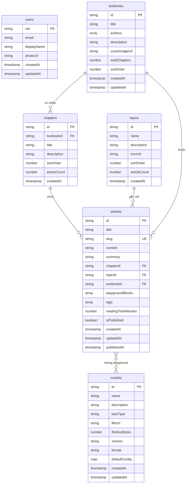

# Thiết kế Firestore — Data Model

> Tài liệu mô tả chi tiết cấu trúc dữ liệu Firestore cho nền tảng Sequoia.
> Cập nhật lần cuối: 2026-07-16

---

## 1. Tổng quan quan hệ giữa các Collections



### Ghi chú quan hệ

| Quan hệ | Mô tả |
| --- | --- |
| `textbooks` → `chapters` | 1:N — Một giáo trình có nhiều chương, liên kết qua `chapters.textbookId` |
| `chapters` → `articles` | 1:N — Một chương chứa nhiều bài viết, liên kết qua `articles.chapterId` |
| `topics` → `articles` | 1:N — Một chủ đề gắn nhiều bài viết, liên kết qua `articles.topicId` |
| `textbooks` → `articles` | 1:N — Denormalized ref để query nhanh, liên kết qua `articles.textbookId` |
| `articles` ↔ `models` | N:M — Bài viết nhúng nhiều model qua mảng `playgroundBlocks[].modelId` |

> [!IMPORTANT]
> Một bài viết có thể **đồng thời** thuộc một chương trong giáo trình VÀ một chủ đề độc lập. Cả `chapterId` và `topicId` đều optional — bài viết phải có ít nhất một trong hai.

---

## 2. Chi tiết từng Collection

### 2.1. `users`

Collection lưu thông tin người dùng, document ID trùng với Firebase Auth UID.

| Field | Type | Required | Description |
| --- | --- | --- | --- |
| `uid` | `string` | ✅ | Firebase Auth UID, đồng thời là document ID |
| `email` | `string` | ✅ | Email đăng ký, unique |
| `displayName` | `string` | ✅ | Tên hiển thị của người dùng |
| `photoUrl` | `string` | ❌ | URL ảnh đại diện (lưu trên R2 hoặc Google avatar) |
| `createdAt` | `timestamp` | ✅ | Thời điểm tạo tài khoản, set bởi server |
| `updatedAt` | `timestamp` | ✅ | Thời điểm cập nhật gần nhất, set bởi server |

---

### 2.2. `textbooks`

Collection lưu thông tin giáo trình (sách).

| Field | Type | Required | Description |
| --- | --- | --- | --- |
| `id` | `string` | ✅ | Auto-generated document ID |
| `title` | `string` | ✅ | Tên giáo trình, ví dụ: "Nhập môn Machine Learning" |
| `authors` | `array<string>` | ✅ | Danh sách tác giả, ít nhất 1 phần tử |
| `description` | `string` | ✅ | Mô tả ngắn về nội dung giáo trình |
| `coverImageUrl` | `string` | ❌ | URL ảnh bìa trên R2, null nếu chưa upload |
| `totalChapters` | `number` | ✅ | Tổng số chương, cập nhật khi thêm/xóa chapter (denormalized) |
| `sortOrder` | `number` | ✅ | Thứ tự hiển thị trên danh sách, giá trị nhỏ hiển thị trước |
| `createdAt` | `timestamp` | ✅ | Thời điểm tạo |
| `updatedAt` | `timestamp` | ✅ | Thời điểm cập nhật gần nhất |

---

### 2.3. `chapters`

Collection lưu thông tin chương thuộc giáo trình.

| Field | Type | Required | Description |
| --- | --- | --- | --- |
| `id` | `string` | ✅ | Auto-generated document ID |
| `textbookId` | `string` | ✅ | Reference đến `textbooks` document, dùng cho query |
| `title` | `string` | ✅ | Tên chương, ví dụ: "Chương 3: Neural Networks cơ bản" |
| `description` | `string` | ❌ | Mô tả nội dung chương |
| `sortOrder` | `number` | ✅ | Thứ tự chương trong giáo trình (1, 2, 3...) |
| `articleCount` | `number` | ✅ | Số bài viết trong chương (denormalized), default `0` |
| `createdAt` | `timestamp` | ✅ | Thời điểm tạo |

---

### 2.4. `topics`

Collection lưu thông tin chủ đề độc lập (không thuộc giáo trình).

| Field | Type | Required | Description |
| --- | --- | --- | --- |
| `id` | `string` | ✅ | Auto-generated document ID |
| `name` | `string` | ✅ | Tên chủ đề, ví dụ: "Computer Vision", "NLP" |
| `description` | `string` | ✅ | Mô tả chủ đề |
| `iconUrl` | `string` | ❌ | URL icon đại diện cho chủ đề (SVG/PNG trên R2) |
| `sortOrder` | `number` | ✅ | Thứ tự hiển thị |
| `articleCount` | `number` | ✅ | Số bài viết thuộc chủ đề (denormalized), default `0` |
| `createdAt` | `timestamp` | ✅ | Thời điểm tạo |

---

### 2.5. `articles`

Collection trung tâm lưu nội dung bài viết. Đây là collection phức tạp nhất vì liên kết với cả `chapters`, `topics`, và `models`.

| Field | Type | Required | Description |
| --- | --- | --- | --- |
| `id` | `string` | ✅ | Document ID, dùng custom slug (xem mục 4) |
| `title` | `string` | ✅ | Tiêu đề bài viết |
| `slug` | `string` | ✅ | URL-friendly identifier, unique, dùng làm document ID |
| `content` | `string` | ✅ | Nội dung bài viết dạng Markdown (hỗ trợ KaTeX, code blocks) |
| `summary` | `string` | ✅ | Tóm tắt ngắn, hiển thị trong danh sách / SEO meta |
| `chapterId` | `string` | ❌ | Reference đến `chapters` document, null nếu không thuộc giáo trình |
| `topicId` | `string` | ❌ | Reference đến `topics` document, null nếu không thuộc chủ đề |
| `textbookId` | `string` | ❌ | Denormalized reference đến `textbooks`, luôn đi kèm `chapterId` |
| `playgroundBlocks` | `array<map>` | ✅ | Mảng các playground nhúng trong bài, có thể rỗng `[]` |
| `playgroundBlocks[].modelId` | `string` | ✅ | Reference đến `models` document |
| `playgroundBlocks[].position` | `number` | ✅ | Vị trí nhúng trong content (paragraph index hoặc marker ID) |
| `playgroundBlocks[].defaultConfig` | `map` | ✅ | Config mặc định cho playground instance này |
| `tags` | `array<string>` | ✅ | Tags phân loại, có thể rỗng `[]`, ví dụ: `["cnn", "image"]` |
| `readingTimeMinutes` | `number` | ✅ | Thời gian đọc ước tính (phút), tính từ word count |
| `createdAt` | `timestamp` | ✅ | Thời điểm tạo |
| `updatedAt` | `timestamp` | ✅ | Thời điểm cập nhật gần nhất |
| `publishedAt` | `timestamp` | ❌ | Thời điểm publish, null nếu chưa publish |
| `isPublished` | `boolean` | ✅ | Trạng thái publish, default `false` |

> [!NOTE]
> `textbookId` trong `articles` là denormalized field — khi bài viết thuộc một chương, `textbookId` được copy từ `chapters.textbookId` để tránh query 2 bước khi cần lọc bài theo giáo trình.

---

### 2.6. `models`

Collection lưu metadata của các mô hình AI. File model thực tế lưu trên Cloudflare R2.

| Field | Type | Required | Description |
| --- | --- | --- | --- |
| `id` | `string` | ✅ | Auto-generated document ID |
| `name` | `string` | ✅ | Tên model, ví dụ: "YOLOv8n Object Detection" |
| `description` | `string` | ✅ | Mô tả model: kiến trúc, công dụng, hạn chế |
| `taskType` | `string` | ✅ | Loại tác vụ: `object_detection`, `classification`, `segmentation`, `text_generation` |
| `fileUrl` | `string` | ✅ | URL public trên R2 để tải model, ví dụ: `https://r2.sequoia.dev/models/yolov8n.tflite` |
| `fileSizeBytes` | `number` | ✅ | Dung lượng file model tính bằng bytes |
| `version` | `string` | ✅ | Phiên bản model, format semver: `"1.0.0"` |
| `format` | `string` | ✅ | Định dạng file model: `"litert"` (TFLite), mở rộng sau: `"onnx"`, `"coreml"` |
| `defaultConfig` | `map` | ✅ | Cấu hình mặc định khi chạy model |
| `defaultConfig.threshold` | `number` | ✅ | Ngưỡng confidence mặc định (0.0 – 1.0), ví dụ: `0.5` |
| `defaultConfig.inputSize` | `number` | ✅ | Kích thước ảnh input (px), ví dụ: `320`, `640` |
| `createdAt` | `timestamp` | ✅ | Thời điểm tạo |
| `updatedAt` | `timestamp` | ✅ | Thời điểm cập nhật gần nhất |

---

## 3. Composite Indexes cần tạo

Firestore tự động tạo single-field indexes. Các composite indexes dưới đây cần tạo thủ công cho các query phổ biến.

| # | Collection | Fields | Mục đích |
| --- | --- | --- | --- |
| 1 | `chapters` | `textbookId` ASC, `sortOrder` ASC | Lấy danh sách chương theo giáo trình, sắp xếp theo thứ tự |
| 2 | `articles` | `chapterId` ASC, `sortOrder` ASC | Lấy danh sách bài viết theo chương, sắp xếp theo thứ tự |
| 3 | `articles` | `topicId` ASC, `publishedAt` DESC | Lấy bài viết theo chủ đề, bài mới nhất trước |
| 4 | `articles` | `textbookId` ASC, `isPublished` ASC, `publishedAt` DESC | Lấy bài đã publish theo giáo trình |
| 5 | `articles` | `isPublished` ASC, `publishedAt` DESC | Lấy tất cả bài đã publish, mới nhất trước (trang chủ) |
| 6 | `articles` | `isPublished` ASC, `tags` ARRAY_CONTAINS, `publishedAt` DESC | Lọc bài theo tag |
| 7 | `textbooks` | `sortOrder` ASC | Sắp xếp giáo trình theo thứ tự |
| 8 | `topics` | `sortOrder` ASC | Sắp xếp chủ đề theo thứ tự |

### Cấu hình trong `firestore.indexes.json`

```json
{
  "indexes": [
    {
      "collectionGroup": "chapters",
      "queryScope": "COLLECTION",
      "fields": [
        { "fieldPath": "textbookId", "order": "ASCENDING" },
        { "fieldPath": "sortOrder", "order": "ASCENDING" }
      ]
    },
    {
      "collectionGroup": "articles",
      "queryScope": "COLLECTION",
      "fields": [
        { "fieldPath": "chapterId", "order": "ASCENDING" },
        { "fieldPath": "sortOrder", "order": "ASCENDING" }
      ]
    },
    {
      "collectionGroup": "articles",
      "queryScope": "COLLECTION",
      "fields": [
        { "fieldPath": "topicId", "order": "ASCENDING" },
        { "fieldPath": "publishedAt", "order": "DESCENDING" }
      ]
    },
    {
      "collectionGroup": "articles",
      "queryScope": "COLLECTION",
      "fields": [
        { "fieldPath": "textbookId", "order": "ASCENDING" },
        { "fieldPath": "isPublished", "order": "ASCENDING" },
        { "fieldPath": "publishedAt", "order": "DESCENDING" }
      ]
    },
    {
      "collectionGroup": "articles",
      "queryScope": "COLLECTION",
      "fields": [
        { "fieldPath": "isPublished", "order": "ASCENDING" },
        { "fieldPath": "publishedAt", "order": "DESCENDING" }
      ]
    }
  ]
}
```

> [!TIP]
> Index #6 (tag filtering) chỉ cần tạo khi thực sự implement tính năng lọc theo tag. Firestore tính phí theo số index, nên chỉ tạo khi cần.

---

## 4. Quy tắc Document ID

| Collection | Chiến lược ID | Ví dụ | Lý do |
| --- | --- | --- | --- |
| `users` | Firebase Auth UID | `"fB7xK2mNpQe4rT1u"` | Mapping 1:1 với Auth, query nhanh bằng UID |
| `textbooks` | Auto-generated | `"Ld9kX3mPqR2s"` | Không cần URL-friendly, truy cập qua API |
| `chapters` | Auto-generated | `"Wn5tY8vBcD1f"` | Không cần URL-friendly, truy cập qua API |
| `topics` | Auto-generated | `"Hj3kM7nPqS9w"` | Không cần URL-friendly, truy cập qua API |
| `articles` | Custom slug | `"neural-network-co-ban"` | URL-friendly, SEO-friendly, dùng trực tiếp trong URL path |
| `models` | Auto-generated | `"Rt6uI0oLkJ2h"` | Không cần URL-friendly, referenced bởi ID |

### Quy tắc slug cho `articles`

- Chỉ chứa lowercase a-z, số 0-9, và dấu gạch ngang `-`
- Không bắt đầu hoặc kết thúc bằng `-`
- Tối đa 100 ký tự
- Phải unique trên toàn collection
- Ví dụ: `"gioi-thieu-machine-learning"`, `"yolo-object-detection-tutorial"`

```kotlin
// Validation regex cho slug
val SLUG_PATTERN = Regex("^[a-z0-9]([a-z0-9-]{0,98}[a-z0-9])?$")
```

---

## 5. Ví dụ Documents

### 5.1. `users` document

```json
{
  "uid": "fB7xK2mNpQe4rT1u",
  "email": "nguyen.van.a@gmail.com",
  "displayName": "Nguyễn Văn A",
  "photoUrl": "https://lh3.googleusercontent.com/a/photo123",
  "createdAt": "2026-07-15T10:30:00Z",
  "updatedAt": "2026-07-15T10:30:00Z"
}
```

### 5.2. `textbooks` document

```json
{
  "id": "Ld9kX3mPqR2s",
  "title": "Nhập môn Machine Learning",
  "authors": ["Nguyễn Văn B", "Trần Thị C"],
  "description": "Giáo trình toàn diện về Machine Learning, từ lý thuyết nền tảng đến ứng dụng thực tế với các mô hình trên thiết bị di động.",
  "coverImageUrl": "https://r2.sequoia.dev/covers/nhap-mon-ml.jpg",
  "totalChapters": 12,
  "sortOrder": 1,
  "createdAt": "2026-06-01T08:00:00Z",
  "updatedAt": "2026-07-10T14:20:00Z"
}
```

### 5.3. `chapters` document

```json
{
  "id": "Wn5tY8vBcD1f",
  "textbookId": "Ld9kX3mPqR2s",
  "title": "Chương 3: Neural Networks cơ bản",
  "description": "Tìm hiểu cấu trúc neuron, hàm kích hoạt, lan truyền tiến và lan truyền ngược.",
  "sortOrder": 3,
  "articleCount": 5,
  "createdAt": "2026-06-05T09:00:00Z"
}
```

### 5.4. `topics` document

```json
{
  "id": "Hj3kM7nPqS9w",
  "name": "Computer Vision",
  "description": "Các bài viết về thị giác máy tính: nhận diện vật thể, phân loại ảnh, segmentation và ứng dụng thực tế.",
  "iconUrl": "https://r2.sequoia.dev/icons/computer-vision.svg",
  "sortOrder": 1,
  "articleCount": 15,
  "createdAt": "2026-06-01T08:00:00Z"
}
```

### 5.5. `articles` document

```json
{
  "id": "neural-network-co-ban",
  "title": "Neural Network cơ bản — Từ Perceptron đến Multi-Layer",
  "slug": "neural-network-co-ban",
  "content": "# Neural Network cơ bản\n\nNeural network là mô hình tính toán lấy cảm hứng từ cấu trúc não bộ...\n\n## 1. Perceptron\n\nPerceptron là đơn vị cơ bản nhất...\n\n$$y = f(\\sum_{i=1}^{n} w_i x_i + b)$$\n\n```python\nimport numpy as np\n\ndef perceptron(x, w, b):\n    return 1 if np.dot(w, x) + b > 0 else 0\n```\n\n<!-- playground:yolov8n-demo -->\n\n## 2. Multi-Layer Perceptron\n\n...",
  "summary": "Tìm hiểu neural network từ perceptron đơn giản đến mạng nhiều lớp, kèm playground nhận diện vật thể trực tiếp.",
  "chapterId": "Wn5tY8vBcD1f",
  "topicId": "Hj3kM7nPqS9w",
  "textbookId": "Ld9kX3mPqR2s",
  "playgroundBlocks": [
    {
      "modelId": "Rt6uI0oLkJ2h",
      "position": 3,
      "defaultConfig": {
        "threshold": 0.45,
        "inputSize": 320,
        "showBoundingBoxes": true
      }
    }
  ],
  "tags": ["neural-network", "perceptron", "deep-learning"],
  "readingTimeMinutes": 12,
  "createdAt": "2026-06-10T11:00:00Z",
  "updatedAt": "2026-07-12T16:45:00Z",
  "publishedAt": "2026-06-15T08:00:00Z",
  "isPublished": true
}
```

### 5.6. `models` document

```json
{
  "id": "Rt6uI0oLkJ2h",
  "name": "YOLOv8n Object Detection",
  "description": "YOLOv8 nano — mô hình nhận diện vật thể nhẹ, tối ưu cho chạy on-device. Hỗ trợ 80 classes COCO. Phù hợp cho thiết bị có tài nguyên hạn chế.",
  "taskType": "object_detection",
  "fileUrl": "https://r2.sequoia.dev/models/yolov8n-v1.0.0.tflite",
  "fileSizeBytes": 6340096,
  "version": "1.0.0",
  "format": "litert",
  "defaultConfig": {
    "threshold": 0.5,
    "inputSize": 640
  },
  "createdAt": "2026-06-01T08:00:00Z",
  "updatedAt": "2026-07-01T10:00:00Z"
}
```
