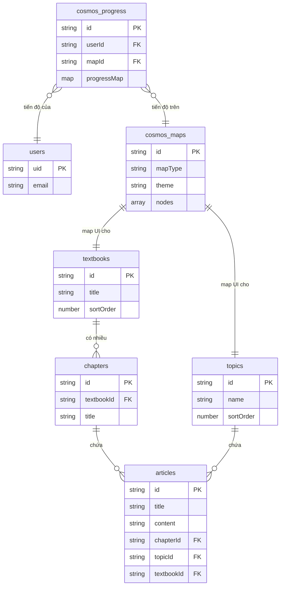

# Thiết kế Firestore — Data Model

> Tài liệu mô tả chi tiết cấu trúc dữ liệu Firestore cho nền tảng Sequoia.
> Bao gồm kiến trúc tách biệt giữa Core Education Domain (dữ liệu học thuật) và Presentation Domain (The Neural Cosmos).
> Cập nhật lần cuối: 2026-07-20

---

## 1. Tổng quan Kiến trúc Dữ liệu

Hệ thống được thiết kế theo nguyên tắc **Separation of Concerns (Tách biệt mối quan tâm)** và **Cost Optimization (Tối ưu chi phí đọc/ghi trên Firestore)**:

1. **Core Education Domain:** Chứa dữ liệu cốt lõi (Sách, Chương, Bài học). Hoàn toàn tinh khiết, không chứa bất kỳ dữ liệu nào liên quan đến UI/UX hay Theme.
2. **Cosmos Game Domain (Presentation):** Chứa cấu hình hiển thị bản đồ và tiến trình học tập dưới dạng game hóa (Gamification). Sử dụng kỹ thuật **Denormalization (Chuẩn hóa ngược)** và **Aggregation (Gộp dữ liệu)** để đảm bảo mỗi lần tải bản đồ chỉ tốn tối đa **2 reads**, tiết kiệm tối đa chi phí.



---

## 2. Core Education Domain

Các Collection này giữ nguyên tính trừu tượng của một CMS giáo dục.

### 2.1. `users`
| Field | Type | Required | Description |
| --- | --- | --- | --- |
| `uid` | `string` | ✅ | Firebase Auth UID |
| `email` | `string` | ✅ | Email đăng ký |
| `displayName` | `string` | ✅ | Tên hiển thị |
| `createdAt` | `timestamp` | ✅ | Thời điểm tạo |

### 2.2. `textbooks` (Giáo trình)
| Field | Type | Required | Description |
| --- | --- | --- | --- |
| `id` | `string` | ✅ | Document ID |
| `title` | `string` | ✅ | Tên giáo trình |
| `description` | `string` | ✅ | Mô tả ngắn |
| `authors` | `array<string>` | ✅ | Tác giả |
| `sortOrder` | `number` | ✅ | Thứ tự sắp xếp |

### 2.3. `chapters` (Chương)
| Field | Type | Required | Description |
| --- | --- | --- | --- |
| `id` | `string` | ✅ | Document ID |
| `textbookId` | `string` | ✅ | Ref đến `textbooks` |
| `title` | `string` | ✅ | Tên chương |
| `sortOrder` | `number` | ✅ | Thứ tự |

### 2.4. `topics` (Chủ đề độc lập)
| Field | Type | Required | Description |
| --- | --- | --- | --- |
| `id` | `string` | ✅ | Document ID |
| `name` | `string` | ✅ | Tên chủ đề |
| `description` | `string` | ✅ | Mô tả ngắn |
| `iconUrl` | `string` | ❌ | Ảnh đại diện/Icon |
| `sortOrder` | `number` | ✅ | Thứ tự sắp xếp |

### 2.5. `articles` (Bài viết)
| Field | Type | Required | Description |
| --- | --- | --- | --- |
| `id` | `string` | ✅ | Document ID (slug) |
| `title` | `string` | ✅ | Tiêu đề |
| `content` | `string` | ✅ | Nội dung Markdown |
| `chapterId` | `string` | ❌ | Ref đến `chapters` (dành cho bài thuộc giáo trình) |
| `topicId` | `string` | ❌ | Ref đến `topics` (dành cho bài thuộc chủ đề tự do) |
| `textbookId` | `string` | ❌ | Ref đến `textbooks` (lưu thừa để query nhanh) |
| `playgroundBlocks` | `array<map>`| ✅ | Metadata config cho các Interactive Model nhúng |

### 2.5. `models` (Mô hình AI)
| Field | Type | Required | Description |
| --- | --- | --- | --- |
| `id` | `string` | ✅ | Document ID |
| `name` | `string` | ✅ | Tên model |
| `fileUrl` | `string` | ✅ | R2 public URL tải file `.tflite` |

---

## 3. Cosmos Game Domain (Presentation)

Đây là tầng UI/UX. Chữ tín "Rẻ & Nhanh" đặt lên hàng đầu. Một bản đồ có 100 ngôi sao cũng chỉ tốn **1 read** thay vì 100 reads.

### 3.1. `cosmos_maps` (Cấu hình bản đồ không gian)
Document ID bắt buộc trùng với `textbookId` (đối với Giáo trình) hoặc `topicId` (đối với Chủ đề tự do). Ktor tự động đồng bộ (sync) dữ liệu từ `articles` sang đây khi có thay đổi.

| Field | Type | Required | Description |
| --- | --- | --- | --- |
| `id` | `string` | ✅ | Map 1:1 với `textbooks` hoặc `topics` |
| `mapType` | `string` | ✅ | Loại bản đồ: `"textbook"`, `"topic"`, `"rogue_anomalies"` |
| `theme` | `string` | ✅ | Theme đang dùng, vd: `"cosmos"`, `"nebula"` |
| `nodes` | `array<map>` | ✅ | Mảng chứa toàn bộ các ngôi sao (bài học) trên bản đồ |
| `nodes[].articleId` | `string` | ✅ | ID bài viết tương ứng |
| `nodes[].title` | `string` | ✅ | Tiêu đề (Denormalized từ `articles` để tránh read phụ) |
| `nodes[].x` | `number` | ✅ | Tọa độ X trên bản đồ |
| `nodes[].y` | `number` | ✅ | Tọa độ Y trên bản đồ |
| `nodes[].celestialType` | `string` | ✅ | Loại sao: `"star"`, `"binary_star"`, `"anomaly"` |
| `nodes[].connections` | `array<string>`| ✅ | Mảng các `articleId` mà sao này nối tới (để vẽ tia sáng) |

**Ví dụ JSON:**
```json
{
  "id": "mml-id",
  "mapType": "textbook",
  "theme": "cosmos",
  "nodes": [
    {
      "articleId": "vector-spaces",
      "title": "Vector Spaces",
      "celestialType": "star",
      "x": 150,
      "y": 300,
      "connections": ["matrix-decomp"]
    }
  ]
}
```

### 3.2. `cosmos_progress` (Tiến trình giải mã)
Document ID là `{userId}_{mapId}`. Gộp toàn bộ tiến trình của 1 user trên 1 bản đồ vào 1 document.

| Field | Type | Required | Description |
| --- | --- | --- | --- |
| `id` | `string` | ✅ | `{userId}_{mapId}` |
| `userId` | `string` | ✅ | ID người dùng |
| `mapId` | `string` | ✅ | ID bản đồ (`textbookId` hoặc `topicId`) |
| `progressMap` | `map` | ✅ | Map ánh xạ `articleId` -> `status` |
| `progressMap.<articleId>` | `string` | ✅ | Trạng thái: `"locked"`, `"decoding"`, `"decoded"` |

**Ví dụ JSON:**
```json
{
  "id": "user123_mml-id",
  "userId": "user123",
  "mapId": "mml-id",
  "progressMap": {
    "vector-spaces": "decoded",
    "matrix-decomp": "decoding",
    "eigenvalues": "locked"
  }
}
```

---

## 4. Phân tích chi phí (Read Cost)

Khi người dùng mở ứng dụng và tải một Bản đồ Sao:
1. Fetch `cosmos_maps/{mapId}` -> **1 Read**. (Lấy toàn bộ cấu trúc bản đồ, vị trí, tên bài học).
2. Fetch `cosmos_progress/{userId}_{mapId}` -> **1 Read**. (Lấy trạng thái sương mù/mở khóa của toàn bộ bản đồ).

**Tổng chi phí: Tối đa 2 Reads / user / map load.** Bất kể bản đồ lớn cỡ nào. Kiến trúc này giải quyết triệt để vấn đề N+1 Query.
