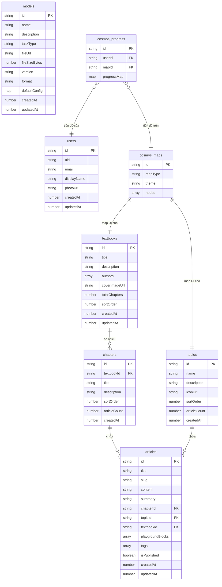

# Thiết kế Firestore — Data Model

> Tài liệu mô tả chi tiết cấu trúc dữ liệu Firestore cho nền tảng Sequoia.
> Bao gồm kiến trúc tách biệt giữa Core Education Domain (dữ liệu học thuật) và Presentation Domain (The Neural Cosmos).
> Cập nhật lần cuối: 2026-07-24

---

## 1. Tổng quan Kiến trúc Dữ liệu

Hệ thống được thiết kế theo nguyên tắc **Separation of Concerns (Tách biệt mối quan tâm)** và **Cost Optimization (Tối ưu chi phí đọc/ghi trên Firestore)**:

1. **Core Education Domain:** Chứa dữ liệu cốt lõi (Sách, Chương, Bài học, Model). Hoàn toàn tinh khiết, không chứa bất kỳ dữ liệu nào liên quan đến UI/UX hay Theme.
2. **Cosmos Game Domain (Presentation):** Chứa cấu hình hiển thị bản đồ và tiến trình học tập dưới dạng game hóa (Gamification). Sử dụng kỹ thuật **Denormalization (Chuẩn hóa ngược)** và **Aggregation (Gộp dữ liệu)** để đảm bảo mỗi lần tải bản đồ chỉ tốn tối đa **2 reads**, tiết kiệm tối đa chi phí.

```mermaid
erDiagram
    users {
        string id PK
        string uid
        string email
        string displayName
        string photoUrl
        number createdAt
        number updatedAt
    }

    textbooks {
        string id PK
        string title
        string description
        array authors
        string coverImageUrl
        number totalChapters
        number sortOrder
        number createdAt
        number updatedAt
    }

    chapters {
        string id PK
        string textbookId FK
        string title
        string description
        number sortOrder
        number articleCount
        number createdAt
    }

    topics {
        string id PK
        string name
        string description
        string iconUrl
        number sortOrder
        number articleCount
        number createdAt
    }

    articles {
        string id PK
        string title
        string slug
        string content
        string summary
        string chapterId FK
        string topicId FK
        string textbookId FK
        array playgroundBlocks
        array tags
        boolean isPublished
        number createdAt
        number updatedAt
    }

    models {
        string id PK
        string name
        string description
        string taskType
        string fileUrl
        number fileSizeBytes
        string version
        string format
        map defaultConfig
        number createdAt
        number updatedAt
    }

    cosmos_maps {
        string id PK
        string mapType
        string theme
        array nodes
    }

    cosmos_progress {
        string id PK
        string userId FK
        string mapId FK
        map progressMap
    }

    textbooks ||--o{ chapters : "có nhiều"
    chapters ||--o{ articles : "chứa"
    topics ||--o{ articles : "chứa"
    cosmos_maps ||--|| textbooks : "map UI cho"
    cosmos_maps ||--|| topics : "map UI cho"
    cosmos_progress }o--|| users : "tiến độ của"
    cosmos_progress }o--|| cosmos_maps : "tiến độ trên"
```

---

## 2. Core Education Domain

Các Collection này giữ nguyên tính trừu tượng của một CMS giáo dục.

### 2.1. `users`
| Field | Type | Required | Description |
| --- | --- | --- | --- |
| `id` | `string` | ✅ | Document ID |
| `uid` | `string` | ✅ | Firebase Auth UID |
| `email` | `string` | ✅ | Email đăng ký |
| `displayName` | `string` | ✅ | Tên hiển thị |
| `photoUrl` | `string` | ❌ | URL ảnh đại diện |
| `createdAt` | `timestamp` | ✅ | Thời điểm tạo |
| `updatedAt` | `timestamp` | ✅ | Thời điểm cập nhật cuối |

### 2.2. `textbooks` (Giáo trình)
| Field | Type | Required | Description |
| --- | --- | --- | --- |
| `id` | `string` | ✅ | Document ID |
| `title` | `string` | ✅ | Tên giáo trình |
| `description` | `string` | ✅ | Mô tả ngắn |
| `authors` | `array<string>` | ✅ | Tác giả |
| `coverImageUrl` | `string` | ✅ | Ảnh bìa |
| `totalChapters` | `number` | ✅ | Tổng số chương |
| `sortOrder` | `number` | ✅ | Thứ tự sắp xếp |
| `createdAt` | `timestamp` | ✅ | Thời điểm tạo |
| `updatedAt` | `timestamp` | ✅ | Thời điểm cập nhật cuối |

### 2.3. `chapters` (Chương)
| Field | Type | Required | Description |
| --- | --- | --- | --- |
| `id` | `string` | ✅ | Document ID |
| `textbookId` | `string` | ✅ | Ref đến `textbooks` |
| `title` | `string` | ✅ | Tên chương |
| `description` | `string` | ✅ | Tóm tắt chương |
| `sortOrder` | `number` | ✅ | Thứ tự |
| `articleCount` | `number` | ✅ | Số bài viết trong chương |
| `createdAt` | `timestamp` | ✅ | Thời điểm tạo |

### 2.4. `topics` (Chủ đề độc lập)
| Field | Type | Required | Description |
| --- | --- | --- | --- |
| `id` | `string` | ✅ | Document ID |
| `name` | `string` | ✅ | Tên chủ đề |
| `description` | `string` | ✅ | Mô tả ngắn |
| `iconUrl` | `string` | ❌ | Ảnh đại diện/Icon |
| `sortOrder` | `number` | ✅ | Thứ tự sắp xếp |
| `articleCount` | `number` | ✅ | Số bài viết trong chủ đề |
| `createdAt` | `timestamp` | ✅ | Thời điểm tạo |

### 2.5. `articles` (Bài viết)
| Field | Type | Required | Description |
| --- | --- | --- | --- |
| `id` | `string` | ✅ | Document ID |
| `title` | `string` | ✅ | Tiêu đề |
| `slug` | `string` | ✅ | URL-friendly slug |
| `content` | `string` | ✅ | Nội dung Markdown |
| `summary` | `string` | ✅ | Tóm tắt ngắn gọn |
| `chapterId` | `string` | ❌ | Ref đến `chapters` (dành cho bài thuộc giáo trình) |
| `topicId` | `string` | ❌ | Ref đến `topics` (dành cho bài thuộc chủ đề tự do) |
| `textbookId` | `string` | ❌ | Ref đến `textbooks` (lưu thừa để query nhanh) |
| `playgroundBlocks` | `array<map>`| ✅ | Metadata config cho các Interactive Model nhúng |
| `tags` | `array<string>`| ✅ | Các thẻ phân loại bài viết |
| `isPublished` | `boolean` | ✅ | Cờ trạng thái xuất bản |
| `createdAt` | `timestamp` | ✅ | Thời điểm tạo |
| `updatedAt` | `timestamp` | ✅ | Thời điểm cập nhật cuối |

### 2.6. `models` (Mô hình AI)
| Field | Type | Required | Description |
| --- | --- | --- | --- |
| `id` | `string` | ✅ | Document ID |
| `name` | `string` | ✅ | Tên model |
| `description` | `string` | ✅ | Mô tả mô hình |
| `taskType` | `string` | ✅ | Loại tác vụ (vd: object_detection) |
| `fileUrl` | `string` | ✅ | R2 public URL tải file `.tflite` |
| `fileSizeBytes` | `number` | ✅ | Dung lượng file byte |
| `version` | `string` | ✅ | Phiên bản |
| `format` | `string` | ✅ | Định dạng (vd: litert) |
| `defaultConfig` | `map` | ✅ | Tham số mặc định (threshold, inputSize) |
| `createdAt` | `timestamp` | ✅ | Thời điểm tạo |
| `updatedAt` | `timestamp` | ✅ | Thời điểm cập nhật cuối |

---

## 3. Cosmos Game Domain (Presentation)

Đây là tầng UI/UX. Chữ tín "Rẻ & Nhanh" đặt lên hàng đầu. Một bản đồ có 100 ngôi sao cũng chỉ tốn **1 read** thay vì 100 reads.

### 3.1. `cosmos_maps` (Cấu hình bản đồ không gian)
Document ID bắt buộc trùng với `textbookId` (đối với Giáo trình) hoặc `topicId` (đối với Chủ đề tự do). Ktor tự động đồng bộ (sync) dữ liệu từ `articles` sang đây khi có thay đổi.

| Field | Type | Required | Description |
| --- | --- | --- | --- |
| `id` | `string` | ✅ | Map 1:1 với `textbooks` hoặc `topics` |
| `mapType` | `string` | ✅ | Loại bản đồ: `"textbook"`, `"topic"`, `"rogue_anomalies"` |
| `theme` | `string` | ✅ | Theme đang dùng, vd: `"cosmos"`, `"nebula"` |
| `nodes` | `array<map>` | ✅ | Mảng chứa toàn bộ các ngôi sao (bài học) trên bản đồ |
| `nodes[].articleId` | `string` | ✅ | ID bài viết tương ứng |
| `nodes[].title` | `string` | ✅ | Tiêu đề (Denormalized từ `articles` để tránh read phụ) |
| `nodes[].celestialType` | `string` | ✅ | Loại sao: `"star"`, `"binary_star"`, `"anomaly"` |
| `nodes[].x` | `number` | ✅ | Tọa độ X trên bản đồ |
| `nodes[].y` | `number` | ✅ | Tọa độ Y trên bản đồ |
| `nodes[].connections` | `array<string>`| ✅ | Mảng các `articleId` mà sao này nối tới (để vẽ tia sáng) |

### 3.2. `cosmos_progress` (Tiến trình giải mã)
Document ID là `{userId}_{mapId}`. Gộp toàn bộ tiến trình của 1 user trên 1 bản đồ vào 1 document.

| Field | Type | Required | Description |
| --- | --- | --- | --- |
| `id` | `string` | ✅ | `{userId}_{mapId}` |
| `userId` | `string` | ✅ | ID người dùng |
| `mapId` | `string` | ✅ | ID bản đồ (`textbookId` hoặc `topicId`) |
| `progressMap` | `map` | ✅ | Map ánh xạ `articleId` -> `status` |
| `progressMap.<articleId>` | `string` | ✅ | Trạng thái: `"locked"`, `"decoding"`, `"decoded"` |

---

## 4. Phân tích chi phí (Read Cost)

Khi người dùng mở ứng dụng và tải một Bản đồ Sao:
1. Fetch `cosmos_maps/{mapId}` -> **1 Read**. (Lấy toàn bộ cấu trúc bản đồ, vị trí, tên bài học).
2. Fetch `cosmos_progress/{userId}_{mapId}` -> **1 Read**. (Lấy trạng thái sương mù/mở khóa của toàn bộ bản đồ).

**Tổng chi phí: Tối đa 2 Reads / user / map load.** Bất kể bản đồ lớn cỡ nào. Kiến trúc này giải quyết triệt để vấn đề N+1 Query.
