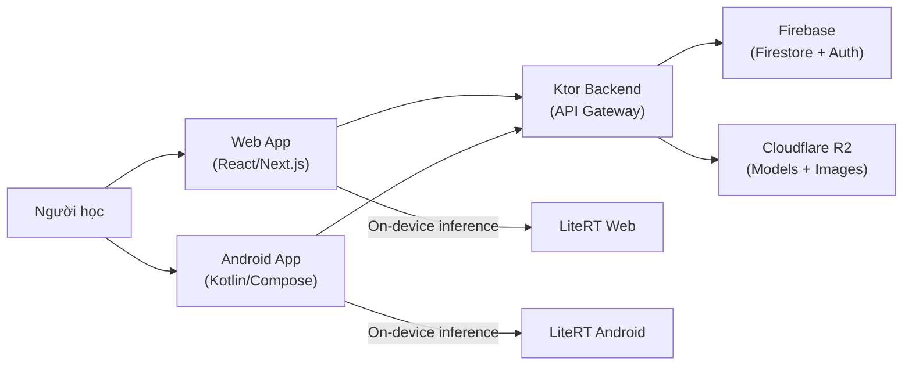
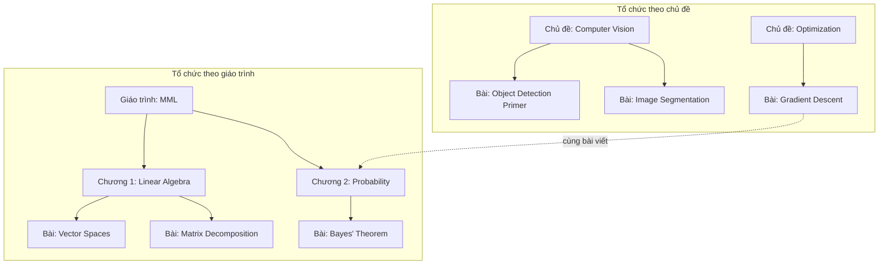
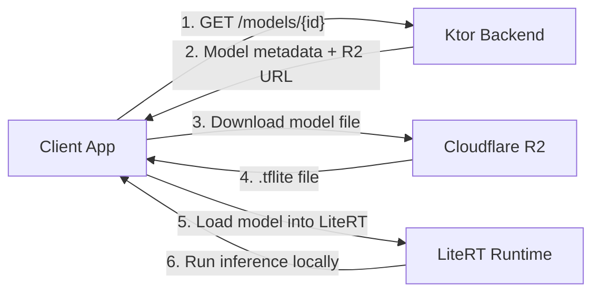
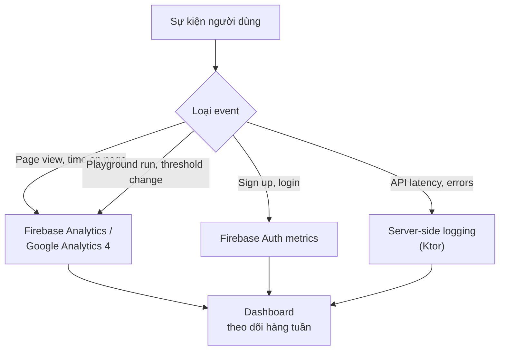

# Product Requirements Document — Sequoia

> Phiên bản: 1.0
> Cập nhật lần cuối: 2026-07-16
> Tác giả: Hieu Nguyen

---

## 1. Tầm nhìn sản phẩm

Sequoia là nền tảng học AI/ML có cấu trúc theo giáo trình, kết hợp bài viết chuyên sâu với **Model Playground nhúng trực tiếp trong nội dung**, cho phép người học chạy mô hình AI ngay trên thiết bị của mình mà không cần server xử lý AI phía backend.

### Triết lý thiết kế

| Nguyên tắc | Giải thích |
| --- | --- |
| **Học đi đôi với thực hành** | Playground được nhúng ngay trong bài viết, tại vị trí phù hợp về mặt nội dung — không phải tách riêng sang trang khác |
| **On-device inference** | Mô hình AI chạy hoàn toàn trên trình duyệt (LiteRT Web) hoặc thiết bị Android (LiteRT Android), loại bỏ chi phí GPU server và độ trễ mạng |
| **Nội dung có cấu trúc** | Tổ chức theo giáo trình kinh điển (MML, AIMA) giúp người học có lộ trình rõ ràng, đồng thời hỗ trợ chủ đề độc lập cho người muốn học theo nhu cầu |
| **Đa nền tảng** | Web (React/Next.js) + Android (Kotlin/Jetpack Compose) chia sẻ chung backend Ktor, đảm bảo trải nghiệm nhất quán |

### Mô hình vận hành

AI inference không đi qua backend — client tải model từ R2 rồi chạy cục bộ. Backend Ktor chỉ xử lý business logic, xác thực, và cung cấp nội dung.

---

## 2. Đối tượng người dùng mục tiêu

### Persona chính

| Persona | Đặc điểm | Nhu cầu | Cách dùng Sequoia |
| --- | --- | --- | --- |
| **Sinh viên IT/AI** | Đang học đại học ngành CNTT, KHMT, hoặc AI. Có nền tảng lập trình cơ bản, đang tiếp cận ML/DL | Cần tài liệu có cấu trúc theo giáo trình, hiểu lý thuyết qua thực hành, đọc công thức toán | Học theo giáo trình MML hoặc AIMA, chạy playground để trực quan hóa khái niệm |
| **Developer muốn học ML** | Đã có kinh nghiệm lập trình, muốn chuyển hướng hoặc bổ sung kỹ năng ML | Cần hiểu nhanh các khái niệm qua demo thực tế, không muốn setup môi trường phức tạp | Duyệt theo chủ đề (Computer Vision, NLP), chạy model ngay trên trình duyệt để hiểu cách hoạt động |
| **Người tự học AI** | Không nhất thiết có background CS, tự tìm hiểu AI/ML theo sở thích hoặc nhu cầu công việc | Cần tài liệu dễ tiếp cận, có giải thích trực quan, không yêu cầu cài đặt phức tạp | Bắt đầu từ bài viết chủ đề độc lập, thử playground YOLO để có trải nghiệm "wow", sau đó đi sâu vào giáo trình |

### Đặc điểm chung

- Đọc được tiếng Anh kỹ thuật (nội dung bài viết có thể song ngữ)
- Có thiết bị cá nhân đủ mạnh để chạy inference cơ bản (smartphone đời 2020+ hoặc laptop với trình duyệt hiện đại)
- Thích học qua tương tác hơn đọc thụ động

---

## 3. Điểm khác biệt

### So sánh với các nền tảng hiện có

| Tiêu chí | HuggingFace | Towards Data Science | Coursera/edX | **Sequoia** |
| --- | --- | --- | --- | --- |
| **Nội dung có cấu trúc** | ❌ Hub model, không có giáo trình | ❌ Blog rời rạc, không lộ trình | ✅ Khóa học có cấu trúc | ✅ Giáo trình + chủ đề độc lập |
| **Playground tương tác** | ⚠️ Demo riêng biệt, không gắn bài viết | ❌ Chỉ có text + code snippet | ❌ Video + quiz, không playground | ✅ Playground nhúng trong bài viết |
| **On-device inference** | ❌ Chạy trên server HuggingFace | ❌ Không có | ❌ Không có | ✅ LiteRT chạy trên thiết bị |
| **Công thức toán** | ⚠️ Hạn chế | ✅ Hỗ trợ LaTeX | ⚠️ Trong video, khó tra cứu | ✅ LaTeX/KaTeX render trực tiếp |
| **Chi phí GPU server** | Cao (Inference API) | N/A | Cao (nếu có lab) | **$0** — inference trên client |
| **Offline capable** | ❌ | ❌ | ⚠️ Video download | ✅ (Post-MVP Android) |

### Giá trị cốt lõi duy nhất

> **Sequoia là nền tảng duy nhất kết hợp ba yếu tố: nội dung AI/ML có cấu trúc theo giáo trình + playground nhúng trực tiếp trong bài viết + inference hoàn toàn trên thiết bị người dùng.**

Mỗi nền tảng hiện tại chỉ đáp ứng một phần:

- **HuggingFace**: Có demo model nhưng không có nội dung giáo trình, playground tách biệt khỏi ngữ cảnh học.
- **Towards Data Science / Medium**: Có bài viết chuyên sâu nhưng hoàn toàn tĩnh, không thể tương tác với model.
- **Coursera / edX**: Có khóa học có cấu trúc nhưng dựa vào video, không có on-device inference, chi phí cao cho GPU lab.

---

## 4. Tính năng MVP chi tiết

### 4.1 Hệ thống nội dung linh hoạt

**Mô tả:**
Hai cách tổ chức nội dung song song, linh hoạt:

- **Theo giáo trình:** Mỗi giáo trình (VD: *Mathematics for Machine Learning*, *Artificial Intelligence: A Modern Approach*) được chia thành các chương, mỗi chương chứa nhiều bài viết. Người dùng có lộ trình học rõ ràng, theo thứ tự chương.
- **Theo chủ đề độc lập:** Các bài viết được nhóm theo chủ đề tự do (VD: Computer Vision, NLP, Optimization). Không yêu cầu đọc theo thứ tự.
- **Một bài viết có thể thuộc cả giáo trình lẫn chủ đề** — ví dụ bài "Gradient Descent" vừa là chương 5 của MML, vừa thuộc chủ đề Optimization.

**Lý do đưa vào MVP:**
Cấu trúc nội dung là xương sống của sản phẩm. Không có nó, Sequoia chỉ là một blog. Hệ thống hai chiều (giáo trình + chủ đề) phục vụ cả người học có lộ trình lẫn người duyệt theo nhu cầu.

**Tiêu chí hoàn thành:**

- [ ] Hiển thị danh sách giáo trình trên trang chủ, mỗi giáo trình có tên, tác giả, mô tả, ảnh bìa
- [ ] Khi chọn một giáo trình, hiển thị danh sách chương theo thứ tự, mỗi chương liệt kê các bài viết
- [ ] Hiển thị danh sách chủ đề độc lập, mỗi chủ đề có tên, mô tả, icon/ảnh minh họa
- [ ] Khi chọn một chủ đề, hiển thị danh sách bài viết thuộc chủ đề đó
- [ ] Một bài viết có thể xuất hiện ở cả view giáo trình lẫn view chủ đề
- [ ] API endpoint: `GET /textbooks`, `GET /textbooks/{id}/chapters`, `GET /topics`, `GET /topics/{id}/articles`
- [ ] Hoạt động trên cả Web và Android

---

### 4.2 Bài viết có playground nhúng

**Mô tả:**
Bài viết không chỉ chứa văn bản, mà có thể nhúng các khối playground tương tác tại **vị trí phù hợp về mặt nội dung**. Ví dụ: bài viết về Object Detection giải thích YOLO xong → ngay phía dưới là playground để chạy YOLO trên ảnh/camera. Playground là một phần của bài viết, không phải trang riêng.

**Lý do đưa vào MVP:**
Đây là điểm khác biệt cốt lõi của Sequoia. Nếu bỏ playground nhúng, sản phẩm chỉ còn là blog tĩnh — không khác Towards Data Science.

**Tiêu chí hoàn thành:**

- [ ] Bài viết render đúng nội dung Markdown xen kẽ với các khối playground
- [ ] Playground block được đặt tại vị trí cụ thể trong bài (không phải cuối bài)
- [ ] Mỗi playground block hiển thị: tên model, nút chạy, vùng input (camera/upload ảnh), vùng output (kết quả inference)
- [ ] Khi cuộn bài viết, playground nằm đúng vị trí trong flow nội dung
- [ ] Nội dung bài viết trong Firestore chứa metadata về vị trí và cấu hình playground
- [ ] API endpoint: `GET /articles/{id}` trả về nội dung bài viết kèm danh sách playground blocks và vị trí

---

### 4.3 Render LaTeX/KaTeX cho công thức toán

**Mô tả:**
Hỗ trợ render công thức toán học inline (`$...$`) và block (`$$...$$`) trong nội dung bài viết, sử dụng KaTeX để đảm bảo hiệu năng render nhanh.

**Lý do đưa vào MVP:**
Bắt buộc cho các giáo trình nặng toán như MML. Không có LaTeX render, nội dung giáo trình sẽ không thể trình bày đúng — ví dụ công thức Bayes, gradient, matrix operations đều cần ký hiệu toán học chuẩn.

**Tiêu chí hoàn thành:**

- [ ] Inline math: `$\nabla f(x)$` render đúng trong dòng văn bản
- [ ] Block math: `$$\mathbf{A}^T\mathbf{A} = \mathbf{I}$$` render đúng dạng centered block
- [ ] Hỗ trợ ký hiệu phổ biến trong ML: ma trận, vector, gradient, tổng sigma, tích phân, xác suất có điều kiện
- [ ] Render không gây layout shift khi trang load
- [ ] Hoạt động trên cả Web (KaTeX JS) và Android (WebView hoặc thư viện native)
- [ ] Thời gian render < 200ms cho bài viết có 50+ công thức

---

### 4.4 Code blocks với syntax highlighting + copy

**Mô tả:**
Bài viết AI/ML chứa code minh họa (chủ yếu Python, cùng Kotlin, JavaScript). Code blocks cần hiển thị với syntax highlighting và nút copy để người dùng dễ sử dụng.

**Lý do đưa vào MVP:**
Bài viết AI/ML luôn kèm code. Không có syntax highlighting, code sẽ khó đọc. Không có nút copy, người dùng phải chọn thủ công — trải nghiệm kém.

**Tiêu chí hoàn thành:**

- [ ] Syntax highlighting cho ít nhất: Python, Kotlin, JavaScript, JSON, YAML, Bash
- [ ] Hiển thị tên ngôn ngữ ở góc code block
- [ ] Nút copy xuất hiện khi hover (Web) hoặc luôn hiển thị (Android)
- [ ] Click copy → nội dung code được sao chép vào clipboard, hiện thông báo "Đã sao chép"
- [ ] Hỗ trợ line numbers (tùy chọn, theo cấu hình bài viết)
- [ ] Code block hiển thị đúng trong dark mode và light mode

---

### 4.5 Tìm kiếm full-text

**Mô tả:**
Tìm kiếm xuyên suốt bài viết, giáo trình, chủ đề. Người dùng nhập từ khóa, hệ thống trả về kết quả phù hợp với highlight từ khóa và ngữ cảnh xung quanh.

**Lý do đưa vào MVP:**
Khi có nhiều bài viết từ nhiều giáo trình và chủ đề, tìm kiếm là cách nhanh nhất để người dùng tìm nội dung cần thiết. Firestore không hỗ trợ full-text search natively, cần thiết kế giải pháp ngay từ đầu (ảnh hưởng kiến trúc dữ liệu).

**Tiêu chí hoàn thành:**

- [ ] Ô tìm kiếm xuất hiện trên header, truy cập nhanh bằng phím tắt (Web: `Ctrl+K` hoặc `/`)
- [ ] Kết quả trả về trong < 500ms cho dataset MVP
- [ ] Mỗi kết quả hiển thị: tiêu đề bài viết, đoạn trích chứa từ khóa (có highlight), giáo trình/chủ đề cha
- [ ] Tìm kiếm hoạt động với tiếng Anh (nội dung chính) và tiếng Việt (nếu có)
- [ ] Kết quả xếp hạng theo relevance
- [ ] API endpoint: `GET /search?q={query}` trả về danh sách kết quả phân trang
- [ ] Giải pháp index: sử dụng Algolia, Meilisearch, hoặc custom index trên Ktor — quyết định cụ thể ở giai đoạn thiết kế kỹ thuật

---

### 4.6 Model Playground giáo dục — YOLO LiteRT

**Mô tả:**
Playground tương tác cho mô hình YOLO (object detection) ở định dạng LiteRT, chạy inference hoàn toàn trên thiết bị. Khác với demo model thông thường, playground có **tính giáo dục**: hiển thị và giải thích các chỉ số để người học hiểu cách model hoạt động.

**Thông tin hiển thị:**

| Chỉ số | Mô tả giáo dục |
| --- | --- |
| **Confidence score** | Phần trăm chắc chắn của model cho mỗi detection, kèm giải thích ngắn "model tin rằng đây là X với xác suất Y%" |
| **Threshold slider** | Cho phép điều chỉnh ngưỡng confidence, quan sát trực tiếp tradeoff precision/recall: threshold cao → ít detection nhưng chính xác hơn |
| **Inference time** | Thời gian chạy inference (ms), giúp hiểu tradeoff performance/accuracy giữa các model sizes |
| **Model size** | Kích thước file model, cho thấy tradeoff giữa accuracy và deployment constraints |

**Input hỗ trợ:**

- Camera thiết bị (real-time detection)
- Upload ảnh từ thư viện

**Lý do đưa vào MVP:**
Playground là hook chính để thu hút người dùng và minh chứng giá trị "học qua tương tác" của Sequoia. YOLO là lựa chọn tốt cho MVP vì kết quả trực quan (bounding boxes), dễ hiểu với người mới, và có sẵn model LiteRT chất lượng cao.

**Tiêu chí hoàn thành:**

- [ ] Tải model YOLO LiteRT từ Cloudflare R2 về thiết bị, hiển thị progress bar
- [ ] Chạy inference trên ảnh upload: hiển thị bounding boxes với label và confidence score
- [ ] Chạy inference real-time qua camera: ≥ 15 FPS trên thiết bị mid-range (Android), hoạt động trên trình duyệt desktop (Web)
- [ ] Slider threshold: điều chỉnh từ 0.0 đến 1.0, kết quả cập nhật real-time
- [ ] Hiển thị inference time cho mỗi frame/ảnh
- [ ] Hiển thị model size (MB) và tên model
- [ ] Tooltip/text giải thích cho mỗi chỉ số (confidence, threshold, inference time)
- [ ] Xử lý lỗi: camera permission denied, model download failed, inference error
- [ ] API endpoint: `GET /models/{id}` trả về metadata model + download URL từ R2

---

### 4.7 Đăng ký / Đăng nhập

**Mô tả:**
Hệ thống xác thực người dùng qua Firebase Authentication. Hỗ trợ đăng ký/đăng nhập bằng email + password. Đăng nhập mở khóa các tính năng cá nhân hóa (post-MVP: bookmark, tiến độ, lịch sử).

**Lý do đưa vào MVP:**
Cần có từ đầu để thiết lập pipeline xác thực: client → Firebase Auth token → Ktor verify → Firestore. Nội dung bài viết và playground vẫn truy cập được khi chưa đăng nhập, nhưng đăng nhập cần thiết cho các tính năng cá nhân hóa sắp tới.

**Tiêu chí hoàn thành:**

- [ ] Đăng ký bằng email + password, validate: email hợp lệ, password ≥ 8 ký tự
- [ ] Đăng nhập bằng email + password
- [ ] Đăng xuất
- [ ] Hiển thị trạng thái đăng nhập trên UI (avatar/tên hoặc nút đăng nhập)
- [ ] Token Firebase được gửi trong header `Authorization: Bearer <token>` cho mọi API call cần xác thực
- [ ] Ktor verify token thành công trước khi xử lý request
- [ ] Xử lý lỗi: email đã tồn tại, sai mật khẩu, token hết hạn
- [ ] Nội dung bài viết và playground **không yêu cầu đăng nhập** để truy cập

---

### 4.8 Dark mode

**Mô tả:**
Hỗ trợ chuyển đổi giữa light mode và dark mode trên cả Web và Android.

**Lý do đưa vào MVP:**
Dark mode là kỳ vọng cơ bản của người dùng hiện đại, đặc biệt với đối tượng developer/sinh viên IT — phần lớn sử dụng dark mode làm mặc định. Ảnh hưởng đến toàn bộ design system, cần thiết kế từ đầu thay vì retrofit sau.

**Tiêu chí hoàn thành:**

- [ ] Toggle dark/light mode từ UI (header hoặc settings)
- [ ] Mặc định theo system preference (`prefers-color-scheme` trên Web, system dark mode trên Android)
- [ ] Preference được lưu lại (localStorage trên Web, DataStore trên Android)
- [ ] Tất cả components hiển thị đúng trong cả hai mode: text, background, code blocks, LaTeX, playground UI, bảng, ảnh minh họa
- [ ] Không có text "biến mất" hoặc contrast quá thấp trong dark mode
- [ ] Chuyển đổi mode không gây flash trắng/đen

---

## 5. Tính năng Post-MVP gần (ảnh hưởng kiến trúc)

> [!IMPORTANT]
> Các tính năng dưới đây chưa cần triển khai trong MVP, nhưng **ảnh hưởng đến quyết định kiến trúc ngay từ đầu**. Cần thiết kế data model và API có khả năng mở rộng cho chúng.

### 5.1 Admin CMS

| Thuộc tính | Chi tiết |
| --- | --- |
| **Mô tả** | Giao diện quản trị Web riêng để tạo, sửa, xóa bài viết, quản lý giáo trình và chủ đề — thay vì thao tác trực tiếp trên Firebase Console |
| **Ảnh hưởng kiến trúc** | Cần role-based access control trong Ktor (admin vs. user). API cần hỗ trợ CRUD đầy đủ, không chỉ read. Firestore Security Rules cần phân biệt admin writes |
| **Chuẩn bị trong MVP** | Thêm trường `role` trong document user trên Firestore. API design sẵn sàng cho write endpoints. Backend middleware phân quyền |

### 5.2 Bookmark / Đánh dấu bài viết

| Thuộc tính | Chi tiết |
| --- | --- |
| **Mô tả** | Người dùng đăng nhập có thể bookmark bài viết để đọc sau. Danh sách bookmark hiển thị trong trang cá nhân |
| **Ảnh hưởng kiến trúc** | Cần subcollection `bookmarks` dưới document user, hoặc collection riêng với compound index |
| **Chuẩn bị trong MVP** | Thiết kế Firestore schema có chỗ cho bookmarks. Đảm bảo article ID stable và unique |

### 5.3 Tiến độ đọc theo giáo trình

| Thuộc tính | Chi tiết |
| --- | --- |
| **Mô tả** | Theo dõi người dùng đang đọc tới đâu trong một giáo trình. Đánh dấu chương/bài viết đã hoàn thành. Hiển thị progress bar trên trang giáo trình |
| **Ảnh hưởng kiến trúc** | Cần lưu trạng thái đọc per-user per-textbook. Ảnh hưởng đến cách thiết kế relationship giữa user, textbook, chapter, article |
| **Chuẩn bị trong MVP** | Thiết kế schema cho reading progress. Đảm bảo thứ tự chương/bài viết ổn định (dùng `order` field) |

### 5.4 Offline support (đặc biệt Android)

| Thuộc tính | Chi tiết |
| --- | --- |
| **Mô tả** | Đọc bài viết và chạy model khi không có mạng. Model files và nội dung bài viết được cache trên thiết bị. Đồng bộ khi có kết nối trở lại |
| **Ảnh hưởng kiến trúc** | Cần local database trên Android (Room). Cần versioning cho nội dung để biết khi nào cần sync. Model files cần cache management (files lớn, 5-50MB) |
| **Chuẩn bị trong MVP** | Thêm trường `updatedAt` và `version` trong các document Firestore. API response kèm ETag hoặc last-modified để hỗ trợ cache validation |

---

## 6. Tính năng Post-MVP xa

> [!NOTE]
> Các tính năng này nằm trong tầm nhìn dài hạn. Không cần chuẩn bị kiến trúc đặc biệt trong MVP, nhưng ghi nhận để tránh thiết kế đóng đường mở rộng.

### 6.1 Glossary / Từ điển thuật ngữ AI/ML

- **Mô tả:** Thuật ngữ AI/ML (VD: overfitting, gradient descent, backpropagation) có định nghĩa ngắn gọn. Trong bài viết, thuật ngữ được cross-link tự động tới glossary — hover hiện tooltip, click vào trang chi tiết.
- **Giá trị:** Giúp người mới không bị "lost" khi gặp thuật ngữ chưa biết giữa bài viết.

### 6.2 Bình luận / Thảo luận

- **Mô tả:** Hệ thống bình luận dưới mỗi bài viết. Người dùng đăng nhập có thể đặt câu hỏi, thảo luận. Hỗ trợ Markdown trong bình luận.
- **Giá trị:** Tạo cộng đồng học tập, giúp phát hiện nội dung khó hiểu cần cải thiện.

### 6.3 Thêm model types

- **Mô tả:** Mở rộng playground hỗ trợ nhiều loại model:

| Model type | Input | Output | Ý nghĩa giáo dục |
| --- | --- | --- | --- |
| Image Classification | Ảnh | Top-K labels + confidence | So sánh softmax output, hiểu multi-class |
| Pose Detection | Camera/ảnh | Skeleton keypoints | Trực quan hóa feature detection |
| Text Embedding | Văn bản | Vector + similarity score | Hiểu vector space, cosine similarity |

### 6.4 So sánh model song song

- **Mô tả:** Chạy hai model trên cùng input, hiển thị kết quả cạnh nhau. So sánh accuracy, speed, model size.
- **Giá trị:** Minh họa trực quan tradeoff giữa các model architectures.

### 6.5 Lịch sử chạy model

- **Mô tả:** Lưu lại các lần chạy inference: input, output, model used, thời gian. Người dùng có thể xem lại kết quả cũ.
- **Giá trị:** Theo dõi quá trình thực hành, so sánh kết quả theo thời gian.

### 6.6 Thống kê tiến độ học tập

- **Mô tả:** Dashboard cá nhân hiển thị: số bài đã đọc, thời gian học, tiến độ từng giáo trình, badges/milestones.
- **Giá trị:** Gamification nhẹ, tạo động lực duy trì thói quen học.

### 6.7 Gemma Playground

- **Mô tả:** Playground cho Gemma (Google LLM nhỏ), chạy text generation trên thiết bị. Người dùng nhập prompt, xem output token-by-token.
- **Giá trị:** Mở rộng từ computer vision sang NLP/LLM, minh họa cách LLM hoạt động ở mức low-level.

---

## 7. Ràng buộc kỹ thuật

### 7.1 Ràng buộc nhân lực

| Ràng buộc | Hệ quả |
| --- | --- |
| **Solo developer** | Không có QA riêng → cần automated testing. Không có designer riêng → UI dùng component library. Không có DevOps riêng → CI/CD đơn giản |
| **Ưu tiên tốc độ phát triển** | Chọn tech stack quen thuộc (Kotlin ecosystem). Tận dụng code sharing giữa Android và backend (cùng Kotlin). Tránh over-engineering |

### 7.2 Ràng buộc công nghệ

| Thành phần | Công nghệ | Lý do chọn |
| --- | --- | --- |
| **Backend** | Ktor (Kotlin) | Nhẹ, async, cùng ngôn ngữ với Android, plugin ecosystem tốt (serialization, auth, OpenAPI) |
| **Android** | Kotlin + Jetpack Compose | Modern UI toolkit, first-class Kotlin support, tích hợp tốt với LiteRT |
| **Web** | React / Next.js | SEO (SSR), ecosystem lớn, hỗ trợ LiteRT Web |
| **Database** | Cloud Firestore | Realtime sync, offline support sẵn, free tier hào phóng, NoSQL phù hợp với content nesting |
| **Auth** | Firebase Authentication | Tích hợp sẵn với Firestore, SDK cho cả Web và Android, free tier đủ dùng |
| **Storage** | Cloudflare R2 | S3-compatible, không tính phí egress (quan trọng khi serve model files lớn), giá rẻ |
| **AI Runtime** | LiteRT (TFLite) | Chạy trên cả Android và Web, hỗ trợ GPU/NPU delegate, model ecosystem lớn (YOLO, MobileNet) |

### 7.3 Ràng buộc AI on-device

- **Không có server-side inference** — mọi inference chạy trên client device
- **Hệ quả:** Giới hạn kích thước model (khuyến nghị < 50MB cho mobile), giới hạn loại model (chỉ model tương thích LiteRT)
- **Ưu điểm:** Zero GPU cost, privacy (ảnh không rời thiết bị), hoạt động offline sau khi tải model

### 7.4 Ràng buộc bảo mật

| Nguyên tắc | Triển khai |
| --- | --- |
| **Defense-in-depth** | Ktor xác thực + phân quyền (lớp 1) → Firestore Security Rules (lớp 2) |
| **No secrets on client** | Client chỉ giữ Firebase config công khai. API keys, R2 credentials nằm trên Ktor server |
| **Presigned upload** | Upload file: Client → Ktor (verify + tạo presigned URL) → Client → R2. Không expose R2 credentials |

---

## 8. Metrics thành công

### 8.1 Metrics sản phẩm

| Metric | Mục tiêu MVP (3 tháng đầu) | Cách đo |
| --- | --- | --- |
| **Số bài viết xuất bản** | ≥ 20 bài viết (ít nhất 2 giáo trình, 3 chủ đề) | Đếm trong Firestore |
| **Số lần chạy playground** | ≥ 500 lần chạy inference | Event tracking (analytics) |
| **Thời gian trung bình trên trang bài viết** | ≥ 3 phút | Analytics (Web: GA4, Android: Firebase Analytics) |
| **Tỷ lệ đăng ký** | ≥ 10% visitor → registered user | Firebase Auth + Analytics |
| **Tỷ lệ playground engagement** | ≥ 30% người đọc bài có playground → chạy playground | Event tracking |

### 8.2 Metrics kỹ thuật

| Metric | Mục tiêu | Cách đo |
| --- | --- | --- |
| **Thời gian load bài viết** | < 2 giây (First Contentful Paint) | Lighthouse / Performance API |
| **Thời gian tải model** | < 10 giây trên 4G cho model ≤ 25MB | Performance monitoring |
| **Inference FPS (Android camera)** | ≥ 15 FPS trên thiết bị mid-range | In-app measurement |
| **API response time** | < 300ms (p95) cho content endpoints | Server-side logging |
| **Uptime** | ≥ 99% | Monitoring |

### 8.3 Cách thu thập

**Cadence đánh giá:** Review metrics hàng tuần trong 3 tháng đầu, điều chỉnh ưu tiên feature dựa trên dữ liệu thực tế.

---

## Phụ lục: Tổng quan Firestore Collections

> Chi tiết schema sẽ được định nghĩa trong tài liệu thiết kế dữ liệu riêng. Dưới đây là tổng quan cho PRD.

| Collection | Mô tả | Quan hệ |
| --- | --- | --- |
| `users` | Thông tin người dùng: email, displayName, role, createdAt | — |
| `textbooks` | Giáo trình: title, authors, description, coverImage, order | Cha của `chapters` |
| `chapters` | Chương: title, description, order, textbookId | Thuộc `textbooks`, chứa references tới `articles` |
| `topics` | Chủ đề độc lập: name, description, icon | Chứa references tới `articles` |
| `articles` | Bài viết: title, content (Markdown), playgroundBlocks, chapterId?, topicIds[], publishedAt | Thuộc `chapters` và/hoặc `topics` |
| `models` | Cấu hình model AI: name, task, fileUrl (R2), fileSize, version, defaultThreshold, inputSize | Được reference bởi playground blocks trong `articles` |
