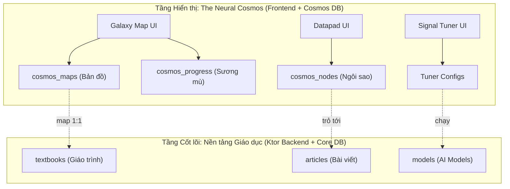

# Product Requirements Document — Sequoia (The Neural Cosmos)

> Phiên bản: 2.0 (Áp dụng kiến trúc Separation of Domains)
> Cập nhật lần cuối: 2026-07-20

---

## 1. Tầm nhìn sản phẩm

Sequoia là nền tảng học AI/ML có cấu trúc, cho phép chạy mô hình AI (LiteRT) ngay trên thiết bị người dùng. Điểm độc đáo nhất là **UI/UX được thiết kế hoàn toàn theo concept "The Neural Cosmos" (Khám phá Vũ trụ)**.

Người dùng không "đọc sách", họ "khám phá dải ngân hà". Họ không "chạy playground", họ "giải mã tín hiệu vũ trụ".

Tuy nhiên, bên dưới lớp vỏ (Presentation), hệ thống vẫn duy trì một Backend mạnh mẽ, thuần túy dành cho giáo dục (Core Education Domain) để đảm bảo tính dễ bảo trì và hiệu năng.

---

## 2. Kiến trúc 2 lớp (Two-Layer Architecture)

**Tại sao thiết kế như vậy?**
- Hệ thống CMS vẫn quản lý Sách và Bài viết một cách dễ hiểu.
- Ứng dụng Frontend (Web/Android) vẽ Vũ trụ cực kỳ mượt mà.
- Database tối ưu tuyệt đối: Tải nguyên 1 bản đồ hàng trăm ngôi sao chỉ tốn đúng **2 lượt đọc (2 reads)** nhờ kỹ thuật Denormalization.

---

## 3. Tính năng MVP chi tiết (Cosmos UI)

### 3.1. Bản đồ sao (Galaxy Map) thay cho Danh sách Giáo trình

Thay vì hiện list sách khô khan, app mở ra một không gian vũ trụ tĩnh mịch.
- Các "Giáo trình" (Textbooks) là các **Sectors** (Vùng không gian).
- Bên trong Sector là các **Chòm sao** (Chapters).
- Các "Chủ đề tự do" (Topics) là các **Tinh vân (Free Nebulas)** (người dùng được truy cập tự do không cần theo thứ tự).
- Các "Bài viết đơn lẻ/Paper" là các **Thiên thể lang thang (Rogue Anomalies / Comets)** rải rác trên bản đồ.
- Các điểm sáng là các **Ngôi sao** (Articles).
- **Fog of War:** Sao nào chưa học (thuộc lộ trình Sector) thì ẩn trong sương mù. Sao nào đang học thì nhấp nháy. Học xong (decoded) thì sáng rực và bắn tia sáng sang sao tiếp theo. Các ngôi sao thuộc Tinh vân tự do không bị che bởi sương mù.

### 3.2. Datapad và Nhật ký thay cho Bài viết

- Khi click vào một ngôi sao đã mở khóa, màn hình Datapad hiện lên.
- Nội dung vẫn là Markdown (hỗ trợ KaTeX, Code), nhưng font chữ và CSS mang âm hưởng Sci-fi, giống như đọc nhật ký của người đi trước.

### 3.3. Signal Tuner thay cho Model Playground

Đây là điểm ăn tiền. Nhúng trực tiếp trong Datapad không phải là một "Playground" khô khan.
- Khi người dùng cuộn đến phần thực hành, một "Thiết bị nhận sóng" (Signal Tuner) xuất hiện.
- Model AI (YOLO LiteRT) được ngầm tải về.
- Người dùng truyền Camera vào để "Quét".
- Kết quả Object Detection (Bounding Box) được hiển thị như là việc "bắt được tín hiệu thành công".
- **Threshold Slider** biến thành **Noise Filter (Bộ lọc nhiễu)**, giúp người dùng hiểu rõ bản chất precision/recall của mô hình thông qua lăng kính chỉnh tần số dò sóng.

### 3.4. AI On-device (LiteRT)

Toàn bộ quá trình quét tín hiệu (chạy AI) thực hiện trên CPU/GPU/NPU của thiết bị (Web/Android) thông qua **LiteRT**. Backend Ktor tuyệt đối không chạy Inference để giảm chi phí server về 0.

### 3.5. Dark Mode Mặc định

Bắt buộc UI phải là Dark Mode (nền đen sâu thẳm, các line neon, hiệu ứng phát sáng glassmorphism) để phù hợp với bối cảnh Không gian.

---

## 4. Metrics Thành công

- **Chi phí hạ tầng:** Giữ ở mức siêu thấp. Firestore reads cho việc load Galaxy map phải luôn là 2 reads/map.
- **Engagement:** Tỷ lệ người dùng "Giải mã" (chạy Signal Tuner) đạt ≥ 40% trên tổng số bài đọc.
- **Retention:** Số sao được mở khóa trung bình mỗi session ≥ 3.
