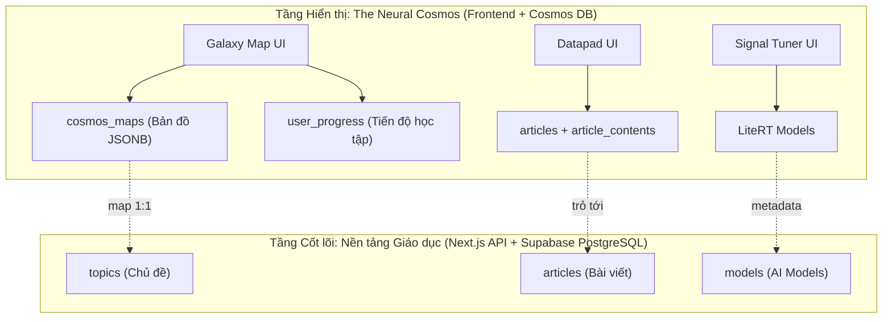

# Product Requirements Document — Sequoia (The Neural Cosmos)

> Phiên bản: 3.0 (Kiến trúc Next.js + Supabase)
> Cập nhật lần cuối: 2026-08-19

---

## 1. Tầm nhìn sản phẩm

Sequoia là nền tảng học AI/ML có cấu trúc, cho phép chạy mô hình AI (LiteRT) ngay trên thiết bị người dùng. Điểm độc đáo nhất là **UI/UX được thiết kế hoàn toàn theo concept "The Neural Cosmos" (Khám phá Vũ trụ)**.

Người dùng được trải nghiệm môi trường tương tác như một hành trình khám phá, kết hợp giải mã tín hiệu mô phỏng.
Tuy nhiên, bên dưới lớp Presentation, hệ thống vẫn duy trì một Backend mạnh mẽ, thuần túy dành cho giáo dục (Core Education Domain) để đảm bảo tính dễ bảo trì và hiệu năng.

---

## 2. Kiến trúc 2 lớp (Two-Layer Architecture)

```mermaid
graph TD
    subgraph "Tầng Hiển thị: The Neural Cosmos (Frontend + Cosmos DB)"
        A["Galaxy Map UI"] --> B["cosmos_maps (Bản đồ JSONB)"]
        A --> C["user_progress (Tiến độ học tập)"]
        D["Datapad UI"] --> E["articles + article_contents"]
        F["Signal Tuner UI"] --> G["LiteRT Models"]
    end

    subgraph "Tầng Cốt lõi: Nền tảng Giáo dục (Next.js API + Supabase PostgreSQL)"
        B -. "map 1:1" .-> H["topics (Chủ đề)"]
        E -. "trỏ tới" .-> I["articles (Bài viết)"]
        G -. "metadata" .-> J["models (AI Models)"]
    end
```

**Tại sao thiết kế như vậy?**
- Hệ thống CMS vẫn quản lý Chủ đề và Bài viết một cách dễ hiểu.
- Ứng dụng Frontend (Web/Android) vẽ Vũ trụ cực kỳ mượt mà.
- Database tối ưu tuyệt đối: Tải nguyên 1 bản đồ hàng trăm ngôi sao chỉ tốn đúng **2 queries** nhờ cột JSONB.

---

## 3. Tính năng MVP chi tiết (Cosmos UI)

### 3.1. Bản đồ sao (Galaxy Map)

Ứng dụng sử dụng giao diện vũ trụ trực quan thay cho danh sách văn bản thông thường:
- Các "Chủ đề tự do" (Topics) là các **Tinh vân (Free Nebulas)** (người dùng được truy cập tự do không cần theo thứ tự).
- Các "Bài viết đơn lẻ/Paper" là các **Thiên thể lang thang (Rogue Anomalies / Comets)** rải rác trên bản đồ.
- Các điểm sáng là các **Ngôi sao** (Articles).

### 3.2. Datapad (Giao diện Bài viết)

- Khi click vào một ngôi sao, màn hình Datapad hiện lên.
- Nội dung vẫn là Markdown (hỗ trợ KaTeX, Code), nhưng font chữ và CSS mang âm hưởng Sci-fi, giống như đọc nhật ký của người đi trước.

### 3.3. Signal Tuner (Model Playground)

Playground được nhúng trực tiếp vào nội dung bài viết dưới dạng Signal Tuner.
- Khi người dùng cuộn đến phần thực hành, một "Thiết bị nhận sóng" (Signal Tuner) xuất hiện.
- Model AI (YOLO LiteRT) được ngầm tải về.
- Người dùng truyền Camera vào để "Quét".
- Kết quả Object Detection (Bounding Box) được hiển thị như là việc "bắt được tín hiệu thành công".
- **Threshold Slider** biến thành **Noise Filter (Bộ lọc nhiễu)**, giúp người dùng hiểu rõ bản chất precision/recall của mô hình thông qua lăng kính chỉnh tần số dò sóng.

### 3.4. AI On-device (LiteRT)

Toàn bộ quá trình quét tín hiệu (chạy AI) thực hiện trên CPU/GPU/NPU của thiết bị (Web/Android) thông qua **LiteRT**. Backend tuyệt đối không chạy Inference để giảm chi phí server về 0.

### 3.5. Dark Mode Mặc định

Bắt buộc UI phải là Dark Mode (nền đen sâu thẳm, các line neon, hiệu ứng phát sáng glassmorphism) để phù hợp với bối cảnh Không gian.

---

### 3.6. Render LaTeX/KaTeX cho công thức toán

**Mô tả:**
Hỗ trợ render công thức toán học inline (`$...$`) và block (`$$...$$`) trong nội dung bài viết, sử dụng KaTeX để đảm bảo hiệu năng render nhanh.

**Tiêu chí hoàn thành:**
- Inline math và Block math render đúng dạng.
- Hỗ trợ ký hiệu phổ biến trong ML: ma trận, vector, gradient, tổng sigma, tích phân.
- Thời gian render < 200ms cho bài viết có 50+ công thức.

### 3.7. Code blocks với syntax highlighting + copy

**Mô tả:**
Code blocks hiển thị với syntax highlighting và nút copy để người dùng dễ sử dụng.

**Tiêu chí hoàn thành:**
- Syntax highlighting cho ít nhất: Python, Kotlin, JavaScript, JSON, YAML, Bash.
- Nút copy xuất hiện khi hover (Web) hoặc luôn hiển thị (Android).
- Hiển thị tên ngôn ngữ ở góc code block.

### 3.8. Tìm kiếm full-text (Radar/Quét tín hiệu)

**Mô tả:**
Tìm kiếm xuyên suốt bài viết (Stars), chủ đề (Nebulas). Người dùng nhập từ khóa, hệ thống trả về kết quả (tọa độ ngôi sao) phù hợp với highlight từ khóa.

**Tiêu chí hoàn thành:**
- Ô tìm kiếm xuất hiện trên header, truy cập nhanh bằng phím tắt.
- API endpoint trả về kết quả dưới 500ms.
- Nhấp vào kết quả sẽ fly-to (bay đến) ngôi sao tương ứng trên Galaxy Map.

### 3.9. Hồ sơ Phi hành gia (Đăng ký / Đăng nhập)

**Mô tả:**
Hệ thống xác thực người dùng qua Supabase Auth (Email/Password, Google OAuth).

**Tiêu chí hoàn thành:**
- Session JWT được quản lý tự động bởi `@supabase/ssr` (cookie-based).
- Next.js API Routes kiểm tra session trước khi xử lý request cần auth.
- Nội dung bài viết không yêu cầu đăng nhập để truy cập, nhưng việc lưu tiến trình (Cosmos Progress) bắt buộc đăng nhập.

---

## 4. Tính năng Post-MVP gần (Ảnh hưởng kiến trúc)

> [!IMPORTANT]
> Cần thiết kế data model và API có khả năng mở rộng cho các tính năng này.

### 4.1. Trạm Kiểm soát (Admin CMS) ✅ Đã hoàn thành
- Giao diện quản trị Web (Genesis Core) để tạo, sửa, xóa dữ liệu Vũ trụ (Stars, Nebulas).
- Bảo vệ bởi `is_admin` claim trong `app_metadata` của Supabase Auth.

### 4.2. Lưu Tọa độ (Bookmark)
- Người dùng đăng nhập có thể lưu tọa độ Ngôi sao để dễ dàng quay lại.
- **Chuẩn bị trong MVP:** Thiết kế PostgreSQL schema có bảng riêng cho bookmarks, đảm bảo article ID (Star ID) luôn stable.

### 4.3. Chế độ Sinh tồn (Offline Support)
- Đọc dữ liệu Datapad và giải mã tín hiệu (chạy model) khi mất kết nối mạng.
- **Chuẩn bị trong MVP:** Tất cả bảng có `updated_at` được tự động quản lý bởi trigger. API hỗ trợ cache validation.

---

## 5. Tính năng Post-MVP xa

> [!NOTE]
> Tính năng dài hạn, không cần thiết kế đặc biệt trong MVP.

- **Từ điển Không gian (Glossary):** Cross-link tự động từ thuật ngữ trong Datapad tới Glossary.
- **Kênh Giao tiếp Cộng đồng:** Thảo luận, trao đổi chiến thuật giải mã tín hiệu dưới mỗi Ngôi sao.
- **Đa dạng Tín hiệu (More Model Types):** Hỗ trợ Pose Detection, Text Embedding, v.v...
- **Bộ dò Tín hiệu Kép (Model Comparison):** Chạy hai Signal Tuner cạnh nhau để so sánh output.
- **Nhật ký Giải mã:** Lưu lịch sử các lần chạy inference (quét tín hiệu).

---

## 6. Ràng buộc Kỹ thuật

- **Backend:** Next.js App Router (API Routes) đóng vai trò full-stack, quản lý xác thực và logic.
- **Client:** React/Next.js (Web) và Kotlin/Jetpack Compose (Android).
- **AI Runtime:** LiteRT (TFLite) chạy on-device. Giới hạn model size < 50MB.
- **Database & Auth:** Supabase PostgreSQL + Supabase Auth.
- **Storage:** Public CDN (jsDelivr / Hugging Face) cho models + Cloudinary cho images.
- **Bảo mật:** Không lưu secret trên client. Next.js API là lớp bảo vệ lớp 1, PostgreSQL RLS là lớp 2.

---

## 7. Metrics Thành công

### 7.1. Metrics Kỹ thuật (Hạ tầng Cosmos)
- **Chi phí hạ tầng:** Giữ ở mức siêu thấp. PostgreSQL queries cho việc load Galaxy map phải luôn là 2 queries/map/user.
- **Thời gian tải model:** < 10 giây trên mạng 4G.
- **Inference FPS:** ≥ 15 FPS trên thiết bị Android tầm trung.
- **API Response:** < 300ms (p95) cho content endpoints.

### 7.2. Metrics Sản phẩm (Gamification)
- **Engagement:** Tỷ lệ người dùng "Giải mã" (chạy Signal Tuner) đạt ≥ 40% trên tổng số bài đọc.
- **Retention:** Số sao được mở khóa trung bình mỗi session ≥ 3.
- **Tỷ lệ đăng ký:** ≥ 10% visitor chuyển đổi thành registered user.
